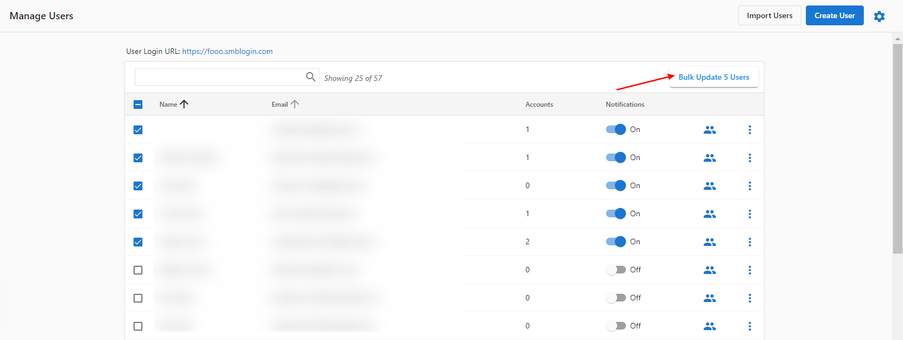
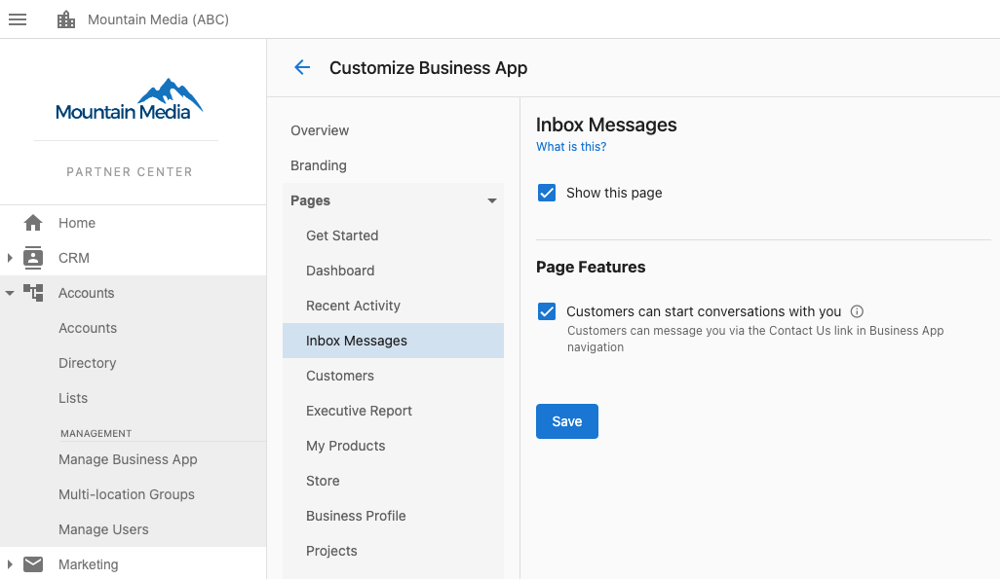

The Inbox Messages tab in the Business App can be turned off from appearing to your clients in Business App - either on a user by user basis, or for all of your accounts within a market.

**WARNING: Removing user access to Inbox will also remove your users ability to use Inbox Pro, Lead capture or SMS messaging features - and is not recommended.**

**To disable Inbox for a specific subset of users:**

1. Navigate to **Partner Center > Accounts > Manage Users.**
2. Click on the checkboxes to select the user(s) you want to modify their feature access > click on 'Bulk Update x users'.

3. Under the 'Tab Access' settings > click the drop-down arrow next to 'Inbox Messages' and select '**Turn Off**,' then Apply Changes to Users.

**To turn Inbox off for all users within a market, the [Customize Business App](https://partners.vendasta.com/customize-business-app/overview) area in Partner Center:**

1. Navigate to **Partner Center > Accounts > Manage Business App > Customize Business App > [Inbox](https://partners.vendasta.com/customize-business-app/pages/inbox)**

2. Uncheck "show this page" and click save, to completely remove Inbox features from all clients within a market.

