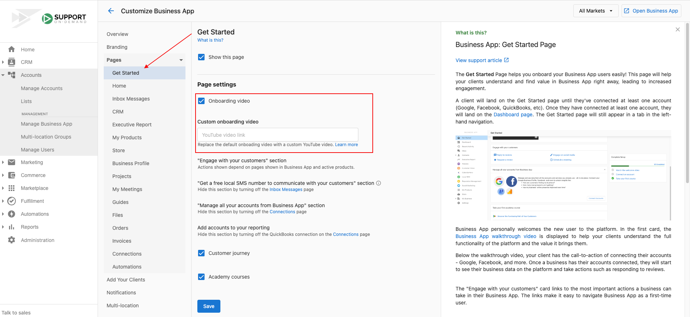

# Add a Custom Video to Get Started Page

Partners have the ability to add their own custom video to the 'Get Started' page in Business App. The purpose of this video is to effectively onboard your prospects and clients into Business App.

With further customization options for Business App, you have the ability to communicate and onboard your clients to your liking and better align with your brand. Create or add your own video, with your own messaging.

## How do I add my video?

Your video must be uploaded to YouTube in order for it to appear in Business App. To add a video, navigate to **Partner Center > Administration > Customize Business App > Get Started > Check off onboarding video > Paste the link to your YouTube video > Save.**

