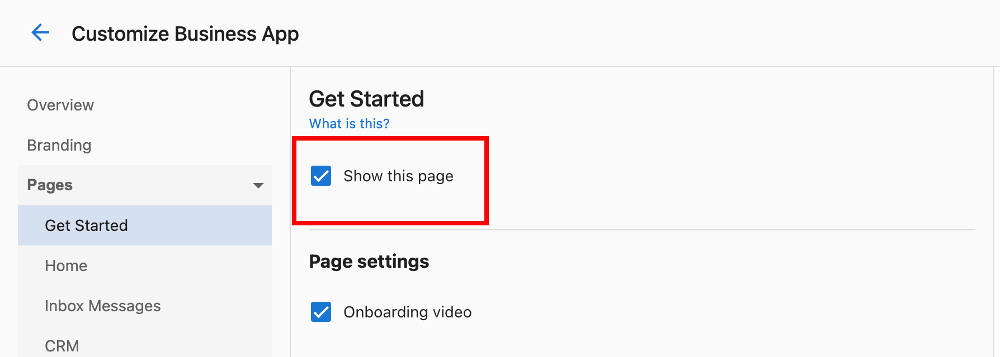
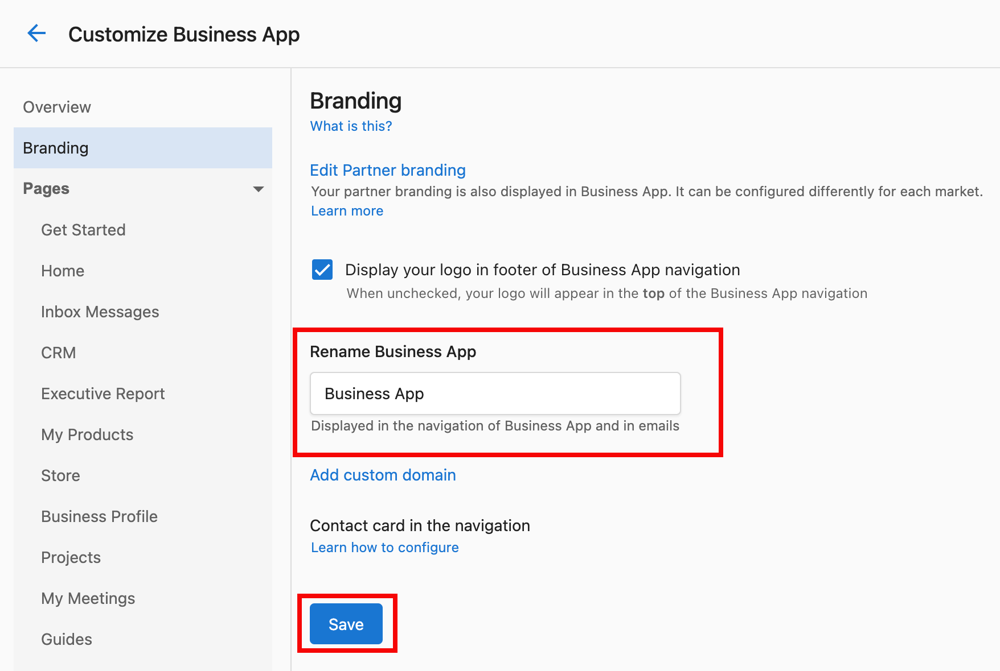

## What is Business App Interface Customization?

Business App Interface Customization allows you to control the layout, navigation, and visual elements of your clients' Business App experience. You can show or hide specific pages, customize branding elements, modify navigation structure, and create a tailored interface that matches your business needs and client requirements.

## Why is Business App Interface Customization important?

Customizing the Business App interface ensures clients see only relevant features and information, creating a cleaner, more focused experience. You can maintain brand consistency, reduce complexity by hiding unused features, and create a professional presentation that reflects your business identity.

## What's Included with Business App Interface Customization?

### Page Visibility and Navigation Control
- **Show/hide dashboard pages**: Control which sections are visible (Grow, Listings, Protect, Connect, Reputation, etc.)
- **Automations page management**: Enable or disable client access to automation features
- **Guides section control**: Show or hide the Guides tab based on client needs
- **Custom navigation structure**: Organize the interface to match your workflow

### Branding and Visual Identity
- **Business App renaming**: Use your preferred name instead of "Business App"
- **Logo placement**: Position your logo for optimal brand visibility
- **Visual consistency**: Maintain brand identity across all interface elements
- **Professional presentation**: Create cohesive branding experience

### User Experience Enhancements
- **Notification banners**: Add important announcements or information
- **Custom content integration**: Include personalized videos and messaging
- **Client interaction controls**: Manage how clients interact with features
- **Simplified navigation**: Focus on essential tools and information

## How to Configure Page Visibility and Navigation

### Show or Hide Dashboard Pages

To control which pages appear in your clients' Business Apps:

1. Navigate to `Administration` > `Platform Settings` > `Business App Settings`
2. Select which pages are visible to each customer:
   - **Grow**: Marketing and growth tools
   - **Listings**: Business listing management
   - **Protect**: Security and protection features
   - **Connect**: Communication and engagement tools
   - **Reputation**: Review and reputation management
   - **Other sections**: Additional platform features
3. Configure visibility settings per client or globally
4. Save the configuration

### Manage Automations Page Visibility

To control access to automation features:

1. Go to `Partner Center` > `Administration` > `Customize Business App` > `Automations`
2. Toggle the **Show this Page** option and save:
   - **Enabled**: Clients can access automation features
   - **Disabled**: Automation page is hidden from client view

The change takes effect immediately for all clients. Automations will continue to run when triggers are met even if the page is hidden.

### Enable or Disable Guides Section

To control the Guides tab visibility:

1. Navigate to `Partner Center` > `Administration` > `Customize Business App` > `Pages` > `Guides`
2. Toggle the **Guides** tab visibility and save:
   - **Show**: Clients can access educational guides and resources
   - **Hide**: Guides tab is removed from navigation
3. If you have multiple markets, repeat these steps per market

:::info
Hiding the Guides section can simplify the interface for clients who don't need educational resources or when you provide training through other channels.
:::

## How to Configure Branding and Visual Identity

### Rename Business App

To use your preferred name instead of "Business App":

1. Go to `Partner Center` > `Administration` > `Customize Business App` > `Branding`
2. Select **Rename Business App**
3. Enter your preferred application name and save

This change appears throughout the client interface, maintaining consistent branding and professional presentation.

### Configure Logo Placement

To optimize logo visibility and brand recognition:

1. Access `Administration` > `Customize Business App` > `Branding`
2. Upload your logo if not already configured
3. Select placement options. Turning off "Display your logo in footer of Business App navigation" moves the logo from the bottom-left to the top-left.
   
   Placement guidance:
   - **Header positioning**: Primary visibility location
   - **Size optimization**: Ensure proper display across devices
   - **Brand consistency**: Maintain visual identity standards
4. Preview and save the placement

Proper logo placement reinforces brand identity and creates professional presentation throughout the client experience.

## How to Enhance User Experience

### Add Notification Banners

To communicate important information to all users:

1. Navigate to `Partner Center` > `Administration` > `Customize Business App`
2. Open the **Notifications** tab > **Global notification banner**
3. Configure banner content:
   - **Message text**: Clear, concise information
   - **Display duration**: Temporary or persistent display
   - **Visual styling**: Colors and formatting
   - **Target audience**: All users or specific groups
4. Add an expiry date if needed and activate the banner

Notification banners are effective for announcements, important updates, or promotional information that all clients should see.

### Configure Client Invitation Settings

To control how clients can invite other businesses:

1. Create a landing page on your website (ideally with an Acquisition Widget for sign-up or trials)
2. Go to `Partner Center` > `Administration` > `Customize Business App` > `Add Your Clients`
3. Paste your landing page link into the **Invitation Landing Page URL** field and save

After saving, an **Invite a business** button appears in the client profile section. Clients can copy and share your landing page link to invite other businesses.

This feature helps expand your client network while maintaining control over new business onboarding.

## Frequently Asked Questions (FAQs)

How quickly do interface changes take effect?

Most interface changes, including page visibility and branding updates, take effect immediately. Clients will see changes the next time they refresh their Business App or log in.

Can I customize the interface differently for different clients?

Yes, many interface settings can be configured per client or client group. You can show different pages and features based on client needs and service packages.

What happens if I hide a page that clients are currently using?

When you hide a page, clients lose access to that section immediately. Ensure you communicate changes in advance and provide alternative access methods if needed.

Can I preview interface changes before applying them?

Some settings offer preview options, but the best practice is to test changes in a staging environment or with a limited client group before rolling out to all clients.

How do I know which pages my clients actually use?

Monitor client usage through analytics and engagement reports. This data helps you make informed decisions about which pages to show or hide.

Can I restore the default Business App name after renaming?

Yes, you can change the application name back to "Business App" or any other preferred name at any time through the branding settings.

What's the difference between hiding a page and disabling a feature?

Hiding a page removes it from navigation but the underlying feature may still be accessible. Disabling a feature completely removes functionality and access.

How does logo placement affect mobile users?

Logo placement should be optimized for both desktop and mobile viewing. Test logo visibility and sizing across different devices to ensure consistent branding.

Can I schedule notification banners to appear at specific times?

Notification banner scheduling depends on your platform capabilities. Check the banner settings for timing and scheduling options.

What should I consider when customizing the interface for clients?

Focus on client needs, simplicity, and functionality. Remove unused features, maintain clear navigation, ensure brand consistency, and gather client feedback on changes.

 