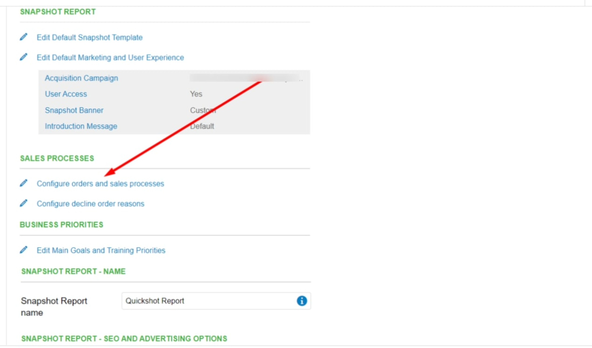
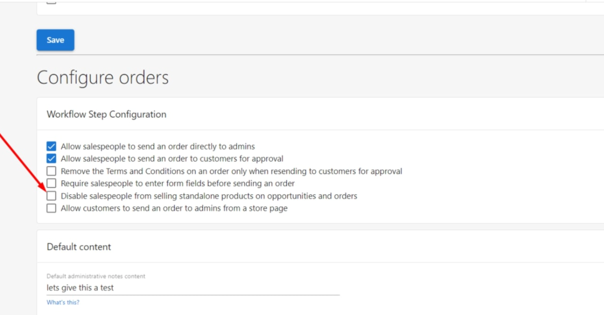

## Steps to Follow

1. Go to **Partner Center > Administration > Customize.**
2. Click **Sales.**
3. Under **Sales Processes > click 'Configure orders and sales processes'** as shown in the screenshot below.

Here you can disable salespeople from selling standalone products on opportunities and orders.

