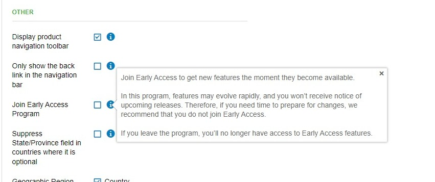

Early Access—formerly known as "Beta"—is a program where Vendasta Partners get new features the moment they become available.

In this program, features may evolve rapidly, and partners do not receive notice of upcoming releases. Therefore, if you need time to prepare for changes, we recommend that you do not join Early Access.

To join the program, go to **Partner Center > Administration > Customize > [General Product Settings](https://partners.vendasta.com/customize-design/?utm_medium=referral&utm_source=resource-center&utm_campaign=early-access-program&utm_content=inline-link) > Others** and then select **Join Early Access Program**. 

If you'd like to add a market to the Early Access program, go to **Partner Center > Administration > Customize > [Markets](https://partners.vendasta.com/customize-design/markets/?utm_medium=referral&utm_source=resource-center&utm_campaign=early-access-program&utm_content=inline-link)**, select a market, go to the **General Product Settings** section, locate **Early Access Program** and change the selection to **Enable**.   The partner default will be respected unless explicitly defined here.

**Note**: If you leave the program, you'll no longer have access to Early Access features.

