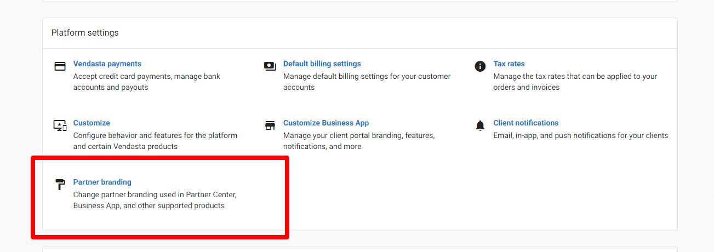
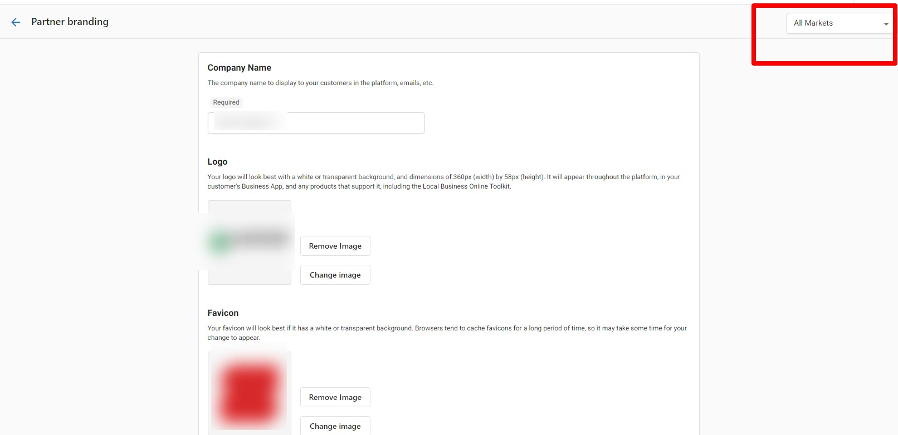
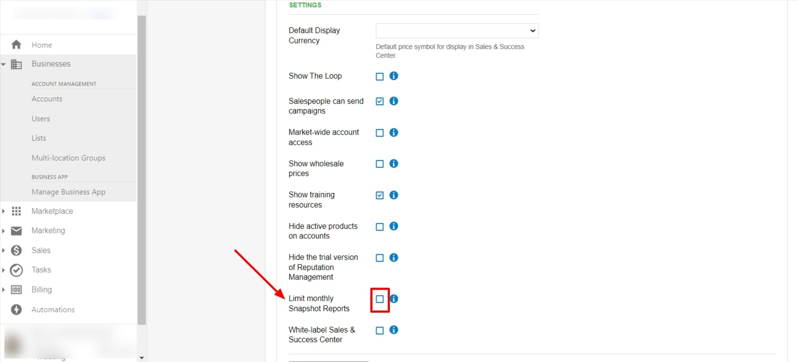
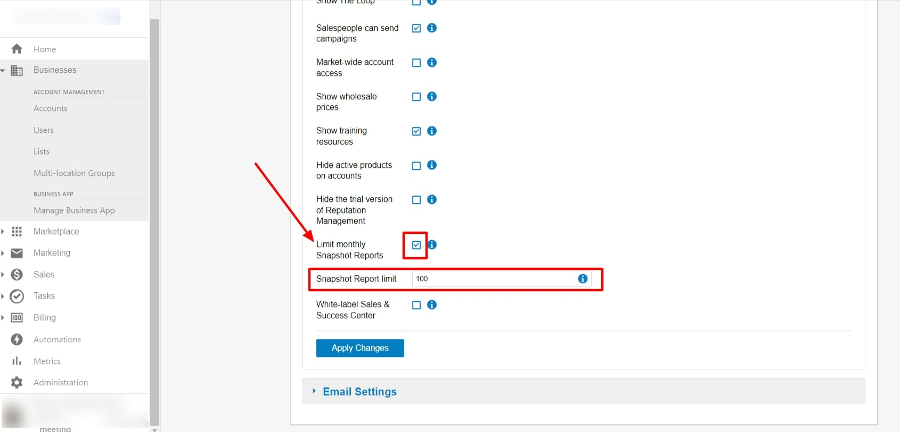

## What are Market Settings?

Market Settings allow you to segment your business by region, brand, industry, or any other organizational structure that makes sense for your operations. Each market can have its own branding, settings, and configuration while maintaining centralized management and oversight.

## Why are Market Settings important?

Markets help organize numerous accounts and provide targeted experiences for different business segments. You can customize branding per market, configure market-specific settings, and manage large-scale operations more efficiently while maintaining brand consistency and operational control.

## What's Included with Market Settings?

### Market Organization and Structure
- **Account assignment**: All new accounts must be assigned to a specific market
- **Market segmentation**: Organize by brand, region, industry, or custom criteria
- **Centralized management**: Maintain oversight across all markets from one platform
- **Scalable structure**: Add new markets as your business grows

### Market-Specific Branding
- **Custom logos**: Upload different logos for each market
- **Color schemes**: Set unique color palettes per market
- **Product naming**: Customize product names for different markets
- **Login portals**: Branded experiences for market-specific users

### Market-Level Configuration
- **Individual settings**: Configure features and restrictions per market
- **Permission inheritance**: Markets inherit default settings but can be customized
- **Sales order settings**: Market-specific sales processes and configurations
- **Reporting limits**: Set different limits and restrictions per market

:::warning
Markets are only available on certain subscription tiers. Contact your account representative or support to activate Markets for your platform or add additional markets.
:::

## How to Understand Market Structure

### Market Organization Principles

#### Account Assignment Process
When Markets are activated on your platform:
- **Required assignment**: Each new account must be assigned to a market during creation
- **Dropdown selection**: A market dropdown appears in the Account Create form
- **Default market**: One market represents your company as a whole
- **Additional markets**: Used for segmentation by region, brand, or other criteria

#### User Access and Permissions
Different user types interact with markets differently:

**Business App Users**:
- Assigned permissions to specific accounts rather than entire markets
- See branding from the first account in their list on login
- Branding updates when they select accounts from different markets
- View market-specific branding when accessing products on assigned accounts

**Salespeople**:
- See market-specific branding after logging into their account
- Snapshot Reports display their assigned market's branding
- New accounts automatically created under their assigned market
- Must be assigned to a market (required for salespeople created before Markets activation)

### URL and Portal Management
- **Consistent URLs**: Portal URLs remain consistent with your original setup
- **Custom domains**: Per-market custom domains are currently unavailable
- **Login branding**: Pre-login portals display your white-label branding
- **Market switching**: Branding updates dynamically based on selected accounts

## How to Configure Market-Specific Branding

### Access Market Branding Settings

To customize branding for individual markets:

1. Navigate to `Administration` > `Partner Branding`
2. Use the dropdown in the top-right corner to select:
   - **All Markets**: Apply branding to all markets
   - **Individual Market**: Customize specific market branding
3. Configure logos, colors, and visual elements
4. Save changes for the selected market scope

### Branding Inheritance and Customization
- **Default branding**: Branding created before Markets activation becomes the default for new markets
- **Individual customization**: Each market can have unique visual identity
- **Inheritance model**: New markets inherit default settings but can be modified
- **Consistent elements**: Maintain brand consistency across markets while allowing differentiation

## How to Manage Market Settings and Configuration

### Configure Market-Specific Features

Each market can have its own configuration for various features:

#### Sales Order Settings Configuration
Markets can have customized sales processes:
- **Individual sales processes**: Configure unique workflows per market
- **Order restrictions**: Set market-specific product and sales limitations
- **Process customization**: Tailor sales workflows to market requirements
- **Permission variations**: Different access levels and capabilities per market

#### Beta Program and Feature Management
- **Market-level beta access**: Enable or disable beta features per market
- **Independent settings**: Beta program participation separate from partner-level settings
- **Feature rollouts**: Test new features in specific markets before wider deployment
- **Controlled access**: Manage feature availability based on market readiness

### Restore Market Settings to Defaults

If you need to reset market-specific configurations:

1. Go to `Administration` > `Customize`
2. Click **Markets**
3. Click the edit icon next to the market you want to restore
4. Navigate to **Sales** > **Configure Orders and Sales Processes**
5. Scroll to the bottom and click **Restore Back to Partner Defaults**

:::info
The "Restore Back to Partner Defaults" option only appears if you've previously configured market-specific sales order settings. This ensures you don't accidentally reset markets that are using default configurations.
:::

## How to Configure Market-Based Reporting Limits

### Set Market-Specific Snapshot Report Limits

While there's no direct market-wide snapshot limit, you can control reporting per market by configuring salesperson limits within each market:

1. Navigate to `Administration` > `Customize` > `Sales`
2. Switch to the specific market you want to configure
3. Check the **Limit monthly Snapshot Reports** checkbox
4. Set the **Snapshot creation limit** for salespeople in that market
5. Save the configuration

### Understanding Market Report Limits
- **Combined limits**: If multiple salespeople work in a market, the limit is the total maximum all salespeople can create combined
- **Market-specific**: Each market can have different reporting limits
- **Individual tracking**: Each salesperson's usage is tracked separately within the market total
- **Monthly reset**: All limits reset monthly regardless of market configuration

## How to Add and Manage Markets

### Adding New Markets
To expand your market structure:
- **Contact support**: Reach out to your account representative or Support On Demand
- **Define purpose**: Clearly identify how the new market will be used
- **Plan organization**: Consider how accounts will be assigned and managed
- **Branding preparation**: Prepare market-specific branding elements if needed

### Market Management Best Practices
- **Clear naming**: Use descriptive market names that reflect their purpose
- **Consistent organization**: Establish clear criteria for account assignment
- **Regular review**: Periodically assess market structure effectiveness
- **User training**: Ensure team members understand market assignments and implications

## Frequently Asked Questions (FAQs)

How do I activate Markets for my platform?

Markets are only available on certain subscription tiers. Contact your account representative or Support On Demand to activate Markets or add additional markets to your platform.

Can I limit Snapshot Report creation per market?

There's no direct market-wide limit, but you can limit snapshot creation per salesperson within each market. The market limit becomes the total maximum all salespeople in that market can create combined.

How do I restore market settings to defaults?

Go to Administration > Customize > Markets, edit the market, navigate to Sales > Configure Orders and Sales Processes, then click "Restore Back to Partner Defaults" at the bottom of the page.

What happens to salespeople created before Markets were activated?

Salespeople created before Markets activation must be assigned to a market the next time you edit their details. This ensures proper market association and branding.

Can each market have different branding?

Yes, each market can have custom logos, colors, product names, and other branding elements. Use the market dropdown in Partner Branding to configure individual market branding.

How do Business App users see different market branding?

Business App users are assigned to accounts, not markets. They see branding from their first account on login, and branding updates when they select accounts from different markets.

Can I use custom domains for different markets?

Custom domains per market are currently unavailable. All markets use URLs consistent with your original platform setup, but with market-specific branding applied.

What settings can be configured differently per market?

Markets can have different sales order settings, beta program participation, reporting limits, branding elements, and various feature configurations independent of partner-level settings.

How are new accounts assigned to markets?

When creating new accounts, you must select a market from a dropdown menu in the Account Create form. All accounts require market assignment for proper organization and branding.

What happens if multiple salespeople work in the same market?

When multiple salespeople work in a market with snapshot report limits, the limit represents the total maximum all salespeople in that market can create combined, not per individual.

