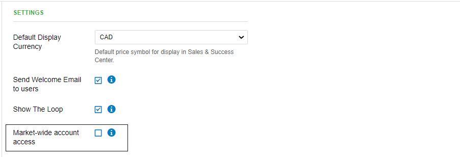
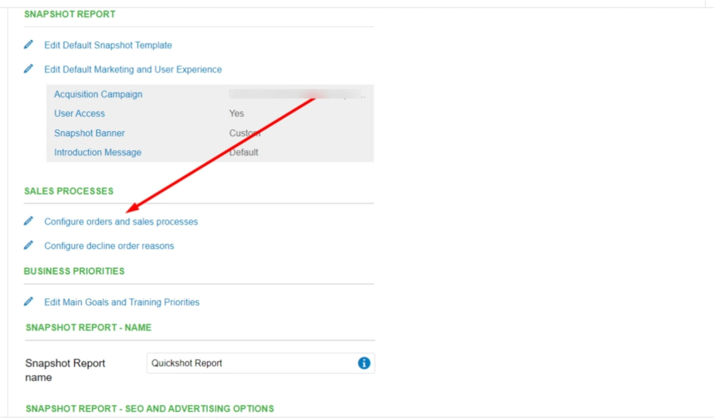
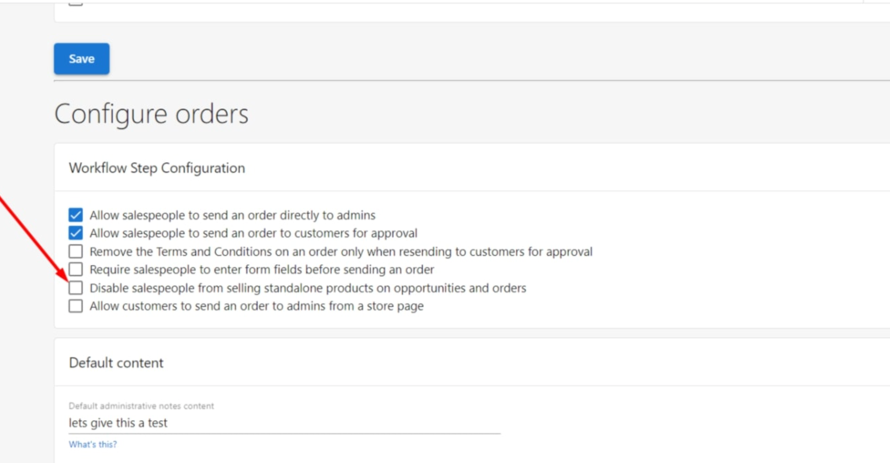
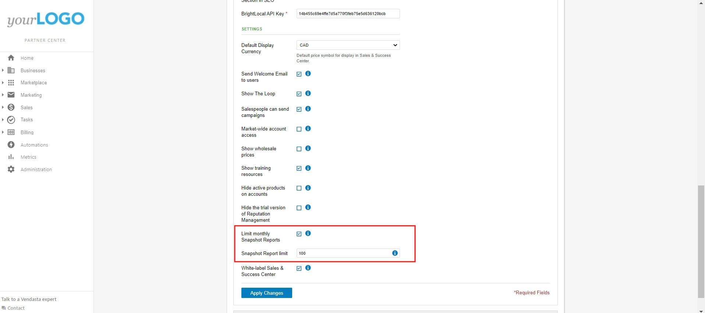
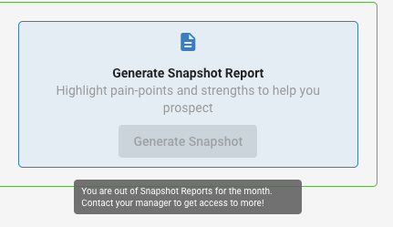

## What is Sales Team Management?

Sales Team Management provides comprehensive control over what your sales team can access, see, and do within the platform. You can configure different permission levels, control pricing visibility, manage reporting capabilities, and set specific restrictions to ensure your team operates within defined business parameters.

## Why is Sales Team Management important?

Proper sales team configuration protects sensitive business information while ensuring team members have the tools they need to be successful. You can maintain pricing confidentiality, prevent unauthorized actions, and scale team operations efficiently by setting appropriate access levels and restrictions.

## What's Included with Sales Team Management?

### Role-Based Access Control
- **Sales Manager permissions**: Full market access and administrative capabilities
- **Salesperson permissions**: Limited access based on assignments and market settings
- **Market-wide access settings**: Control account visibility across territories
- **Assignment-based restrictions**: Limit access to specifically assigned accounts

### Pricing and Product Controls
- **Wholesale pricing visibility**: Show or hide cost information from salespeople
- **Standalone product restrictions**: Control individual product sales capabilities
- **Product selection controls**: Manage which products team members can sell
- **Pricing protection**: Maintain confidential cost structures

### Communication and Marketing Permissions
- **Email campaign access**: Enable or disable marketing campaign capabilities
- **Client communication tools**: Control direct client interaction features
- **Campaign generation**: Manage who can create and send marketing materials
- **Marketing tool access**: Configure availability of promotional features

### Reporting and Analytics Limitations
- **Snapshot report limits**: Set monthly generation caps per salesperson
- **Report access controls**: Define what analytics team members can view
- **Usage monitoring**: Track report generation and team activity
- **Administrative overrides**: Maintain admin access regardless of restrictions

## How to Configure Sales Team Roles

### Understanding Role Differences

#### Sales Manager Capabilities
Sales Managers have enhanced access and administrative functions:
- **Market-wide account access**: Can see all accounts within their market regardless of assignment
- **Override restrictions**: Access accounts even when market-wide access is turned off
- **Administrative functions**: Configure team settings and manage permissions
- **Full reporting access**: Generate unlimited reports and view comprehensive analytics

#### Salesperson Capabilities  
Salespeople have focused access designed for day-to-day sales activities:
- **Assignment-based access**: Can only see accounts specifically assigned to them (when market-wide access is off)
- **Limited administrative access**: Cannot modify team settings or permissions
- **Restricted reporting**: Subject to monthly snapshot report limits
- **Controlled feature access**: Some features may be disabled based on configuration

### Configure Market-Wide Access Settings

Market-wide access determines whether salespeople can see all accounts in their territory:

1. Navigate to `Administration` > `Customize` > `Sales` > `Settings`
2. Locate the **Market-wide access** configuration
3. Enable to allow salespeople to see all market accounts
4. Disable to restrict salespeople to assigned accounts only
5. Save the configuration

:::info
Sales Managers always have access to all accounts in their market, regardless of the market-wide access setting. This ensures proper management oversight and administrative capabilities.
:::

## How to Control Pricing Visibility

### Hide Wholesale Pricing from Salespeople

To protect sensitive cost information while maintaining sales functionality:

1. Go to `Administration` > `Customize` 
2. Expand the **Sales** section
3. Scroll down to pricing controls
4. Toggle off **Show wholesale prices**
5. Save the changes

This setting prevents salespeople from seeing product costs while still allowing them to create quotes and process orders with standard pricing.

### Pricing Visibility Best Practices
- **Protect margins**: Hide wholesale pricing to maintain profit margins
- **Enable transparency**: Show pricing to Sales Managers for oversight
- **Monitor changes**: Track when pricing visibility settings are modified
- **Train team members**: Ensure salespeople understand pricing policies

## How to Configure Product and Campaign Permissions

### Enable Email Campaign Access

To allow salespeople to send marketing campaigns:

1. Navigate to `Administration` > `Customize` > `Sales`
2. Toggle on **Salespeople can send campaigns**
3. Configure any campaign-specific restrictions
4. Save the settings

This enables salespeople to create and send email marketing campaigns directly to their assigned accounts.

### Disable Standalone Product Sales

To require salespeople to sell complete packages rather than individual products:

1. Go to `Administration` > `Customize` > `Sales`
2. Click **Sales Processes**
3. Select **Configure orders and sales processes**
4. Disable standalone product sales for salespeople
5. Apply the changes

This ensures salespeople focus on selling comprehensive solutions rather than individual components.

## How to Manage Snapshot Report Limits

### Set Monthly Report Limits

To control how many Snapshot Reports each salesperson can generate monthly:

1. Navigate to `Administration` > `Customize` > `Sales`
2. Check **Limit monthly Snapshot Reports** under Settings
3. Enter the desired **Snapshot Report limit**
4. Configure limits for specific markets if needed
5. Save the configuration

:::warning
If you have customized markets, you'll need to adjust this setting for each market individually. Check the Markets section to see which markets won't be affected by the default change.
:::

### Report Limit Management
- **Complete restriction**: Set limit to 0 to disable report generation entirely
- **Monthly reset**: All limits reset at 12:00 AM UTC on the first of each month
- **Administrative access**: Admin-generated reports don't count toward salesperson limits
- **Campaign integration**: Report limits affect email campaigns that include report generation steps

### When Limits Are Exceeded

When a salesperson reaches their monthly limit, they'll see a notification preventing additional report generation:

## Frequently Asked Questions (FAQs)

What's the difference between a Sales Manager and a Salesperson?

Sales Managers have full market access and can see all accounts regardless of assignment or market-wide access settings. Salespeople can only see accounts assigned to them when market-wide access is turned off.

Can I completely disable Snapshot Report generation for salespeople?

Yes, you can disable Snapshot Report generation entirely by setting the monthly limit to 0. This prevents salespeople from generating any reports while maintaining admin access.

Do admin-generated reports count toward salesperson limits?

Reports generated directly from admin accounts don't count toward salesperson limits. However, if you're impersonating a salesperson, those reports will count toward their total.

How do snapshot report limits affect email campaigns?

Salespeople cannot add accounts to campaigns that include Snapshot Report generation steps if they've exceeded their monthly limit. Campaigns started from admin accounts are not affected.

When do monthly report limits reset?

All monthly limits reset at 12:00 AM UTC on the first day of each month. You can check the current UTC time to know exactly when limits will reset.

Can salespeople see wholesale pricing if I hide it?

No, when wholesale pricing is hidden, salespeople cannot see product costs. They can still create quotes and process orders using standard customer pricing structures.

What happens if I enable email campaigns for salespeople?

Salespeople will be able to create and send email marketing campaigns to their assigned accounts. They'll have access to campaign creation tools and templates within their permission level.

Can I set different snapshot report limits for different markets?

Yes, you can configure different monthly limits for each market. Navigate to the Markets section to set market-specific limits that override the default setting.

What products can salespeople sell if I disable standalone sales?

When standalone product sales are disabled, salespeople must sell products as part of complete packages or bundles. They cannot sell individual products separately.

How do I know which salespeople have reached their report limits?

You can monitor report generation through admin analytics and reporting features. Salespeople who reach their limits will receive notifications when attempting to generate additional reports.

## Screenshots or Videos

<iframe 
  src="https://drive.google.com/file/d/11_cFgRQLN_Ez6UMK45Tn2O0_yp96AaZI/preview" 
  width="640" 
  height="480" 
  allowFullScreen
></iframe>