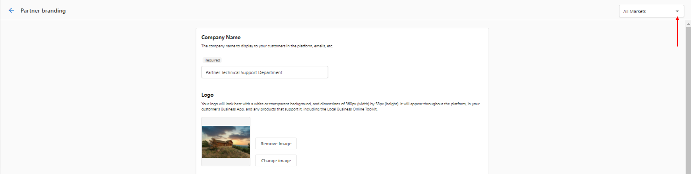
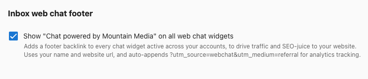

# Partner Branding

Vendasta is a white-label platform—you can brand it as your own with no mention of Vendasta. Your branding is used everywhere customers see the platform, including Business App and email campaigns.

**Where to customize**

- **Name and logos** – **Partner Center** → **Administration** → **Partner Branding**
- **Business App name** – **Partner Center** → **Accounts** → **Manage Business App** → **Customize Business App**

:::info
Some white-label options may depend on your [subscription](https://www.vendasta.com/pricing/).
:::

## Customizable brand elements

Under the **Partner Branding** tab you can configure:

- [Company Name](#company-name)
- [Theme](#theme)
- [Logo](#logo)
- [Favicon](#favicon)
- [Shortcut icon](#company-avatar--shortcut-icon)
- [Primary Color](#primary-color)

## Company Name

The name shown to customers on the platform and in emails. This field is required.

## Theme

Choose a theme (light or dark) for your team in Partner Center. This applies to the navigation only.

## Business App Theme

Set the default theme for customers in Business App (light or dark). **User System Default** matches each user's system settings; users can also change it in the app.

## Logo

Your logo appears wherever white-labeling is used, including in emails. Use versions that work in both light and dark mode; you can upload separate logos for each.

## Favicon

The small graphic in the browser tab for Business App, so users can tell your app apart from other tabs.

**Recommended size:** 16×16 px. **Format:** ICO only.

## Company avatar / Shortcut icon

The shortcut icon is used when users save Business App to their home screen on mobile, and for your company in Inbox chat.

**Recommended size:** 512×512 px. **Formats:** GIF, JPG, or PNG.

## Primary Color

Your brand color is used as an accent in the platform and in some client emails.

## Custom branding for markets

By default, **Partner Branding** settings apply to all markets. If a market has its own customization (under the **Markets** tab), Partner Branding changes may not apply to that market.

To customize by market: open the **All Markets** tab and select the market.

## Web Chat

You can add a footer to all client web chat widgets: "Chat powered by [Your Company Name]" with a link to your site, for SEO and lead generation. The link includes a UTM parameter so you can track engagement in Google Analytics.

**To enable:** **Partner Center** → **Accounts** → **Manage Business App** → **Customize Business App** → **Branding**, then enable **Show 'Chat powered by [Your Company Name]' on all web chat widgets**.

## Articles in this section

- **[Visual Branding and Identity](./visual-branding-and-identity.md)** – Logos, colors, favicon, login page options, multi-market branding, and FAQs

## Related articles

- [Customize text, buttons and translations](/administration/advanced/translate-customize/)
- [Customize Snapshot Reports](/snapshot-report/snapshot-report-customization)
- [Customize your email settings](/marketing/email-settings/update-email-settings)
