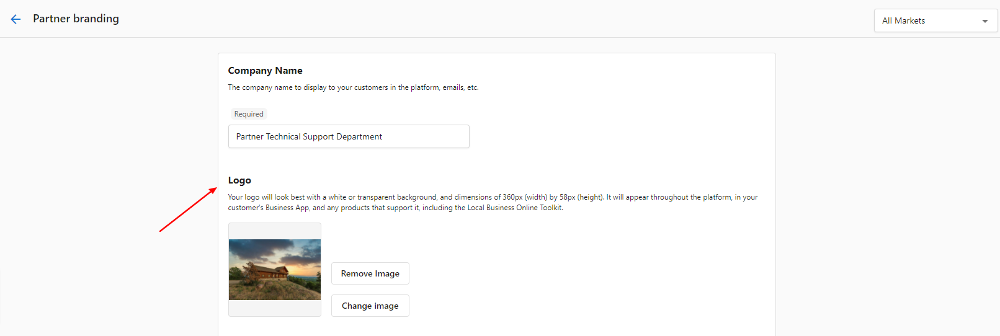
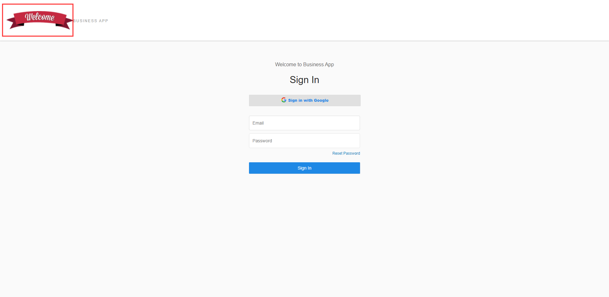
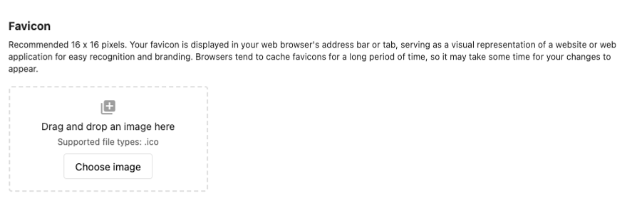
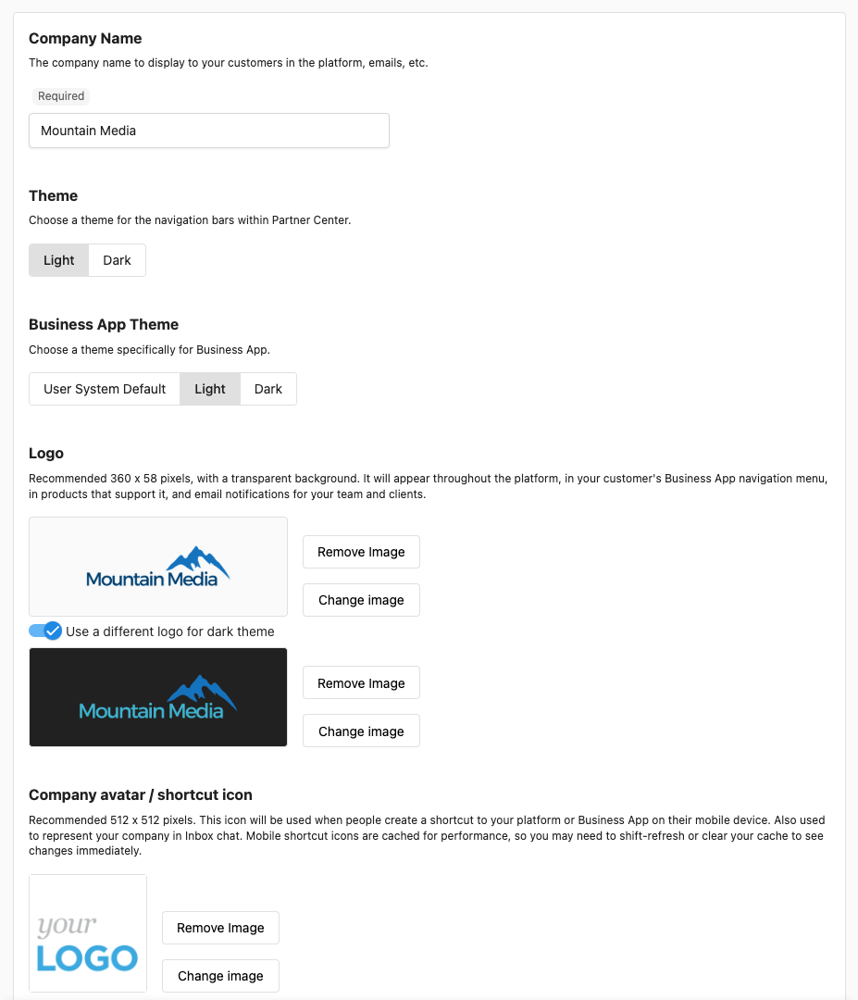

## What is Visual Branding and Identity?

Visual Branding and Identity allows you to customize your platform's appearance with your own logos, colors, company name, and visual elements. This white-label capability ensures your brand identity is consistently presented across all customer-facing aspects of the platform, including Business App, email campaigns, and client communications.

## Why is Visual Branding and Identity important?

Proper branding creates a unified, professional experience that reinforces your business identity. White-labeling removes external brand references and ensures clients see only your brand, building trust and maintaining consistency with your existing business presentation. This professional appearance enhances client confidence and supports business growth.

## What's Included with Visual Branding and Identity?

### Brand Identity Elements
- **Company name customization**: Replace default names with your business name
- **Logo management**: Upload and position logos across the platform
- **Color themes**: Set brand colors for consistent visual identity
- **Favicon configuration**: Add custom browser icons for professional presentation

### White-Label Capabilities
- **Complete brand replacement**: Remove external brand references entirely
- **Unified presentation**: Consistent branding across all platform areas
- **Customer-facing customization**: Branded experience in Business App and communications
- **Professional appearance**: Enhanced credibility and trust with clients

### Multi-Market Support
- **Market-specific branding**: Different visual identity for different business segments
- **Flexible logo options**: Generic or market-specific logos for login pages
- **Scalable brand management**: Organize branding across multiple territories or brands
- **Centralized control**: Manage all branding from one administrative interface

### Technical Implementation
- **File format support**: Specific requirements for optimal display
- **Resolution optimization**: Proper sizing for different display contexts
- **Browser compatibility**: Consistent appearance across devices and browsers
- **Quick implementation**: Changes take effect immediately across the platform

## How to Configure Basic Brand Identity

### Set Up Company Name and Primary Branding

To establish your primary brand identity:

1. Navigate to `Administration` > `Partner Branding`
2. Configure your **Company Name**:
   - Enter your business name exactly as you want it displayed
   - This appears in client communications and platform references
   - Ensure consistency with your existing business materials
3. Save the company name configuration

### Configure Color Theme

To establish visual consistency:

1. Access the **Theme** section in Partner Branding
2. Select or customize your brand colors:
   - **Primary colors**: Main brand colors for interface elements
   - **Secondary colors**: Supporting colors for highlights and accents
   - **Background colors**: Page and section background styling
3. Preview color changes before applying
4. Save the theme configuration

The color theme applies across all customer-facing areas of the platform, ensuring consistent brand presentation.

## How to Manage Logo Implementation

### Upload and Configure Primary Logo

To add your business logo:

1. Go to `Administration` > `Partner Branding` > `Logo`
2. Upload your logo file:
   - **Recommended formats**: PNG or JPG for optimal quality
   - **Size considerations**: High resolution for clear display across devices
   - **Background**: Transparent PNG recommended for flexible placement
3. Position and size the logo appropriately
4. Save the logo configuration

### Configure Market-Specific Branding

To set up different branding for multiple markets:

1. Access `Administration` > `Partner Branding`
2. Use the **All Markets** dropdown (top right) to select specific markets
3. Customize branding for each market:
   - **Market-specific logos**: Different logos for different business segments
   - **Individual color schemes**: Tailored themes per market
   - **Unique company names**: Market-appropriate business names
4. Save configurations for each market

This allows targeted branding while maintaining centralized management.

### Optimize Login Page Branding

To manage login page appearance:

1. Navigate to `Administration` > `Partner Branding` > `Logo`
2. Consider login page limitations:
   - **Login page branding**: Cannot be fully white-labeled
   - **Generic logo option**: Use generic logo for default market if using multiple markets
   - **Market transition**: Market-specific branding displays after login
3. Upload appropriate logo for login page display
4. Test login experience with different market configurations

:::info
While you cannot fully white-label the login page, using a generic logo for the default market allows market-specific branding to appear once users log into Business App.
:::

## How to Configure Favicon and Browser Icons

### Upload Favicon for Professional Presentation

To add custom browser icons:

1. Go to `Administration` > `Partner Branding` > `Favicon`
2. Prepare your favicon file:
   - **Required format**: ICO file type only (not PNG or JPG)
   - **Naming convention**: Use .ico extension (e.g., favicon.ico)
   - **Size recommendations**: 16x16 or 32x32 pixels for optimal display
3. Upload the ICO file
4. Verify favicon appears in browser tabs

### Troubleshoot Favicon Upload Issues

Common favicon problems and solutions:

**File Format Issues**:
- **Problem**: Upload fails with format error
- **Solution**: Ensure file uses .ico extension, not .png or .jpg
- **Conversion**: Use online ICO conversion tools if needed

**Size and Quality Issues**:
- **Problem**: Favicon appears blurry or distorted
- **Solution**: Use 16x16 or 32x32 pixel dimensions
- **Optimization**: Create clean, simple designs for small display size

**Browser Caching**:
- **Problem**: New favicon doesn't appear immediately
- **Solution**: Clear browser cache or test in private browsing mode
- **Patience**: Some browsers cache favicons for extended periods

### Configure Company Avatar and Shortcut Icon

To enhance brand recognition:

1. Access `Administration` > `Partner Branding`
2. Configure **Company Avatar**:
   - Upload square logo or icon for profile representations
   - Optimize for small display contexts (social media, contact listings)
   - Ensure clear visibility at reduced sizes
3. Set up **Shortcut Icon**:
   - Configure icon for mobile shortcuts and bookmarks
   - Test appearance on different devices and platforms
4. Save avatar and shortcut icon settings

## How Platform Branding Works Across Features

### Customer-Facing Brand Implementation

Your branding appears consistently across:

**Business App Experience**:
- Custom logos in navigation and headers
- Brand colors throughout the interface
- Company name in communications and notifications
- Favicon in browser tabs and bookmarks

**Email Campaigns and Communications**:
- Logo placement in email headers and footers
- Brand colors in email templates and designs
- Company name in sender information and signatures
- Consistent visual identity across all client communications

**Client Portal and Login Areas**:
- Branded login experience (with noted limitations)
- Market-specific branding after authentication
- Consistent visual presentation throughout client journey
- Professional appearance that builds client confidence

### Multi-Market Brand Management

When using multiple markets:
- **Centralized control**: Manage all market branding from one interface
- **Flexible implementation**: Different branding per market or unified approach
- **Seamless transitions**: Smooth branding changes as users navigate between markets
- **Scalable management**: Easy addition of new markets with appropriate branding

## Frequently Asked Questions (FAQs)

Can I completely white-label the platform?

Yes, the platform offers comprehensive white-labeling capabilities. You can replace logos, colors, company names, and most visual elements. Some limitations may apply based on your subscription tier.

Why is my favicon not uploading?

All favicons must be an ICO file. For example, instead of image.png or image.jpg, it must be image.ico. To add a favicon, navigate to **Partner Center > Administration > Partner Branding > Favicon**.

If you encounter an upload error, check the file type and try again. Common issues include:
- **Wrong file format**: Ensure the file uses .ico extension, not .png or .jpg
- **File size**: Keep favicon files small (typically 16x16 or 32x32 pixels)
- **File corruption**: Try recreating the ICO file using online conversion tools

If you are still experiencing an issue after checking the file format, contact support for additional assistance.

Can I customize the Business App login page?

You cannot white-label the Business App login page completely. However, if you are using multiple markets with different branding on each, you can use a generic logo for the default branding market. This will display the generic logo on the login page, and as soon as the user logs into Business App the market-specific branding will be shown within Business App.

To change the branding, go to **Administration** > **Partner Branding** > **Logo**. If you have multiple markets and would like to brand them differently, select another Market in the **All Markets** tab (top right of the same page) and customize accordingly.

How quickly do branding changes take effect?

Most branding changes appear immediately across the platform. Some elements like favicons may take longer to update due to browser caching.

What file formats work best for logos?

PNG files with transparent backgrounds work best for logos. Use high-resolution images for clear display across different devices and contexts.

Can I have different branding for different markets?

Yes, you can customize branding individually for each market using the market selector in Partner Branding settings. This allows targeted brand presentation for different business segments.

What happens if I don't set up custom branding?

Without custom branding, the platform displays default visual elements. Setting up branding creates a more professional, cohesive experience that reinforces your business identity.

Are there restrictions on branding based on subscription level?

Some white-labeling features may be limited based on your subscription tier. Check your plan details or contact support for specific feature availability.

How do I test branding changes before applying them?

Some branding settings offer preview options. It's recommended to test changes with a small group before applying them platform-wide to ensure optimal presentation.

What should I do if my branding isn't displaying correctly?

Check file formats, clear browser cache, and verify image sizes. If issues persist, contact support with specific details about the branding problems you're experiencing.

## Screenshots or Videos

The branding configuration interface provides real-time preview of changes. Test all branding elements across different devices and browsers to ensure consistent, professional presentation.

If you need assistance with visual branding and identity setup, please [submit a ticket](https://support.vendasta.com/hc/en-us/requests/new) to our support team.