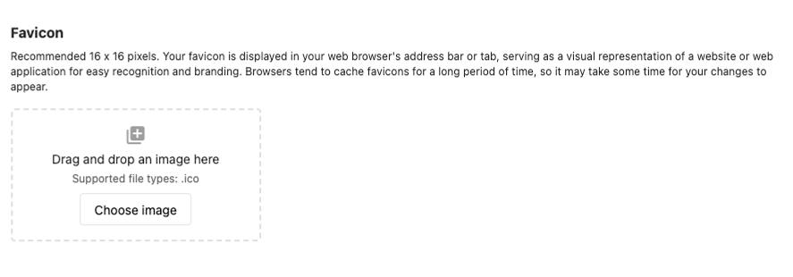

# Why is my favicon not uploading?

To add a favicon, navigate to **Partner Center > Administration > Partner Branding > Favicon.**

**Please note:** All favicons must be an ICO file. For example, instead of image.png or image.jpg, it must be image.ico. If you encounter this error, check the file type and try again. 

*If you are still experiencing an issue, reach out to [support@vendasta.com](mailto:support@vendasta.com).*