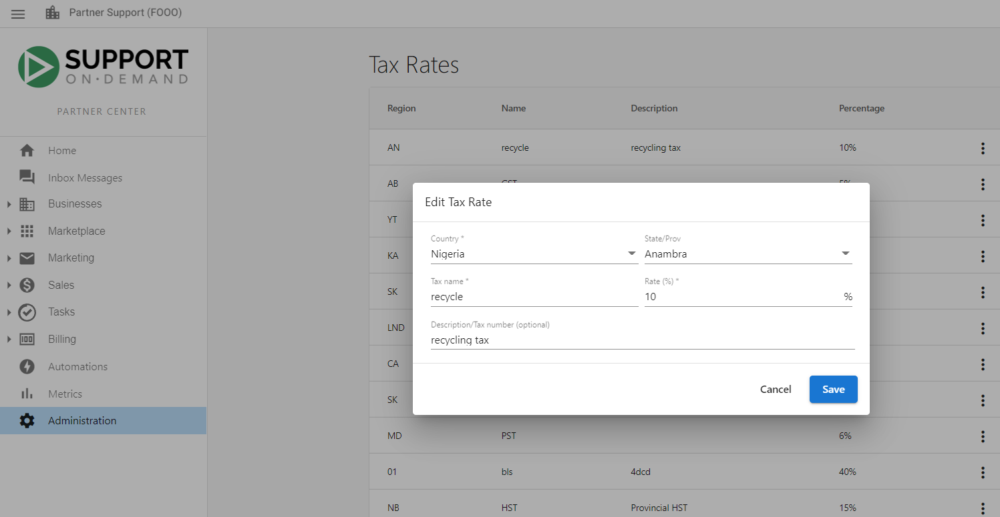

Setting tax rates allows users to collect taxes on invoices, invoice line items, [shopping cart](/manage-platform/shopping-cart) purchases, and sales orders. Partner Center admins can create and edit tax rates at any time. This article explains how users can edit their current tax rates on the platform.

### **Get started using tax rates**

- In your Partner Center account, click the **Administration tab** in the navigation bar.

- Navigate to the **Tax Rate** Tile.

- Click the **Kebab** menu to edit an existing **tax rate**.

- Enter the updated information in the **fields**.

- After updating the information in the fields, click **Save**.

[Back to the top ↑](#tax-rates)