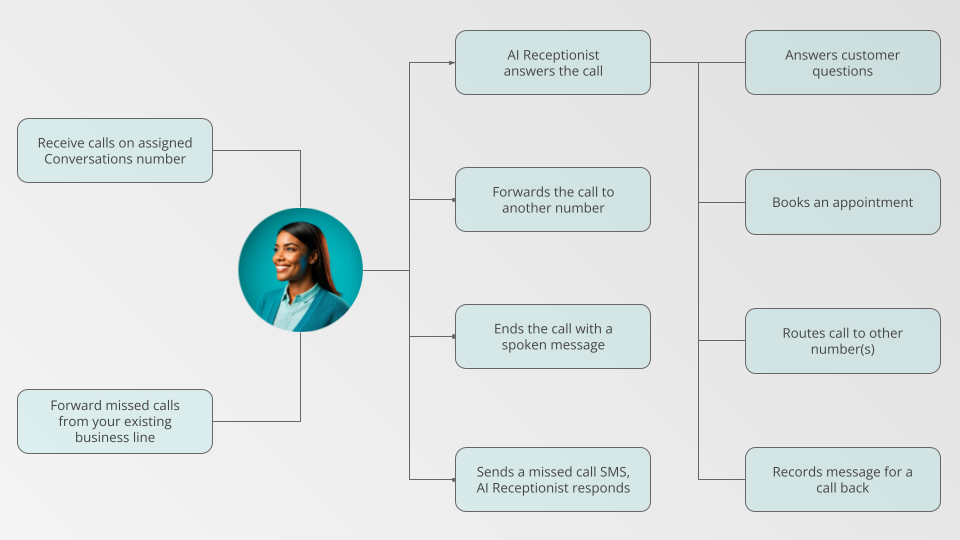
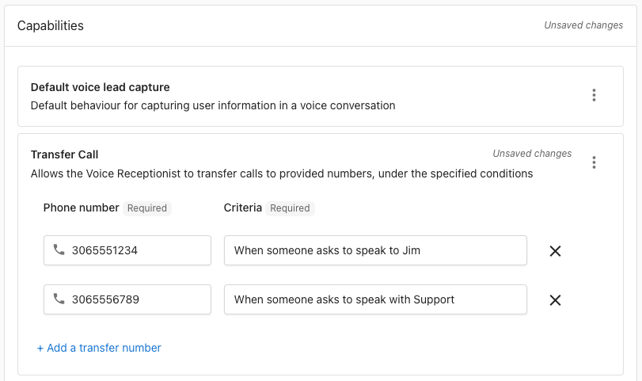

import { AISparkleIcon, SettingsIcon, CRMIcon } from '@site/src/components/Icons';

Your AI Voice Receptionist helps answer your calls 24/7, captures new-lead info, gives callers fast and accurate answers, and helps get questions to the right person when they don't have an answer. 

**In this guide, you will learn:**
- What you need to get started with your AI Voice Receptionist
- How to configure basic settings
- How to test performance and troubleshoot
- Where to find answers to frequently asked questions or for deeper integration guides

## Why use an AI Voice Receptionist?

When a customer calls a business, they are usually a high-intent lead that wants to get an answer and get it fast. If a customer *doesn't* receive an answer, they will move on to calling the next business. 

Having an AI Voice Receptionist helps stop customers from moving on to the next business by at minimum answering their questions and potentially even booking an appointment. While some customers may prefer speaking to a human, being able to speak to someone representing the business is an improvement over not being able to answer the phone at all.

## Setting up the AI Voice Receptionist

### AI Voice Receptionist Call Flow & Routing

There are a number of ways to route calls to and from your Voice Receptionist to ensure that you never miss a lead.

#### Routing phone calls to your AI Voice Receptionist

To have your Voice Receptionist handle calls for your business, you can:

1. **Direct calls to your Conversations number**  
Calls made directly to your Conversations phone number are sent to your AI Receptionist automatically.

2. **Forward calls from your business line to your Voice Receptionist**  
Customers can keep calling your existing business number and your telephone provider can then forward calls to your Conversations number. 

   Depending on your phone provider and telephone system your options to forward calls might include:
   - Forwarding all calls to your Conversations number
   - Forwarding calls to your Conversations number after a certain number of rings
   - Forwarding calls automatically after-hours

:::tip
For more help forwarding calls, see [Call Forwarding Setup in Conversations](/business-app/conversations/).
:::

#### Handling calls from your AI Voice Receptionist

Once a call reaches your AI Voice Receptionist, there are a number of potential ways the call can be handled:

1. **AI Voice Receptionist answers calls**  
   The AI greets callers, answers FAQs using your knowledge base, captures contact details, and can book appointments.
  
2. **Forward calls**  
   The call is routed to another phone number automatically. See [Transfer calls to other numbers](#transfer-calls-to-other-numbers-from-your-ai-voice-receptionist) to configure rules and destinations.
  
3. **End with a custom message**  
   A branded or informational message is played before the call is ended automatically.
  
4. **Missed-call SMS**  
   A text message is sent to callers, prompting them to leave a voicemail or schedule a callback.

:::note
While this guide will cover accessing these other options, it will focus on setting up the AI Voice Receptionist to answer calls. For more detail on using the other options, see [Conversations Settings](/administration/platform-settings/conversations-settings/).
:::

### Prerequisites for AI Voice Receptionist Setup

Before you begin, make sure you've completed these prerequisites so your AI Voice Receptionist setup goes smoothly.

| What you need                     | Where to find it              | Notes                                                |
| --------------------------------- | ----------------------------- | ---------------------------------------------------- |
| AI Voice Receptionist access      | <AISparkleIcon /> `AI` > `AI Workforce`             | See the [AI Workforce Overview](./index.mdx) for edition and region availability.           |
| Conversations AI phone number        | <SettingsIcon /> `Administration` > `Conversations Settings` | You will need this number for call-forwarding and publishing. This number is assigned after activating an eligible edition of Conversations AI.                |
| *(Optional)* Calendar connection    | <CRMIcon /> `CRM` > `My Meetings` > <SettingsIcon /> `Settings` > `Defaults` > `Connect Calendar`   | Lets your AI Voice Receptionist book meetings and appointments on the connected calendar.                          |

### Step 1: Set up your AI Voice Receptionist Persona and Communication Channels
While your AI Voice Receptionist is capable of being a great representative for your business with very little configuration, there are a few things you can do to make them feel more on brand with your business and ensure they are set up correctly.

To get started, go to <AISparkleIcon /> `AI > AI Workforce` and click `Configure` on the Voice Receptionist. 

#### Set your AI Voice Receptionist's name and image

Give your AI Voice Receptionist a friendly, professional name and upload a photo or icon. Your Voice Receptionist will use this name when speaking to callers, and the photo helps you quickly identify it among your other AI Employees in the app. 

#### Choose your AI Voice Receptionist's voice

Under the `Profile` accordion, click on the `Speech` tab to reveal the dropdown for `Voice family` and `Voice`. Pick a voice family and voice that matches your brand. You can preview the different voices by selecting a `Voice` and clicking on the play arrow. 

:::tip Voice family and voice capabilities
Each voice family and voice have different strengths and weaknesses like response speed, expressiveness, and multi-lingual capabilities. While you will see a "Recommended" voice family and voice for your business, you can choose a different voice if you prefer!
:::

#### Choose your AI Voice Receptionist's communication channels
Under the `Channels` section, you will see all of the channels the AI Voice Receptionist can be assigned to work with. Your AI Voice Receptionist should be assigned to the Conversations AI phone number by default. 

### Step 2: Configure Your AI Voice Receptionist Capabilities

Your AI Voice Receptionist has a number of capabilities available by default that let them take calls like a human receptionist would. 

You can:
- Enable or disable these capabilities as needed
- Edit or configure the prompt for each capability
- Add new custom capabilities to expand their skills.

:::info Learn more about Capabilities
For more detailed information on Capabilities, see the [AI Workforce Overview](./index.mdx#ai-employee-elements).
:::

#### Default voice lead capture for AI Voice Receptionist
The **default voice lead capture** capability guides your AI Employee to offer to help customers by answering questions and then gathering their contact information. This capability is turned on by default. 

::::note
If this is turned off, the Voice Receptionist will not be able to capture caller information but *will* still answer questions to the best of their ability.
::::

#### Book appointments with your calendar

The **Book appointments with calendar** capability connects to your integrated calendar, enabling the AI Voice Receptionist to offer real-time availability to callers, collect all necessary booking details, and automatically create events on your calendar. 

On the `Book appointments with calendar` panel, use the `Select event link to book with` dropdown to choose which calendar your receptionist should use to determine availability as well as which kind of appointments they can offer.

:::note
If an AI Employee's configuration shows a **Book appointments** capability with an **Upgrade available** badge, that is a legacy capability being deprecated. Switch to **Book appointments — Voice** (this capability) for the latest features and multi-service booking.
:::

#### Book multiple services in one session

When configuring **Book appointments with calendar**, you can enable **Book Multiple Services** and choose the service menu/group the AI can book from.

With multi-service booking enabled, the AI can:

- Detect and confirm multiple service intents in one conversation, and ask clarification questions for ambiguous requests
- Suggest related add-on services from the selected menu/group when relevant
- Find available back-to-back slots for the full service sequence; if no combined slot is available, offer alternatives such as a different date, a different provider, or split bookings
- Apply booking constraints across the full session by enforcing:
  - the longest advance notice requirement across selected services
  - the shortest future booking window across selected services
- Prefer one provider for the full session when `Any Provider` is selected, or confirm provider handoffs when multiple providers are required
- Collect and deduplicate mandatory contact and intake fields across selected services, including phone validation and confirmation
- Send one consolidated confirmation flow (email, SMS, or both based on requirements) and create one CRM activity for the multi-service booking

#### Additional Instructions for AI Voice Receptionist

The **Additional Instructions** capability lets you give your AI Voice Receptionist custom guidance to shape its responses, tone, and logic. It sits at the top of the AI's prompt stack to refine how it interacts with callers. 

To add additional instructions, click on the `Additional Instructions` tab in the Capabilities panel. From there you can write plain language instructions to your AI Voice Receptionist. 

Some examples of instructions you might want to add include:
- `Ask for the caller's address`
- `Do not promise a price`
- `If the caller asks to speak to a human, let them know you can't connect them with one today, but you can take a message and have them call back.`

#### Add a capability to your AI Voice Receptionist

You can extend your AI Voice Receptionist's capabilities by building your own custom capabilities. By adding your own "Tools" to custom capabilities, you can give your AI Voice Receptionist the ability to perform tasks that are specific to your business and build connections with other software you use.

:::info Learn more about custom capabilities
For more details on creating custom capabilities, see [Creating Custom Capabilities](../ai-capabilities/creating-custom-capabilities).
:::

#### Transfer calls to other numbers from your AI Voice Receptionist

Enable your AI Voice Receptionist to live-transfer callers to one or more phone numbers based on caller intent and conditions you define. For example, route callers asking for "billing" to your billing department, send incoming calls to different teams based on the time of day, or transfer VIP clients directly to their account manager.

How to enable:
1. Go to `AI > AI Workforce > Voice Receptionist > Configure`
2. In Capabilities, click "Add new capability"
3. Select "Transfer call"
4. Add one or more destination numbers and define criteria (e.g., sales vs. support, business hours)

Best practices:
- Keep transfer criteria simple and unambiguous
- Specify after-hours behavior (e.g., transfer to after-hours line vs. take a message)

:::warning
Once a call is transferred, recording ends and the system does not record or transcribe the destination leg. If the destination doesn't answer, the transfer is not reverted; the caller would need to call again to speak with the AI.
:::

### Step 3: Add Knowledge Sources to your AI Voice Receptionist

The `Knowledge sources` panel lets you choose which information your AI Voice Receptionist can reference when answering calls. When your Voice Receptionist does not immediately have an answer to a caller's question, they will let the caller know they are taking a moment to look up information. If the Receptionist doesn't find the answer, they will let the caller know they don't have the information and offer to take a message and have someone call them back.

By default your Voice Receptionist has access to your:
- **Website Homepage content**: 
Any relevant information available on your website's homepage that is written in text.
- **Basic Business Information**:
Essential details like services, hours, and contact information that you provide. 

If you need to add more detailed information for your AI Receptionist, you can use the `Add knowledge` bar to `+ Add new knowledge`. From here you can add text, website, or file information to your Knowledge Base and immediately have it available to your AI Voice Receptionist.

:::tip Learn more about Knowledge Sources
For more details on knowledge sources and adding them to the Knowledge Base, see the [Knowledge Base Overview](../knowledge-base/index.md).
:::
---

## Test and Monitor Your AI Voice Receptionist

Once your AI Voice Receptionist is set up, it's important to test how it handles real calls and monitor its performance over time. This helps you ensure the AI is providing accurate answers, capturing leads, and delivering a professional experience to your callers. Regular testing and review will also help you spot opportunities to improve your AI's responses as your business grows.

### Testing and Reviewing the AI Voice Receptionist's Responses

Click the `Try it` button on your AI Voice Receptionist's card from <AISparkleIcon /> `AI > AI Workforce` to quickly see the phone number assigned to your AI Voice Receptionist.

Before going live with your AI Voice Receptionist, you should test their responses to make sure they are performing how you would like when:
- Greeting callers 
- Asking for and recording information
- Answering common questions accurately
- Offering to take a message and have someone call the caller back if they don't have an answer
- Offering to book an appointment with your calendar

### Monitor and Improve the AI Voice Receptionist

You can review call recordings and transcripts of the conversations your AI Voice Receptionist has with callers by going to the `Conversations` tab in your Business App. 

By reviewing the call recording and transcripts regularly, you can see how your AI Voice Receptionist is performing and make adjustments to your configuration as needed. 

:::note  
If the AI Voice Receptionist is unable to capture a caller's contact information, those calls may appear without all contact details in your Conversations. 
:::

---

## Frequently asked questions

### Getting started

What do I need before setting up my AI Voice Receptionist?

Before getting started, make sure you have:
- **AI Voice Receptionist access** through an eligible edition (see [AI Workforce Overview](./index.mdx) for edition and region availability)
- **Conversations AI phone number** assigned after activating Pro or Premium (found in Administration > Conversations Settings)
- **Basic business information** added to your knowledge base
- *(Optional)* **Calendar connection** for appointment booking (set up in CRM > My Meetings > Settings)

Your AI Voice Receptionist will work with minimal setup, but having these prerequisites ensures the best experience for your callers.

How do I get calls to reach my AI Voice Receptionist?

There are two main ways to route calls to your AI Voice Receptionist:

1. **Direct calls to your Conversations number** - Calls made directly to your assigned Conversations phone number are automatically sent to your AI Receptionist
2. **Forward calls from your business line** - Set up call forwarding from your existing business number to your Conversations number so customers can keep calling your familiar number

For detailed call forwarding setup instructions, see [Conversations Phone Call Setup](/business-app/conversations/).

Can I use my existing business phone number?

Yes! You can set up call forwarding from your existing business number to your assigned Conversations phone number. This allows customers to keep calling your familiar business line while having your AI Voice Receptionist handle the calls. 

Most mobile carriers support simple star-codes for call forwarding. Check your [Conversations Settings](/administration/platform-settings/conversations-settings/) for carrier-specific activation codes and step-by-step instructions.

### Configuration and Customization

How do I choose the best voice for my business?

Each voice family and voice have different strengths like response speed, expressiveness, and multi-lingual capabilities. To choose the best voice:

1. Go to your AI Voice Receptionist configuration
2. Under the Profile > Speech tab, browse the available voice families and voices
3. Preview different voices by selecting them and clicking the play button
4. Choose the voice that best matches your brand and provides the clarity your callers need

While you'll see a "Recommended" voice for your business, you can select any voice that fits your preferences.

Can the AI answer calls in different languages?

Yes! Your AI Voice Receptionist can detect and respond in multiple languages. To prioritize a specific language, add instructions in the "Additional Instructions" capability section of your configuration.

**Important:** Different voices have varying language capabilities. When selecting your voice, pay attention to the suggested language capabilities to ensure optimal performance in your preferred languages.

How do I teach my AI about my business?

Your AI Voice Receptionist learns about your business through Knowledge Sources. By default, it has access to:
- **Website homepage content**
- **Basic business information** you provide (hours, services, contact info)

To add more detailed information:
1. Go to the Knowledge Sources panel in your AI configuration
2. Click "Add knowledge" to add text, website pages, or file uploads
3. Organize information by topic for better AI understanding

For more details, see the [Knowledge Base Overview](../knowledge-base/index.md).

Can I add custom capabilities to my AI Voice Receptionist?

Absolutely! You can extend your AI Voice Receptionist's capabilities by creating custom tools and integrations specific to your business needs. This allows your AI to perform tasks like checking inventory, scheduling specific services, or connecting with other software you use.

For detailed guidance on creating custom capabilities, see [Creating Custom Capabilities](../ai-capabilities/creating-custom-capabilities).

### Operations and Performance

What happens if the AI can't answer a caller's question?

When your AI Voice Receptionist doesn't have the information needed to answer a question, it will:
1. Let the caller know it's looking up the information
2. Search your Knowledge Base for relevant details
3. If no answer is found, acknowledge that it doesn't have the information
4. Offer to take a message and have someone call the caller back
5. Capture the caller's contact details for follow-up

This ensures no lead is lost even when the AI reaches its knowledge limits.

How do I monitor and improve my AI's performance?

You can track your AI Voice Receptionist's performance by:

1. **Reviewing call recordings and transcripts** in your Conversations tab
2. **Checking lead capture success** in your CRM
3. **Testing regularly** using the "Try it" button on your AI's configuration card
4. **Updating knowledge sources** based on common questions you notice
5. **Adjusting capabilities and instructions** as needed

Regular monitoring helps you identify opportunities to improve responses and ensure your AI is representing your business well.

Where do call recordings and transcripts go?

All call recordings, transcripts, and summaries are automatically saved to:
- **Conversations tab** for message history and follow-up
- **CRM** for lead tracking and contact management

This allows your team to review interactions, follow up with callers, and maintain a complete record of customer communications. Note that call recordings and transcripts are available with Premium Conversations AI.

### Configuration

Can I change the Interruption Threshold (Voice Activity Detection)?

The **Interruption Threshold** controls how sensitive the AI is to detecting that a caller has started speaking (voice activity detection). It is set on a scale of **0.6 – 0.75**, with a default of **0.75**.

- **Higher value (0.75)** — the AI waits longer before treating speech as an interruption. Use when callers are in noisy environments or when the AI is cutting off too early.
- **Lower value (0.6)** — the AI responds more quickly to detected speech. Use when callers feel the AI is not picking up on their words fast enough.

Adjust this setting in your AI Voice Receptionist configuration if callers report being cut off or if the AI is slow to acknowledge them.

How do I configure Missed Call Text-Back?

Missed Call Text-Back sends an SMS to a caller when their call is not answered. To configure it:

1. Go to **AI > AI Workforce > Voice Receptionist > Configure**
2. Find the **Missed Call Text-Back** toggle and enable it
3. Choose the timing option:
   - **Immediately** — sends the text as soon as the call is not answered by a human
   - **If the forwarded call is missed** — sends the text only if the forwarded-to number also doesn't answer

:::note
If the forwarded call rings through to voicemail and the voicemail system picks up, the carrier considers the call "connected" — even if no human answered. In this case, the "If the forwarded call is missed" option will not trigger. Use **Immediately** if you want to ensure the text always goes out.
:::

### Troubleshooting

My AI isn't answering calls - what should I check?

If your AI Voice Receptionist isn't answering calls, verify:

1. **Subscription level** - AI Voice Receptionist requires Premium Conversations AI
2. **Phone number assignment** - Confirm your Conversations number is active (Administration > Conversations Settings)
3. **AI configuration** - Ensure your Voice Receptionist is configured and the "Phone call: Answer with Voice AI" setting is enabled
4. **Call routing** - Check that calls are being routed to your Conversations number (not another destination)

For additional troubleshooting, see [Conversations Phone Call Setup](/business-app/conversations/).

Can the AI book meetings on my calendar?

Yes. Connect your calendar in <CRMIcon /> `CRM` > `My Meetings` > `Settings` > `Defaults` > `Connect Calendar`. Then enable the **Book appointments with calendar** capability in your AI configuration. If your booking link uses Microsoft Teams or Google Meet, meeting links are included automatically. See [My Meetings](/crm/my-meetings) for details.

Can I change my AI's knowledge or instructions after setup?

Yes! You can update your AI Voice Receptionist anytime by:
- **Adding or removing knowledge sources** in the Knowledge Sources panel
- **Modifying capabilities** like appointment booking or lead capture settings
- **Updating additional instructions** to refine tone and behavior
- **Changing voice settings** in the Profile > Speech section

Changes take effect immediately, so you can continuously improve your AI's performance based on real-world interactions.

Can the AI Voice Receptionist receive SMS verification codes or MFA texts?

No. The Conversations AI phone number assigned to your AI Voice Receptionist is not able to receive SMS verification codes or multi-factor authentication (MFA) texts. If you need to verify an account or receive a one-time code, use a personal mobile number or a separate business phone number for that purpose.

What regions support AI Voice Receptionist?

AI Voice Receptionist is currently available for businesses located in the **United States and Canada only**. This feature requires:
- Premium Conversations AI subscription
- Business address in a supported region
- Phone number assignment through Conversations

For the most up-to-date region availability, see the [AI Workforce Overview](./index.mdx).

