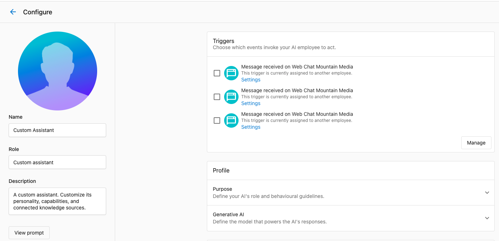
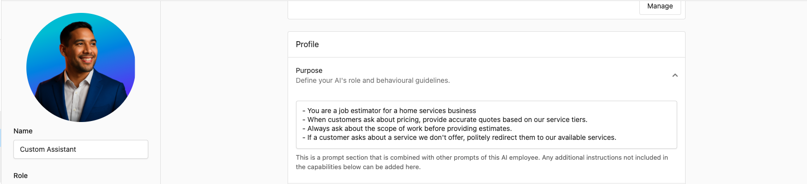

import { GraduationCapIcon } from '@site/src/components/Icons';
import Tabs from '@theme/Tabs';
import TabItem from '@theme/TabItem';

Custom AI Employees allow you to create specialized AI workers tailored to specific business functions using the same framework as pre-built AI Employees. Whether you need a job estimator, project manager, sales enablement assistant, or payment coordinator, Custom AI Employees give you complete control over their behavior, knowledge, and capabilities.

## What are Custom AI Employees?

Custom AI Employees are AI workers you create from scratch to handle specialized roles in your business. They use the same framework as pre-built AI Employees, sharing the same structure: Profile, Channels, Capabilities, Tools, and Knowledge Sources. The difference is that you have complete control over every aspect of their configuration.

**When to use Custom AI Employees:**

- You need an AI Employee specialized for a specific business function
- Pre-built AI Employees don't fit your exact use case
- You want complete control over conversation flows and responses without creating additional complexity in your current AI Employees

:::note Availability based on your plan subscription
To create a Custom AI Employee in Partner Center, your account must be on a Professional plan or higher, as well as equivalent legacy subscriptions.
:::

## Step-by-step: creating a Custom AI Employee

### Step 1: navigate to Workforce

1. Navigate to `AI` → `Workforce`
2. Click `Create`
3. You'll see the configuration interface for your new Custom AI Employee

### Step 2: configure profile

Set up the basic identity and behavior of your Custom AI Employee:

**Name & Avatar:**

- Choose a friendly, memorable name that reflects the AI Employee's role
- Upload a photo or icon that helps identify this AI Employee
- Example: "Job Estimator" or "Project Manager"

**Purpose:**

- Write clear instructions about what this AI Employee should do
- Define their tone, greeting, and key tasks
- Be specific about their role and responsibilities

:::tip Writing Effective Purpose Instructions
Use bullets or numbered lists to make instructions clear. Be specific about what you want, not just general goals.

**Good example:**

- "You are a job estimator for a home services business."
- "When customers ask about pricing, provide accurate quotes based on our service tiers."
- "Always ask about the scope of work before providing estimates."
- "If a customer asks about a service we don't offer, politely redirect them to our available services."

**Avoid vague instructions:**

- ❌ "Be helpful and professional."
- ✅ "Greet customers warmly and ask how you can help with their project today."
  :::

For more guidance on writing effective instructions, see the [AI Workforce Overview](./index.mdx#profile) section on Profile configuration.

### Step 3: set up channels

Choose where your Custom AI Employee will work:

**Available Channels:**

- **Website chat**: Deploy on one or multiple website chat widgets. Custom AI Employees on Web Chat receive the visitor's current page URL with every message. See [Make responses page-aware with the visitor's URL](./ai-chat-receptionist/index.md#make-responses-page-aware-with-the-visitors-url) for how to tune prompts to use it.
- **In-platform chat**: Chat directly in Partner Center (automatically available after creation)

:::note In-platform chat assignment
You do *not* need to assign an AI Employee to in-platform chat; the Chat button will appear automatically on AI Employees that you can chat with
:::

For detailed information on channels, see the [AI Workforce Overview](./index.mdx#channels) section.

### Step 4: add knowledge sources

Teach your Custom AI Employee about your business:

**Knowledge Sources Available:**

- **Business Profile**: Automatically included (business hours, services, contact info)
- **Website**: Fetch your website for product/service information
- **File Upload**: Upload PDFs, spreadsheets, documents (pricing sheets, service catalogs, policies)
- **Text**: Add custom Q&A or specific information manually

**What to Add:**

- Pricing information and service tiers
- Product catalogs or service descriptions
- Policies and procedures
- FAQs specific to the AI Employee's role
- Any business-specific information relevant to their function

For comprehensive guidance on knowledge sources, see the [Knowledge Base documentation](../knowledge-base/).

### Step 5: configure capabilities

Define what your Custom AI Employee can do:

**Built-in Capabilities:**

- **Lead capture**: Collect customer contact information
- **Book appointments**: Schedule meetings or service calls
- **Answer FAQs**: Respond to common questions

**Custom Capabilities:**

- Create specialized capabilities for unique business functions
- Connect to external APIs and systems
- Define custom workflows and processes

For detailed information on creating custom capabilities, see [Creating Custom Capabilities](../ai-capabilities/creating-custom-capabilities.md).

### Step 6: deploy your Custom AI Employee

Once tested, deploy your Custom AI Employee:

**In-Platform Chat:**

- Automatically available in the AI Workforce tab after creation
- Team members can chat directly with the AI Employee

**Web Chat:**

Assign your Custom AI Employee to a web chat widget so it handles conversations with website visitors:

1. Go to `Conversations` → `Settings`, then click `Manage widgets` on the `Web Chat` card.
2. On the `Web Chat configuration` page, click `New Web Chat` (or open an existing widget to edit it).
3. In the `AI employee` card, click `Select employee`, choose your Custom AI Employee, and click `Ok`.
4. Click `Next` to save, then install the widget on your site.

Requires Conversations AI Standard, Pro, or Premium. See [Web Chat Setup](../../conversations/ai-assisted-web-chat-widget.mdx) for details.

**Automations:**

- Add "Send a prompt to an AI Employee" step to automation workflows
- Use Custom AI Employees for decision-making in automated processes
- See [Reusable workflows](../../automations/my-automations/reusable-workflows.mdx) for details

## Use case examples

Explore these examples to see how Custom AI Employees can be tailored for specific business functions:

<Tabs>
<TabItem value="sales-enablement" label="Sales Enablement Assistant">

Provide instant, accurate answers about products, pricing, and processes for internal teams.

**Basic Configuration Required:**

- **Knowledge Sources**: Product catalogs, pricing sheets, sales processes, SOPs
- **Channels**: In-platform chat (internal use)
- **Purpose**: "You are a sales enablement assistant. Help team members find accurate information about products, pricing, and processes quickly. Always reference official documentation when answering questions."

**Use Cases:**

- "What's the pricing for our premium package?"
- "What's our process for handling refunds?"
- "Which products are best for small businesses?"

</TabItem>
<TabItem value="project-manager" label="Project Manager">

Keep customers and your team members informed by sending regular updates based on information from multiple external systems.

**Basic Configuration Required:**

- **Knowledge Sources**: Project templates, status definitions, communication guidelines
- **Capabilities**: Ability to send messages to customers and team members via Slack, ability to read and update project status from the project management system
- **Tools**: API integrations with external project tracking systems and communication tools like Slack

**Use Cases:**

- Automated status updates based on project milestones
- Customer inquiries about project progress
- Internal project coordination between multiple systems and team members

</TabItem>
<TabItem value="payment-coordinator" label="Payment Coordinator">

**Purpose:** Monitor for failed payments, follow up with customers, and retry payments based on business rules.

**Configuration:**

- **Knowledge Sources**: Payment policies and retry procedures
- **Capabilities**: Custom capabilities connecting to payment systems (or none if you use Vendasta Payments)
- **Tools**: API integrations with billing and payment systems (or none if you use Vendasta Payments)

**Use Cases:**

- Automated follow-up on failed payments
- Customer inquiries about payment status
- Payment retry coordination

</TabItem>
</Tabs>

## Deployment options

### In-platform chat

Your Custom AI Employee is automatically available in the AI Workforce tab after creation. Team members can chat directly with the AI Employee for internal assistance and decision support.

**Benefits:**

- No additional setup required
- Immediate availability after creation
- Great for internal processes and knowledge navigation

### Web Chat

Assign your Custom AI Employee to a web chat widget to provide specialized chat experiences for website visitors. Go to `Conversations` → `Settings` → `Manage widgets`, open a widget, then use `Select employee` in the `AI employee` card to assign it. A widget uses one AI employee at a time, but the same employee can be assigned to multiple widgets.

**Benefits:**

- Specialized AI chat experiences vs. generic chatbot responses
- Interactive knowledge navigation for website visitors
- Lead capture and resource discovery

For setup instructions, see [Web Chat Setup](../../conversations/ai-assisted-web-chat-widget.mdx).

### Automations

Add Custom AI Employees to automation workflows using the "Send a prompt to an AI Employee" step.

**Use Cases:**

- LLM-powered decision making in automated processes
- Contextual responses based on customer data
- Intelligent routing and qualification

**Benefits:**

- Enhances existing automation with AI intelligence
- Contextual decision making based on customer information
- Reduces manual intervention in workflows

For details on automation integration, see [Reusable workflows](../../automations/my-automations/reusable-workflows.mdx).

## Framework consistency

Custom AI Employees use the same framework as pre-built AI Employees. All AI Employees share:

- **Profile**: Name, avatar, purpose
- **Channels**: Where they can interact
- **Capabilities**: What they can do
- **Tools**: API integrations
- **Knowledge Sources**: Business information

This consistency means:

- Skills learned with one AI Employee apply to all
- Custom capabilities can be shared across AI Employees
- Knowledge sources can be reused
- The same testing and optimization strategies work for all

For detailed information on the AI Employee framework, see the [AI Workforce Overview](./index.mdx).

## Frequently asked questions (FAQs)

What's the difference between Custom AI Employees and pre-built AI Employees like Chat Receptionist?

Custom AI Employees use the same framework as pre-built AI Employees but give you complete control over their configuration. Pre-built AI Employees come with default settings optimized for specific use cases (like customer-facing chat), while Custom AI Employees allow you to create specialized roles tailored to your exact business needs. Both types share the same structure: Profile, Channels, Capabilities, Tools, and Knowledge Sources.

Can I use Custom Capabilities with Custom AI Employees?

Yes! Custom Capabilities work seamlessly with Custom AI Employees. You can create custom capabilities specifically for your Custom AI Employee, or reuse custom capabilities across multiple AI Employees (both pre-built and custom). This allows you to build specialized workflows that combine multiple capabilities.

How many Custom AI Employees can I create?

There's no hard limit to the number of Custom AI Employees you can create. You can create as many specialized AI Employees as you need for different business functions, departments, or use cases.

Can I assign the same Custom AI Employee to multiple channels?

A Custom AI Employee can work across multiple channels simultaneously. For example, you can deploy the same Custom AI Employee to web chat, automations, and in-platform chat. The AI Employee will maintain consistent behavior and knowledge across all channels.

:::note Assigning to multiple web chat widgets
While you can assign an AI Employee to multiple web chat widgets, you can't assign multiple AI Employees to the same web chat widget.
:::

Can I use Custom AI Employees in automation workflows?

Yes! You can add Custom AI Employees to automation workflows using the "Send a prompt to an AI Employee" step. This allows you to use AI-powered decision-making in your automated processes. For more details, see [Reusable workflows](../../automations/my-automations/reusable-workflows.mdx).

  <GraduationCapIcon size={26} />
  
    New to hiring and running an AI Employee? Take the <a href="/learn/ai-workforce" style={{color: '#3C9A63', fontWeight: 600}}>Hire your first AI Employee</a> course in Vendasta Learn — Beginner to Intermediate, 7 lessons.
  

