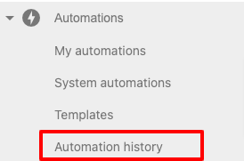
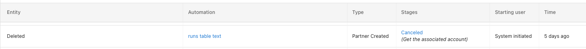
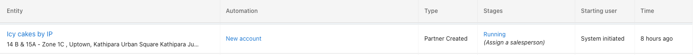
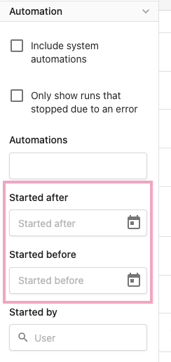

# Automation History

## What is Automation History?

Automation history provides a log of your platform's automation history. This feature allows you to review and troubleshoot failed automation activities or runs.

You can access **Automation History** in Partner Center under the main **Automations** tab > Automation history.

> **Note:** Each automation history entry in the table represents a single automation run (run_id).

## Exploring the Automation History Table

The Automation History table presents details of your automation processes. You can use filters to include system automation runs for a comprehensive view. Below is an overview of the table's columns:

### Columns in the Automation History Table

- **Entity** – Displays the type of object the automation step ran on (e.g., Contact, Company, Sales Order, User, or Account Group).

- **Entity Type** – Helps users quickly identify the kind of entity associated with the automation.

- **Automation** – Shows the name of the automation.

- **Type** – Identifies whether the automation was created by you (Partner) or is a System Automation.

- **Stages** – Indicates the status of an automation run, showing either its current stage or the last completed step if canceled.

- **Starting User** – Displays the user who initiated the automation.

- **Time** – Provides the timestamp for the automation's last step. Hover over this field to see the exact date and time in your browser's standard time format.

## Stages in the History Table

Each automation run is assigned a stage that represents its current status:

- **Unknown** – The automation has likely been deleted.

- **Deleted** – The automation or related entities have been removed.

- **Completed** – The automation history entry successfully finished.

- **Canceled** – The automation history entry was canceled. The table shows which step it reached before cancellation.

- **Running** – The automation is currently in progress, and you can view its steps in real time.

> **Note:** At this time, there is no specific stage for Archived Orders.

## Available Filters for Automation History

To help refine your search and find specific automation runs, you can use the following filters:

### Automation Filters

- **Include System Automation** – Adds system automation runs to the results. (This is not a filter to view only system automation runs.)

- **Only Show Runs That Stopped Due to an Error** – Filters automation runs that encountered an error and stopped.

- **Automations Search** – Lists all currently active automations.

> **Note:** This does not filter system automation.

### Entity Filters

You can also search for automation runs by entity type. Available entity filters include:

- Contacts

- Companies

- Accounts

- Users

- Order IDs

### Time Filter

Find automation histories for a given period of time, allowing you to narrow down results based on when the automation was executed.

### Starting User Filter

Filter automation runs by the user who initiated them.

For further assistance with Automation History, please reach out to our support team.