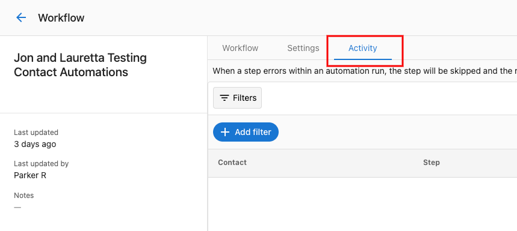
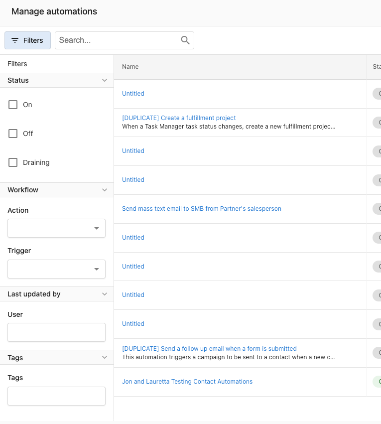
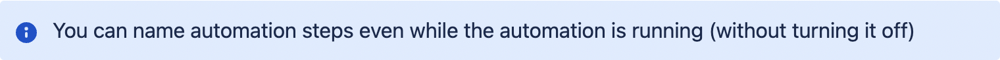

# Managing your automations

Once an automation is turned on, use the **Activity** tab on the automation to see each run, diagnose errors, and retry failed runs.

## Automation activity

The Activity tab lists every run of the automation, including errors.

### Activity filters

Filter the activity list to narrow down what you're looking at:

- **Date range** — when the activity occurred
- **Automation** — filter to a specific automation
- **Status** — success, error, in progress, or waiting
- **Business** — filter to a specific business or account

#### Filter by company

The Company filter requires a **Company ID**, not the company name. Entering a company name will return no results.

To find a Company ID:
1. Go to **Partner Center** → **CRM** → **Companies** and open the company.
2. Look at the browser URL: `.../companies/76543/details` — the number is the Company ID.
3. Enter that number in the Company filter.

#### Adjusting the date range

Filters only return results within the selected date range. If an expected run isn't showing up, extend the date range to cover the period when the automation ran — the default window may not include older activity.

:::tip
Filters are case-sensitive and will not match if there are leading or trailing spaces in the field. If you're not seeing results you expect, verify the ID is entered exactly and the date range is wide enough.
:::

### Activity statuses

Each run shows one of these statuses:

| Status | Meaning |
|--------|---------|
| **In progress** | The automation is currently running through its steps. |
| **Waiting** | The automation is paused — for example, waiting for a delay step to finish or an event to occur. |
| **Completed** | The automation finished successfully. |
| **Completed from goal** | The automation finished because it reached a defined goal. |
| **Completed from error** | The automation finished after encountering and recovering from an error (error handling set to **Continue**). |
| **Continued from error** | The automation hit an error on a step but continued to the next step (error handling set to **Continue**). |
| **Error** | The automation hit an error and stopped (error handling set to **Stop**). See [Creating and configuring automations](../my-automations/creating-and-configuring-automations.mdx) for error handling settings. |
| **Canceled** | The run was manually canceled or stopped by the system. |
| **Did not run** | The automation was triggered but didn't execute. See the reasons below. |

### Why an automation "did not run"

When the Activity tab shows **Did not run**, the reason tells you why:

| Reason | What happened |
|--------|---------------|
| **Run type** | The automation's entry setting prevented this run — for example, it's set to **Only once per account** and has already run for this account. |
| **One at a time** | The automation is set to **One at a time per account** and another run is already in progress for this account. The trigger was dropped. |
| **Rate limited** | The automation exceeded the platform's rate limit (50 runs per minute). Try again shortly. |
| **Trigger filters failed** | The trigger's conditions didn't match the event data — for example, the account didn't have the required tag. |
| **Trigger choices failed** | The trigger's choice logic (conditional branching on the trigger) didn't match. |
| **Task definition choices failed** | A step's pre-condition check failed before the workflow could start. |

## Error handling

### View errors

Errors appear in the Activity tab with an **Error** status. The row includes a short description of what went wrong.

Click the row to see details:

### Retry a failed run

If an automation fails, you can retry the run from any step. Click **Retry** on the failed activity:

Then pick the step to retry from:

Use this to fix the underlying issue and resume the run without restarting it from the beginning.

## Related resources

- [Creating and configuring automations](../my-automations/creating-and-configuring-automations.mdx) — entry settings, error handling, timezone
- [Troubleshooting automations](./troubleshooting-automations.mdx) — common issues and fixes
- [Automations overview](../index.mdx)
