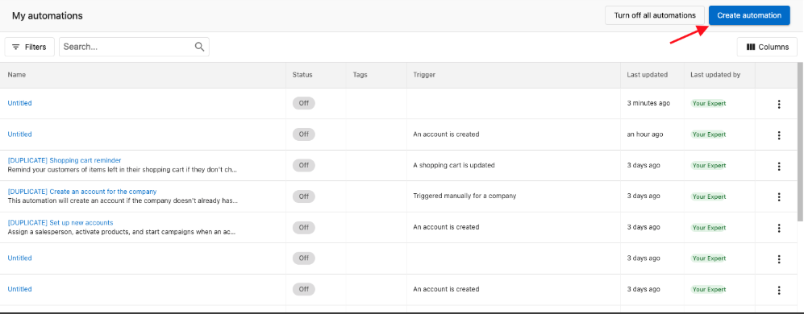
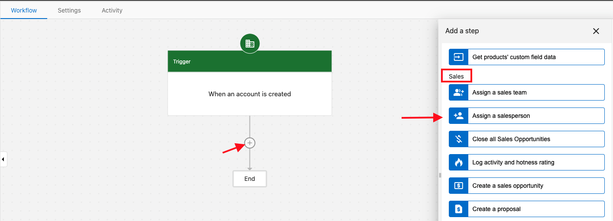

# Automation Templates Overview

Templates are pre-built automation workflows you can customize for your own use. They're the fastest way to get up and running, especially for common scenarios like onboarding, lead nurturing, and sales follow-up.

The full, up-to-date list of templates lives in [Partner Center](https://partners.vendasta.com/automations/create-from-template). This page covers the basics of using templates and walks through a handful of featured ones.

## Use a template

1. Go to **Partner Center** → **Automations**.
2. Click **Create automation**.
3. Browse the available templates.
4. Click **Use template** on the one you want.
5. Customize the trigger, conditions, and steps for your use case.
6. Test the automation, then toggle it **On**.

## The blank template

<iframe src="https://www.loom.com/embed/5c55090e160e4de5bdf40f4d75363c64" width="100%" height="400px" frameborder="0" allowfullscreen></iframe>

The blank template is a clean canvas — pick a trigger and add steps from scratch. Use this when no pre-built template matches, or when you want full control over the workflow.

See [Automations overview](./index.mdx), [Automation triggers reference](./automation-triggers-reference.mdx), and [Automation steps reference](./automation-steps-reference.mdx) for the building blocks.

## Featured templates

### Auto-assign a salesperson to new accounts

Automatically assign a specific salesperson (or a member of a sales team) to every account that gets created.

**Setup:**

1. Go to **Partner Center** → **Automations** → **Create automation** and select **Blank Template**.

   

2. Under **Start the automation when**, select **An account is created** and click **Save**. Add conditions only if you want to limit which accounts trigger the automation.

   

3. Click the **+** under the trigger, scroll to **Sales**, and select **Assign a salesperson** (or **Assign a sales team** for round-robin assignment across a team).

   

4. Pick the salesperson (or team) and click **Save**.
5. Toggle the automation **On**.

### Recurring sales task

Creates a recurring sales task on weekdays from 9 AM to 5 PM, every 30 days, for a full year.

**Customize:**

- Change how often the task is created by editing the number of days in the delay step.
- Adjust how many times it repeats by modifying the **Jump to a step** action at the end.

### Segment accounts into lists

<iframe src="//www.loom.com/embed/827c9de749924ef689257afebd418dcf" width="560" height="315" frameborder="0" allowfullscreen></iframe>

When an account is created, segment it into one of three lists based on whether the business is in a target market.

**Setup:**

- Create the lists your accounts will be sorted into.
- Define the target-market criteria (location, custom fields, tags).

### AGOGE task sequence on company

Triggered manually. Creates an opportunity on the company (if one isn't already open), then creates tasks on days 1, 3, 4, 7, 10, 14, 17, 19, and 24 following the AGOGE methodology. Sends reminders to the assigned salesperson if tasks aren't completed within 1 day, up to 5 times.

**Prerequisites:**

- A sales pipeline set up for opportunities.
- A product or package associated with the opportunity.

The automation stops when no open opportunities remain or when tasks aren't completed within 5 days.

### Nurture cold leads

<iframe src="//www.loom.com/embed/1a8fedb03683462588554cd0ce24a0e5" width="560" height="315" frameborder="0" allowfullscreen></iframe>

Put a cold lead into a list, send a starter email campaign, and based on engagement, either send a Snapshot Report campaign or mark the lead as disengaged.

**Setup:**

- Create lists for Cold Leads, Warm Leads, and Disengaged contacts.
- Publish two email campaigns: the starter and the Snapshot Report follow-up.
- Have at least one salesperson created.

:::note
Standard rates apply for Snapshot campaigns beyond your allocation.
:::

### Systematize your sales process

<iframe src="//www.loom.com/embed/8be38913796d441aa073f3f307732f07" width="560" height="315" frameborder="0" allowfullscreen></iframe>

When an account is added to a list, automatically create an opportunity and a sales task so your team runs a consistent process without manual setup.

**Setup:**

- A list for accounts requiring sales outreach.
- An email campaign for post-contact follow-up.

## Related resources

- [Partner-made automation templates](./partner-made-automation-templates.mdx) — build templates for your clients to use
- [Automations overview](./index.mdx)
- [Creating and configuring automations](./creating-and-configuring-automations.mdx)
- [Automation triggers reference](./automation-triggers-reference.mdx)
- [Automation steps reference](./automation-steps-reference.mdx)
