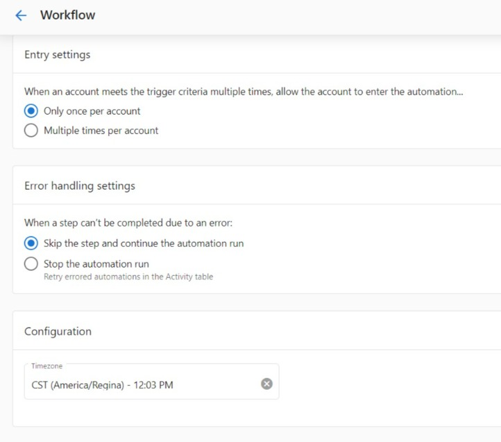
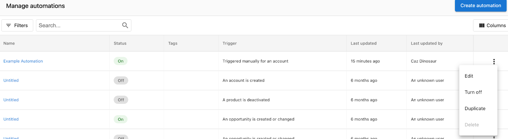
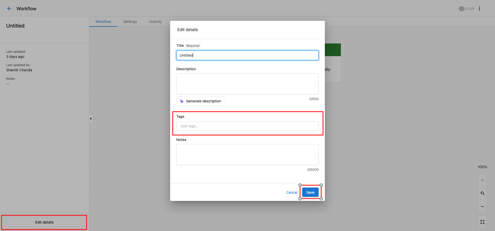
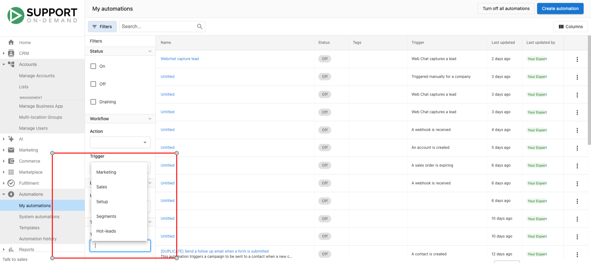
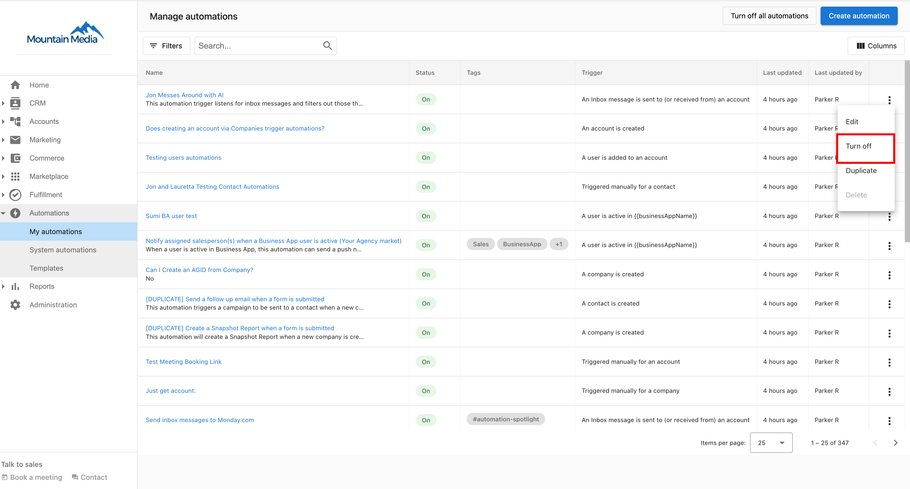
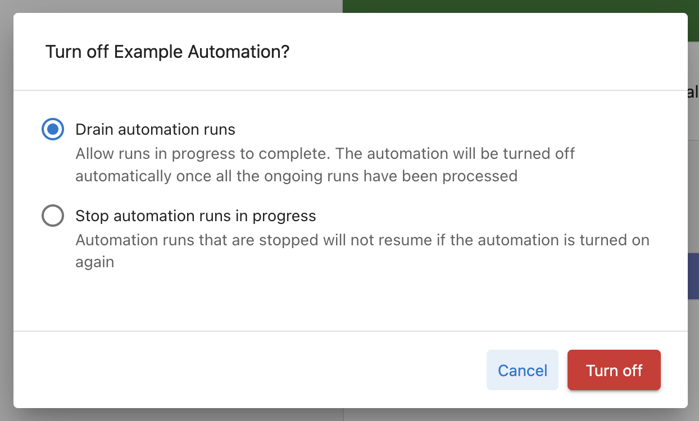

# Creating and configuring automations

This guide covers the complete process of creating automations and configuring their advanced settings to ensure they work exactly as you need them to.

## Automation settings

Several settings can be configured for each automation you create. You can access these settings in the **Advanced** section of the left menu in your automation.

### Entry settings

Many trigger events and conditions can be met multiple times. For example, **A customer makes a payment** trigger with the trigger options set to **Succeeds or fails** will fire each time a customer attempts to pay for an invoice or shopping cart purchase. The entry settings allow you to specify how often the automation should run when the trigger fires.

**Options:**

- **Only once per account** — The automation runs a maximum of one time per account, ever. Once it has run for an account, that account is excluded from all future runs, even if the trigger fires again. Use this for one-time onboarding flows or welcome sequences.
- **One at a time per account** — Prevents concurrent runs for the same account. If a second trigger fires while a run is already in progress for that account, the second trigger is dropped. Once the first run completes, new triggers will start fresh runs normally. Use this when overlapping runs would cause duplicate actions.
- **Multiple times per account** — The automation runs every time the trigger conditions are met, with no frequency or concurrency limits. Use this for ongoing notifications, recurring task creation, or any scenario where re-triggering is intentional.

:::warning Common misconception
**One at a time per account** does not limit the automation to running once total. It only prevents two runs from overlapping simultaneously. If the trigger fires again after the first run finishes, a new run will start. To run only once ever, use **Only once per account**.
:::

### Error handling settings

You can have many steps in an automation workflow. If at any point a step fails to complete, you can choose to have your automation ignore the error and continue with the following steps, or stop that specific automation run.

**Options:**
- **Ignore the error and continue the automation**: If a step fails, the automation will log an error (viewable in the Activity table) and move on to the next step of the workflow.
- **Stop that specific automation run**: If a step fails, the automation run will completely stop for that account. The automation will not move on to the next step of the workflow. You may manually resume the run from any step in the workflow from the automation activity section.

### Permissions

An automation runs on behalf of whoever turned it on. If that person's access changes — for example, they're deactivated, their role changes, or their consent is revoked — the automation stops processing new triggers until someone re-authorizes it.

To transfer permissions to your own profile, click **Transfer Permissions** and sign in to approve the requested access. See [Fixing "Automation requires valid permissions to run"](./automation-permissions-error.mdx) for the full troubleshooting steps.

### Timezone configuration

Set your preferred timezone for time-based automation steps and scheduling.

### Notification settings

Subscribe to error notifications to be alerted when automations encounter issues.

## Duplicating automations

There may be times when you want to copy an automation you've created. You can do this from the main Automations page, or from a specific automation.

:::note
**Important Notes:**
- Duplicated automations are off by default. Remember to turn on the automation when you're ready.
- If you have markets enabled, the new automation will be copied into the same market as the original.
:::

### From the Automations page

To copy an automation from **Partner Center** > [**Automations**](https://partners.vendasta.com/automations):

1. Find the automation you want to copy in the table. Then, click the **Menu** icon at the end of the row.
2. Click **Duplicate**.

### From a specific automation

To copy an automation from a specific automation:

1. Click **Menu** in the top right corner of the screen.
2. Click **Duplicate**.

## Automation market scope

Automations apply to **all markets** by default. Single-market automation creation is no longer supported — if you duplicate an automation, the copy will be scoped to all markets regardless of how the original was configured.

To restrict an automation to a specific market, add a market condition to the trigger:

1. In the trigger step, click **Add conditions for starting this automation**.
2. Set **Condition type** to **Account data**.
3. Select **Market** → **Is** → choose the market from the dropdown.
4. Save the trigger.

The automation will only fire for accounts in that market. To target multiple specific markets, add additional market conditions using **OR** logic.

## Organizing automations with tags

Tired of scrolling through your long list of automations? You can now add tags to your automations to group them into categories and find them more easily.

### Common tag examples

Here are some commonly used tags:
- Leads
- Onboarding
- Sales
- Retention
- Marketing
- Trial
- Pipeline

You can enter any tag you like, so the options are endless!

### Adding tags

To add tags to an automation:

1. Go to **Partner Center** > [**Automations**](https://partners.vendasta.com/automations)
2. Create new automation by clicking **Create automation** and selecting a template, or selecting an existing automation.
3. Click the **Edit Details.**
4. In the **Tags** field, enter one or more tags. To use a new tag, enter the text for the tag, then press **Enter**.
5. Click **Save**. 

### Removing tags

To remove tags from an automation:

1. Repeat steps 1-3 in the **Add tags section**.
2. In the **Tags** field, click the **Remove** icon on the tag(s) you want to remove. 
3. Click **Save**.

### Filtering by tags

To filter the automation table by tags:

1. Go to **Partner Center** > My [**Automations**](https://partners.vendasta.com/automations)
2. Click the **Filter** icon  on the table.
3. In the **Tags** section, select a tag to filter the table by.

The table should now be filtered by the selected tag.

## Turning off automations

You can turn off automation from the Workflow page, or from the main Automations page.

### Drain vs. stop

When you turn off an automation, you can stop it immediately or set it to drain. Automation draining allows you to stop an automation that is running but lets the existing runs finish rather than halting their progress. No new automation runs are started once the automation is stopped.

**Stop immediately**: All scheduled steps will be stopped immediately and canceled.
**Drain**: Allow remaining steps to complete for accounts currently in progress, but no new runs will start.

### How to turn off an automation

**Method 1: From the Automations List**

Go to **Partner Center > Automations**. Choose the automation you would like to turn off or allow to drain before it completely stops. **Click the kebab icon > Turn off the automation.**

**Method 2: From Within the Automation**

You can also click into the automation and stop it from there by toggling from 'On' to 'Off'.

### Choosing stop or drain

You will be prompted to either "Stop automation runs in progress" or "drain automation runs". By selecting to stop runs in progress, all scheduled steps will be stopped immediately.

By choosing to drain the automation, you are allowing the remaining steps of the automation to run for any account still in progress, however, no new runs will be activated.

:::warning
When you turn off automation without selecting the "drain automation runs" option, all scheduled steps are canceled and will not resume if the automation is turned on again. For example, if you have an automation running that sends an email 5 days after a new account is created, any currently running workflows to send emails to the accounts triggered in the last 5 days will be canceled.
:::

## Best practices for configuration

1. **Test Entry Settings**: Carefully consider whether your automation should run once or multiple times per account
2. **Plan Error Handling**: Decide upfront how your automation should handle errors based on the criticality of each step
3. **Use Descriptive Tags**: Implement a consistent tagging strategy to keep your automations organized
4. **Monitor Performance**: Regularly check automation activity to ensure settings are working as expected
5. **Document Changes**: When duplicating automations, clearly name and document what changes you're making

  <a 
    style={{fontSize: '16px', fontWeight: 'bold', color: '#ffffff', backgroundColor: '#33ace2', textDecoration: 'none', borderRadius: '5px', padding: '10px 30px 9px 30px', border: '1px solid #33ACE2', display: 'inline-block', textAlign: 'center'}}
    href="https://partners.vendasta.com/automations"
    target="_blank"
    rel="noopener"
  >
    Configure Your Automations
  </a>

