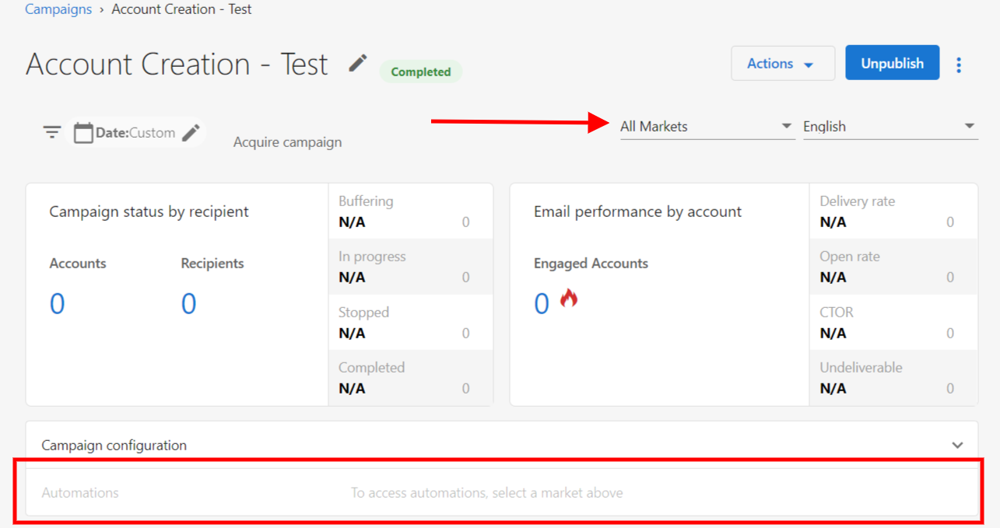
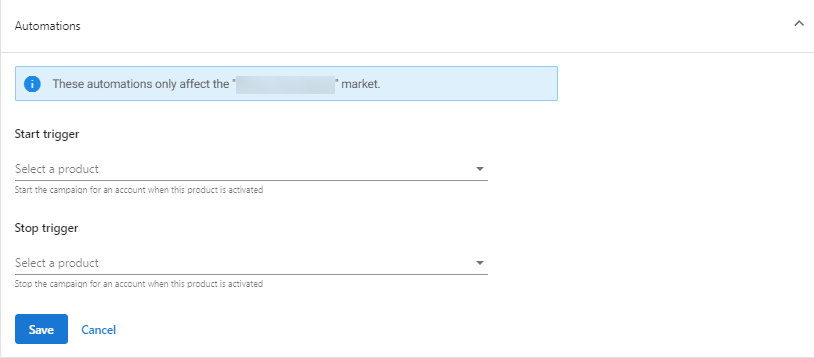

# Email Campaign Automations

This guide covers everything you need to know about automating email campaigns within your workflows, from basic setup to advanced configuration and troubleshooting.

## Overview of Email Campaign Automation

Email campaign automation allows you to automatically start, pause, or manage email campaigns based on specific triggers and conditions. This powerful feature helps you:

- **Nurture leads** with timely, relevant content
- **Onboard new customers** with welcome sequences
- **Re-engage inactive users** with targeted campaigns
- **Promote products** when specific conditions are met
- **Manage campaign lifecycle** automatically

## Adding Email Campaign Automations

You can add automation to your email campaigns to start or stop campaigns automatically when specific products are activated or other conditions are met.

### Basic Setup Process

1. Go to **Partner Center** > **Marketing**
2. Click on the campaign you want to add automation to

   :::note
   You can also create a custom campaign. Learn more about creating custom campaigns
   :::

3. Click **Automations** to expand the menu
4. If you have not selected a market, select one from the top of the screen. The automation you set will only apply to this market.

   

5. Select the product that will trigger the email campaign:
   - When this product is activated, the platform will automatically start the campaign and send it to the prospects and customers on the campaign.

6. Select the product that will stop the email campaign:
   - When this product is activated, the platform will automatically end the campaign.

   

7. Click **Save**

## Campaign Automation Actions

### Starting Campaigns

**Send a campaign for the user**
- Starts an email campaign for the specific user who triggered the automation
- **Special Cases**: The email campaign system only allows a campaign to be sent to each account once. If the campaign is already paused, nothing happens.
- **Example Use Case**: When a user is interested in a product, start an email campaign advertising the product.

**Send a campaign to the account**
- Starts an email campaign for the account and all users and contacts associated with it
- **Special Cases**: The email campaign system only allows a campaign to be sent to each account once. If it has already been sent, nothing happens. An error occurs when a campaign is sent to an account without users.
- **Example Use Case**: When Website Pro is activated, send the "How to Use Website Pro" campaign

### Pausing Campaigns

**Pause a campaign for the user**
- Pauses an ongoing email campaign for the specific user who triggered the automation
- **Special Cases**: If the campaign is already paused, nothing happens
- **Example Use Case**: When a campaign email is clicked, stop the campaign

**Pause a campaign for the account**
- Pauses an ongoing email campaign for the account and all users and contacts associated with it
- **Example Use Case**: When an opportunity is closed for the account, stop the "Prompt First Contact" campaign

**Pause Campaign for Company**
- Pause an ongoing campaign for the company. This will action on all of the contacts associated with the company (up to 50)
- **Special Cases**: If the Contact associated is not on that campaign, it will be considered an error and a list of failed contacts will show on the activity
- **Example Use Case**: When a company has scheduled a meeting with salesperson, pause an email campaign

**Pause campaign for Contact**
- Pauses an ongoing email campaign for the contact
- **Special Cases**: If the Contact is not on that campaign, it will be considered an error
- **Example Use Case**: When a Contact has scheduled a meeting with a salesperson, pause an email campaign

## Campaign Automation Templates

### Send a Welcome Message

This automation template triggers when an account is created, populating the Inbox in Business App with a welcome message from the assigned salesperson (or your company if there's no assigned salesperson) after a brief 1 minute delay.

**Setup**: No additional configuration required - works out of the box.

### Send a Product Education Campaign

<iframe src="//www.loom.com/embed/3463b3ad0fe644f39572b8157be7b312" width="560" height="315" frameborder="0" allowfullscreen></iframe>

When a specific product is activated for an account, this automation will send an email campaign to the account to explain how to use the product or to offer additional services. You'll be notified if they click a call-to-action in the email thanks to the built-in automations for hot leads.

**Setup Requirements:**
- Published email campaign that educates users about the activated product
- Check out recommended [campaigns](https://partners.vendasta.com/marketing/campaigns/all) or build your own

### Send a Campaign

When an account is added to a list, this automation will send a personalized drip campaign to the account.

**Setup Requirements:**
- Create a list for the accounts you want to target
- Use recommended [campaigns](https://partners.vendasta.com/marketing/campaigns/all) or build your own

**Important Note**: Email campaigns can't be sent if there are no users on the account.

### Send a Follow Up Email When a Form is Submitted

This automation triggers a campaign to be sent to a contact when a new contact is created from a form submission.

**Setup Requirements:**
- Published and activated email campaign
- Form integration with contact creation

**Template Details:**

#### Purpose
This automation simplifies the process of launching targeted marketing campaigns. When a new contact is added to a specified list in the CRM system, the automation triggers a corresponding campaign.

#### How It Works
- **Trigger Event**: The automation activates when a contact is added to a predefined list
- **Campaign Launch**: A pre-selected marketing campaign starts for the new contact
- **Customization**: Campaigns can be customized to match the list's purpose and audience

#### Benefits
- **Efficiency**: Eliminates manual effort in launching campaigns
- **Timeliness**: Ensures immediate follow-up with new contacts
- **Personalization**: Enables targeted marketing by associating campaigns with specific lists

#### Use Cases
- **Lead Nurturing**: Automatically send introductory content to new leads added to a prospect list
- **Customer Onboarding**: Initiate welcome campaigns for new customers added to an onboarding list
- **Event Promotions**: Trigger campaigns for contacts signing up for specific events

#### Customizations
Add a tag to the contact after the email is sent:
1. Add a new automation action by clicking **+**
2. Select **Update contact**
3. Look for the **tags** field
4. Add your tag and hit enter

<iframe src="https://www.loom.com/embed/6c81e0d6425d403e89668af63f1f41f1" width="560" height="315" frameborder="0" allowFullScreen></iframe>

## Advanced Campaign Automation Strategies

### Multi-Stage Campaign Sequences

Create sophisticated nurture sequences by combining multiple campaign automations:

1. **Welcome Series**: Start with a welcome campaign when accounts are created
2. **Education Phase**: Follow up with product education based on engagement
3. **Conversion Push**: Send targeted offers based on user behavior
4. **Retention Campaigns**: Re-engage users who haven't been active

### Conditional Campaign Logic

Use if/else logic to create dynamic campaign experiences:

```
IF user clicked previous campaign
  THEN send advanced content campaign
ELSE
  THEN send basic information campaign
```

### Campaign Performance Tracking

Monitor your automated campaigns by:
- Tracking open and click rates in automation activity
- Setting up notifications for campaign engagement
- Using campaign activity triggers for follow-up actions
- Analyzing conversion rates from automated vs manual campaigns

## Troubleshooting Campaign Automations

### Campaign Failed to Start Error

**Error Message**: "Failed to complete due to an error. The required contact information for campaigns is missing."

**Cause**: No contact information specified in Partner Center for your business.

**Solution**: Add required contact information:

1. Go to **Partner Center** > **Administration** > [**Customize**](https://partners.vendasta.com/customize-design)
2. Expand the **Email Settings** tab
3. Fill in the **Required Contact Information for Campaigns** section
4. Click **Apply Changes**

:::note Market-Specific Requirements
If you have Markets enabled, ensure each market has the required contact information. Access market settings through the **Markets** tab, then click **Edit** for each market. You can use **Partner's Contact Information** or **Market's Contact Information**, but selecting **None** will disable campaigns for that market.
:::

### Common Campaign Issues and Solutions

**Campaign Not Sending**
- Verify the campaign is published and active
- Check that the account has users with valid email addresses
- Ensure the campaign hasn't already been sent to the account (campaigns can only be sent once per account)

**Campaign Sending to Wrong Audience**
- Review your trigger conditions
- Check list membership if using list-based triggers
- Verify account segmentation is correct

**Campaign Pausing Unexpectedly**
- Check for competing automations that might pause campaigns
- Review pause conditions in your automation settings
- Verify that pause triggers are configured correctly

**Low Engagement Rates**
- Review campaign content relevance to the trigger
- Check timing of campaign delivery
- Ensure proper audience segmentation
- Test different subject lines and content

### Performance Optimization

**Best Practices for Campaign Automation:**

1. **Segment Your Audience**: Use lists and conditions to target the right people
2. **Time Your Campaigns**: Consider when your audience is most likely to engage
3. **Test and Iterate**: A/B test different campaigns and automation flows
4. **Monitor Engagement**: Track which automations drive the best results
5. **Avoid Over-Communication**: Be mindful of campaign frequency to prevent unsubscribes

**Technical Optimization:**

1. **Use Delays Strategically**: Add delays between campaign steps to avoid overwhelming recipients
2. **Implement Engagement Tracking**: Use campaign activity triggers to measure success
3. **Set Up Proper Error Handling**: Configure automations to handle campaign failures gracefully
4. **Regular Maintenance**: Review and update campaign content regularly

## Integration with Other Automation Features

### Combining with CRM Automations

- Create opportunities when campaigns are engaged with
- Update contact records based on campaign activity
- Assign salespeople when high-value prospects engage

### Using with List Management

- Automatically add engaged users to "hot leads" lists
- Remove unengaged users from active campaign lists
- Segment users based on campaign interaction history

### Leveraging Delay and Logic Steps

- Use delay steps to create drip campaigns
- Implement if/else logic based on previous campaign engagement
- Create complex nurture sequences with multiple decision points

Email campaign automation is a powerful tool for scaling your marketing efforts while maintaining personalization and relevance. Start with simple automations and gradually build more sophisticated workflows as you become comfortable with the features.
