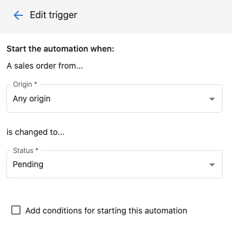
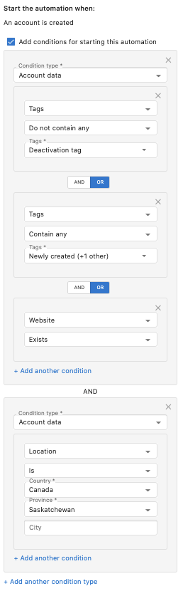
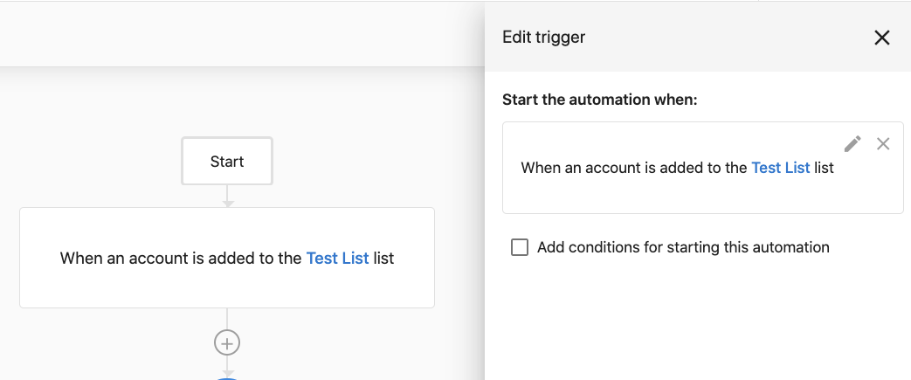
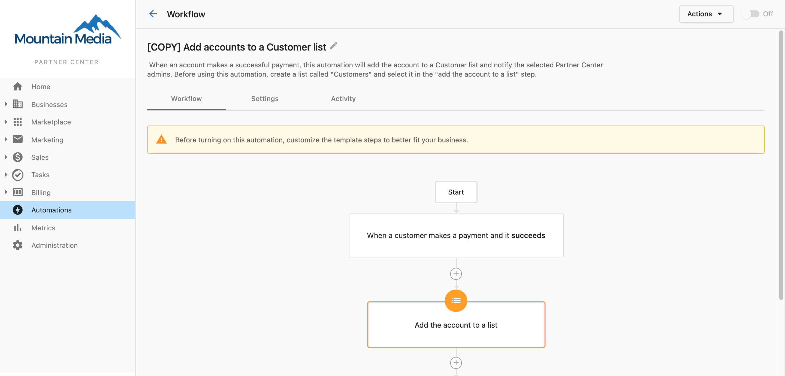
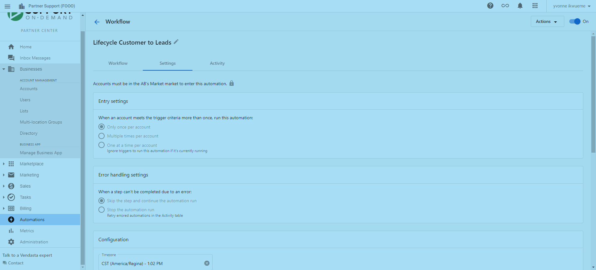
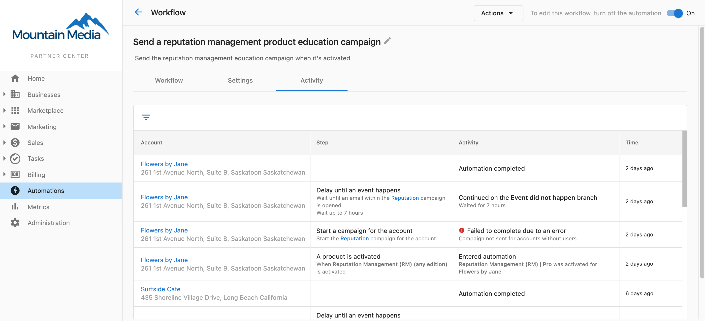

# Automations overview

Automations help you automate sales and marketing processes. Define workflows in the builder so that when a trigger happens, the platform runs your chosen actions—for example, "When a new client is added, assign a salesperson to the account."

<iframe
  src="//www.youtube-nocookie.com/embed/AdLMXuGvGDE"
  width="700"
  height="393.75"
  frameborder="0"
  allowfullscreen=""
></iframe>

An automation workflow is a set of instructions: **when** this trigger happens, **then** perform this action.

## What's in this section

- **[Automation Templates](./automation-templates-overview.mdx)** – Pre-built templates to get started quickly
- **[Automation Triggers Reference](./automation-triggers-reference.mdx)** – All available triggers
- **[Time-based Triggers](./time-based-triggers.mdx)** – Run automations on a daily, weekly, or monthly schedule
- **[Automation Steps Reference](./automation-steps-reference.mdx)** – All available actions and steps
- **[Step deep-dives](./steps/index.mdx)** – In-depth guides for specific steps like Categorize with AI, Find company, and Find custom object
- **[Creating and Configuring Automations](./creating-and-configuring-automations.mdx)** – Build and configure custom workflows
- **[Advanced Automation Features](./advanced-automation-features.mdx)** – Conditions, delays, bulk actions
- **[Managing Your Automations](./managing-your-automations.mdx)** – Monitor, edit, and maintain automations
- **[Troubleshooting Automations](./troubleshooting-automations.mdx)** – Common issues and solutions

## What you can do with automations

### Welcome new clients
When an account is created, send a welcome email campaign, assign a salesperson, and create a task for the salesperson to connect with the client.

### Drive product upgrades
When a client activates a Standard product, send an email campaign about Pro edition benefits, log activity in Sales & Success Center, and notify your team when they open or click.

### Keep track of failed payments
When a customer has a failed payment, receive a notification so you can follow up quickly.

## Understanding automation triggers

Triggers are the events that start a workflow. Some are ready to use (e.g. **An account is created**). Others need **trigger options**—for example, **A sales order status is changed** requires you to set the order origin and the status it changes to.

### Trigger conditions
Conditions filter when the workflow runs. You can filter on tags, salespeople, account location, account categories, active products, and more. When you add multiple conditions, choose **AND** or **OR**:

- **OR** – The trigger runs when **any** condition in the group is met.
- **AND** – The trigger runs only when **all** conditions in the group are met.

## Creating your first automation

1. In Business App go to **Settings** → **Automations**.
2. Click **Create** (top right).
3. Enter **Name**, optional **Description**, and **Status** (on/off).
4. Define the **trigger** (When) and optional **conditions** (If).
5. Set up the **action** that runs when the trigger and conditions are met.
6. Review and click **Create Automation**.

The automation runs whenever the trigger conditions are met (if it's turned on).

## Available triggers and actions

What you see depends on your Vendasta subscription. Common examples:

**Common triggers:** Order created, new lead added, product reaches a certain status, task completed, account created, user active in Business App, campaign email opened or clicked.

**Common actions:** Create a task, send an email, create a note, update a record, assign a salesperson, start an email campaign, add account to a list.

See [Automation Triggers Reference](./automation-triggers-reference.mdx) and [Automation Steps Reference](./automation-steps-reference.mdx) for full lists.

## Best practices

- **Start simple** – Build and test simple automations before complex workflows.
- **Use clear names** – So your team understands each automation's purpose.
- **Monitor regularly** – Check that automations are running as expected.
- **Consider impact** – Think through how automations affect the rest of your workflow.
- **Test first** – Run with a small group before enabling for all accounts.

## Next steps

- [Automation Triggers Reference](./automation-triggers-reference.mdx) – Complete list of triggers
- [Automation Steps Reference](./automation-steps-reference.mdx) – Complete list of actions
- [Creating and Configuring Automations](./creating-and-configuring-automations.mdx) – Advanced configuration
- [Automation Templates Overview](./automation-templates-overview.mdx) – Pre-built templates

<a href="https://partners.vendasta.com/automations" target="_blank" rel="noopener">**Create an Automation**</a> (Partner Center)
