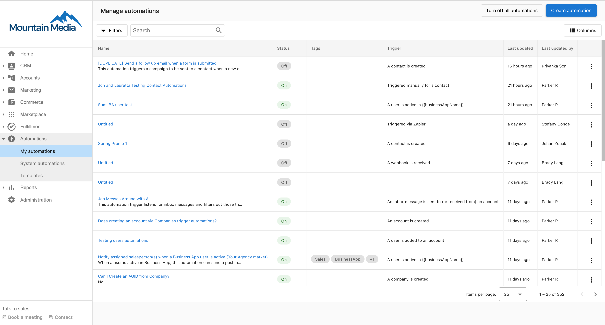

# Automations Overview

Automations are a powerful tool you can use to automate your sales and marketing processes. Map out your personalized workflows in our simple builder and watch your business grow.

<iframe 
  src="//www.youtube-nocookie.com/embed/AdLMXuGvGDE" 
  width="700" 
  height="393.75" 
  frameborder="0" 
  allowfullscreen=""
></iframe>

An automation workflow is simply a set of instructions that tell the platform "***when*** this specific trigger happens, ***then*** perform this action." For example, "When a new client is added, then assign a salesperson to the account."

## Why Use Automations?

Automations help you:
- **Save time** - Eliminate repetitive manual tasks
- **Reduce errors** - Ensure consistent processes every time
- **Scale your business** - Handle more clients without adding staff
- **Improve customer experience** - Respond faster and more consistently
- **Focus on what matters** - Spend time on strategy, not routine tasks

## Common Use Cases

Here are some ideas of how you can use Automations:

### Welcome new clients

When an account is created, automatically send an email campaign to welcome them to the platform. Assign a salesperson to that account, and create a task for the salesperson to connect personally with the client.

### Drive product upgrades

When your clients activate a Standard product, automatically send them an email campaign outlining the benefits of the Pro edition. Set the automation to log your lead's activity and notify your team when your customers open or click through an email.

### Keep track of failed payments

When your customer has a failed payment, receive a notification so you can follow up with them quickly.

## How Automations Work

Every automation consists of three key components:

### 1. Triggers

**Triggers** are specific actions or events that start your workflows. There are numerous triggers to choose from, and we're frequently adding more.

Some triggers are simple and ready out-of-the-box. For example, the **An account is created** trigger will start whenever any account is created.

Other triggers may require specifying **trigger options**. For example, the **A sales order status is changed** trigger requires that you specify the sales order origin and status that it's changed to.

#### Trigger Conditions

Trigger conditions allow you to further filter the triggers that start your workflows. You can filter on tags, salespeople, account location, account categories, active products, and more.

When applying multiple conditions, you can specify which logical operator (AND or OR) should be used:

**OR Operator**: The trigger fires when ***any*** of the conditions in the group are met.

**AND Operator**: The trigger fires only when ***all*** the conditions in the group are met.

### 2. Steps

**Steps** are the actions that you want to happen whenever your workflow starts (after the trigger event happens). You can add multiple steps to a workflow, but you need at least one. Automations will perform the steps from the top down.

Common automation steps include:
- Send or pause email campaigns
- Create tasks or projects
- Assign salespeople
- Send notifications
- Update account information
- Create CRM records
- And many more

For a complete reference, see [Available Automation Steps](./my-automations/available-automation-steps.mdx).

### 3. Logic & Conditions

You can add logic to your automations to create more sophisticated workflows:
- **If/Else conditions** - Branch your automation based on specific criteria
- **Delays** - Wait for a specific time or until a condition is met
- **Grouping** - Organize steps for better readability and error handling

Learn more about [Logic Steps](./my-automations/logic-steps.mdx).

## Getting Started

Ready to create your first automation?

### Navigate to My Automations

In Partner Center, go to **Automations > My Automations** to create and manage your automation workflows.

### Create Your First Automation

1. Click **Create** to start a new automation
2. Choose a trigger that starts your workflow
3. Add steps that define what actions to take
4. Test your automation and turn it on

For detailed instructions, see [Create a New Automation](./my-automations/create-new-automation.mdx).

### Use Pre-Built Solutions

- **[System Automations](./templates/system-automations.mdx)** - Pre-configured automations built by Vendasta
- **[Templates](./templates/)** - Customizable automation templates
- **[Automation History](./automation-history/)** - Track and review execution history

## Next Steps

  

    <h3>🚀 Start Creating</h3>
    <ul>
      <li><a href="./my-automations/">My Automations</a></li>
      <li><a href="./templates/">Browse Templates</a></li>
      <li><a href="./templates/system-automations">System Automations</a></li>
    </ul>
  

  
  

    <h3>📚 Learn More</h3>
    <ul>
      <li><a href="./my-automations/available-automations-triggers-list">All Triggers</a></li>
      <li><a href="./my-automations/available-automation-steps">All Steps</a></li>
      <li><a href="./my-automations/logic-steps">Logic & Conditions</a></li>
    </ul>
  

  
  

    <h3>🔍 Track & Manage</h3>
    <ul>
      <li><a href="./my-automations/automation-activity">Activity Monitoring</a></li>
      <li><a href="./automation-history/">Execution History</a></li>
      <li><a href="./faqs/">Troubleshooting FAQs</a></li>
    </ul>
  

  <a 
    style={{ 
      fontSize: '16px', 
      fontWeight: 'bold', 
      color: '#ffffff', 
      backgroundColor: '#33ace2', 
      textDecoration: 'none', 
      borderRadius: '5px', 
      padding: '10px 30px 9px 30px', 
      border: '1px solid #33ACE2', 
      display: 'inline-block', 
      textAlign: 'center'
    }} 
    href="https://partners.vendasta.com/automations" 
    target="_blank" 
    rel="noopener"
  >
    Create an Automation
  </a>

