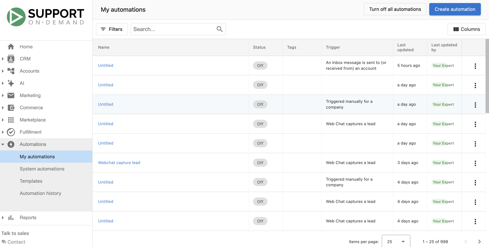

import { Cards, Card } from '@site/src/components/Cards';
import { GraduationCapIcon } from '@site/src/components/Icons';

# Automations overview

Automations help you automate sales and marketing processes. Define workflows in the builder so that when a trigger happens, the platform runs your chosen actions — for example, "When a new client is added, assign a salesperson to the account."

<iframe
  src="//www.youtube-nocookie.com/embed/AdLMXuGvGDE"
  width="700"
  height="393.75"
  frameborder="0"
  allowfullscreen=""
></iframe>

An automation workflow is a set of instructions: **when** this trigger happens, **then** perform this action.

## What's in this section

<Cards cols={2}>
  <Card href="/automations/my-automations/" title="My automations">
    Create, configure, and build custom workflows with triggers, actions, logic, and data expressions
  </Card>
  <Card href="/automations/system-automations/" title="System automations">
    Pre-built workflows provided by Vendasta — enable or disable per account
  </Card>
  <Card href="/automations/templates/" title="Templates">
    Pre-built templates to get started quickly, plus partner-made templates for your clients
  </Card>
  <Card href="/automations/automation-history/" title="Automation history">
    Monitor runs, troubleshoot errors, retry failed automations, and fix permissions
  </Card>
</Cards>

## What you can do with automations

### Welcome new clients
When an account is created, send a welcome email campaign, assign a salesperson, and create a task for the salesperson to connect with the client.

### Drive product upgrades
When a client activates a Standard product, send an email campaign about Pro edition benefits and notify your team when they open or click.

### Keep track of failed payments
When a customer has a failed payment, receive a notification so you can follow up quickly.

## Understanding automation triggers

Triggers are the events that start a workflow. Some are ready to use (e.g. **An account is created**). Others need **trigger options** — for example, **A sales order status is changed** requires you to set the order origin and the status it changes to.

### Trigger conditions
Conditions filter when the workflow runs. You can filter on tags, salespeople, account location, account categories, active products, and more. When you add multiple conditions, choose **AND** or **OR**:

- **OR** — The trigger runs when **any** condition in the group is met.
- **AND** — The trigger runs only when **all** conditions in the group are met.

For a complete list of triggers and how to choose the right one, see [Triggers overview](./my-automations/triggers-overview.mdx).

## Creating your first automation

1. In Business App go to **Settings** then **Automations**.
2. Click **Create** (top right).
3. Enter **Name**, optional **Description**, and **Status** (on/off).
4. Define the **trigger** (When) and optional **conditions** (If).
5. Set up the **action** that runs when the trigger and conditions are met.
6. Review and click **Create Automation**.

The automation runs whenever the trigger conditions are met (if it's turned on).

## Best practices

- **Start simple** — Build and test simple automations before complex workflows.
- **Use clear names** — So your team understands each automation's purpose.
- **Monitor regularly** — Check that automations are running as expected.
- **Consider impact** — Think through how automations affect the rest of your workflow.
- **Test first** — Run with a small group before enabling for all accounts.

## Next steps

- [Triggers overview](./my-automations/triggers-overview.mdx) — Understand trigger types and choose the right one
- [Actions overview](./my-automations/actions-overview.mdx) — Explore 130+ available action steps
- [Creating and configuring automations](./my-automations/creating-and-configuring-automations.mdx) — Entry settings, error handling, permissions
- [Automation templates](./templates/index.mdx) — Pre-built templates to get started quickly

<a href="https://partners.vendasta.com/automations" target="_blank" rel="noopener">**Create an Automation**</a> (Partner Center)

  <GraduationCapIcon size={26} />
  
    New to how AI Employees work? Take the <a href="/learn/ai-foundations" style={{color: '#3C9A63', fontWeight: 600}}>AI foundations</a> course in Vendasta Learn — Beginner, 6 lessons.
  

