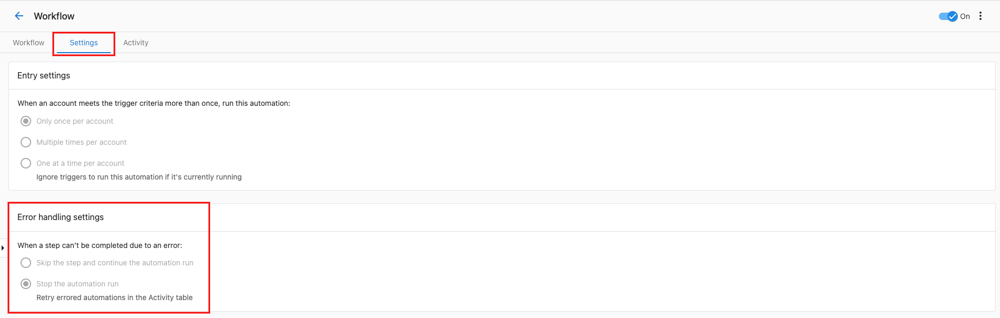
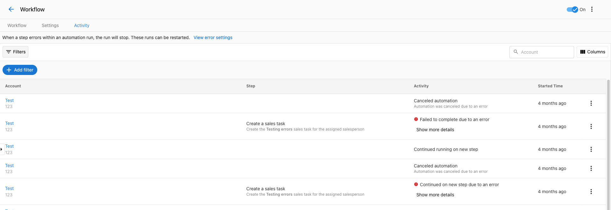
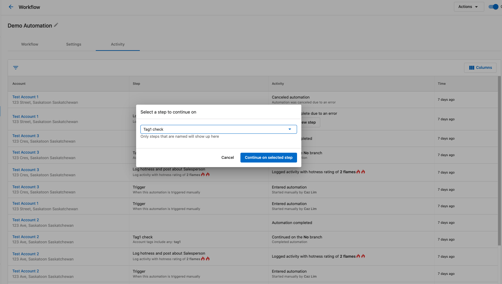

# Managing Your Automations

This guide covers everything you need to know about monitoring, tracking, and managing your automations once they're up and running.

## Automation Activity

The Automation Activity tab is where you can find all of the activities for your automations, including errors or other details.

### Activity Filters

If you have a large number of automation activities, you can use the filters to narrow down what you're looking for. Available filters include:

- **Date Range**: Filter by when the activity occurred
- **Automation**: Filter by specific automation
- **Status**: Filter by success, error, or other statuses
- **Business**: Filter by specific business/account

### Understanding Activity Status

Each automation run will show one of several statuses:
- **Success**: The automation completed successfully
- **Error**: The automation encountered an error and stopped
- **In Progress**: The automation is currently running
- **Waiting**: The automation is paused (e.g., waiting for a delay step to complete)

## Error Handling and Troubleshooting

### Viewing Errors

If an automation encounters an error, you'll see this in the activity tab. Errors show up with an "Error" status and include details about what went wrong.

You can click on an activity to see more details about the error:

### Retrying Failed Automations

If an automation fails, you can retry it by clicking the "Retry" button. This will open a modal where you can select which step to retry from:

You can choose to retry from a specific step in the automation:

This allows you to fix issues and continue automations without having to restart them from the beginning.

## Automation History

For details on tracking and reviewing your automation execution history, see [Automation History](./automation-history.mdx).

## Performance Monitoring

### Key Metrics to Track

Monitor these important metrics for your automations:

1. **Success Rate**: Percentage of automation runs that complete successfully
2. **Execution Time**: How long automations take to complete
3. **Error Frequency**: How often errors occur and what causes them
4. **Trigger Volume**: How often your automations are being triggered
5. **Step Performance**: Which steps are most likely to fail or cause delays

### Regular Maintenance Tasks

Perform these maintenance tasks regularly:

1. **Review Error Logs**: Check for recurring errors and fix their root causes
2. **Update Trigger Conditions**: Refine conditions to reduce false triggers
3. **Optimize Performance**: Remove unnecessary steps or combine related actions
4. **Test Changes**: Always test modifications in a safe environment first
5. **Clean Up Old Data**: Archive or remove outdated automation history as needed

## Best Practices for Automation Management

### Monitoring Strategy

1. **Set Up Notifications**: Configure error notifications so you're alerted to issues immediately
2. **Regular Reviews**: Schedule weekly or monthly reviews of automation performance
3. **Document Changes**: Keep track of modifications and their reasons
4. **Monitor Resource Usage**: Ensure automations aren't overwhelming your system

### Organization Tips

1. **Use Consistent Naming**: Follow a naming convention for easy identification
2. **Tag Strategically**: Use tags to group related automations
3. **Archive Unused**: Disable or archive automations that are no longer needed
4. **Version Control**: When making significant changes, consider duplicating first

### Troubleshooting Workflow

When an automation isn't working as expected:

1. **Check Recent Activity**: Look for error messages or unusual patterns
2. **Review Trigger Conditions**: Ensure conditions are still accurate
3. **Test Individual Steps**: Isolate and test problematic steps
4. **Check Dependencies**: Verify that external systems are working properly
5. **Review Recent Changes**: Consider if recent modifications caused the issue

### Performance Optimization

To keep your automations running efficiently:

1. **Minimize API Calls**: Combine actions where possible to reduce external requests
2. **Use Appropriate Delays**: Don't make delays longer than necessary
3. **Optimize Conditions**: Use the most efficient trigger conditions
4. **Regular Cleanup**: Remove or consolidate redundant automations
5. **Monitor System Load**: Be aware of how many automations run simultaneously

## Advanced Management Features

### Bulk Operations

For managing multiple automations:
- **Bulk Enable/Disable**: Turn multiple automations on or off at once
- **Bulk Tagging**: Apply tags to multiple automations simultaneously
- **Export Data**: Export automation activity data for external analysis

### Integration with Other Tools

Your automation management can integrate with:
- **CRM Systems**: Sync automation data with your CRM
- **Analytics Platforms**: Send automation metrics to business intelligence tools
- **Notification Systems**: Set up alerts through Slack, email, or other channels

### Compliance and Auditing

For businesses with compliance requirements:
- **Audit Trails**: Maintain detailed logs of all automation activities
- **Data Retention**: Configure how long to keep automation history
- **Access Controls**: Manage who can view and modify automations
- **Reporting**: Generate compliance reports from automation data

Remember that effective automation management is an ongoing process. Regular monitoring, maintenance, and optimization will ensure your automations continue to provide value and operate reliably.
