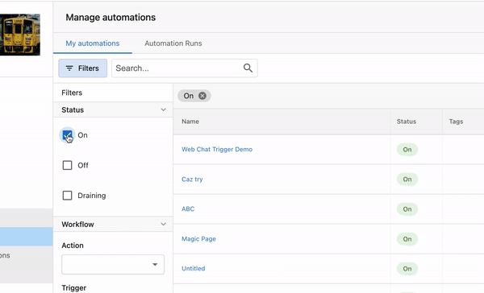
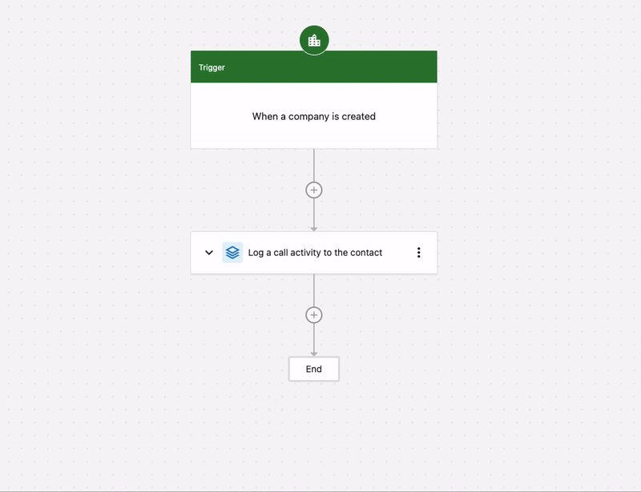
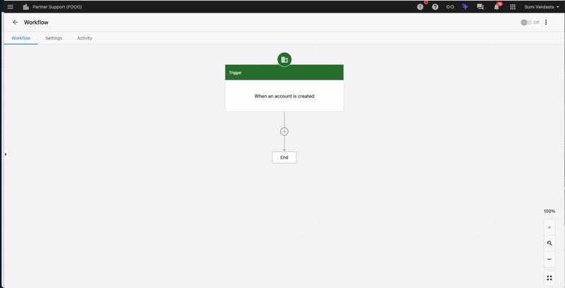

# Grouping and Action Sets

Grouping simplifies the user experience by consolidating multiple actions in automation into an easily accessible set of actions. You can then save these groups as **Action Sets** to reuse across multiple automations.

## Grouping Automation Steps

Grouping allows you to organize consecutive automation steps together for better readability and management. For instance, if you frequently use actions such as adding a task to the company and starting a campaign, you can add them to a Group.

### How to Use Automation Grouping

**Step 1:** Navigate to **Partner Center > Automations > My Automations.**

**Step 2:** 

- **Option 1:** Click on **Create Automation** in the top right to start building a workflow.
- **Option 2:** Use the filter feature to find an automation that's not turned ON. 

  

**Step 3:** Open the automation.

**Step 4:** Identify Your Action Steps

- Start by identifying the consecutive action steps you want to group. For example, in the automation shown below, the automation includes several actions such as updating lead quality, tagging, starting a campaign, and notifying an internal user.

**Step 5:** Access the Grouping Option

- Navigate to the sequence of actions you want to group.
- Click on the three dots (more options) next to one of the actions in the sequence.

**Step 6:** Select Consecutive Steps

- Ensure that the steps you want to group are consecutive (one after the other).
- Select the consecutive steps that should be grouped together.

**Step 7:** Create the Group

- Once the steps are selected, click on Create Group.
- You will have the option to update the auto-generated name of the group.
- Optionally, you can add notes for clarity, which will be visible when viewing the group.

<iframe src="//www.loom.com/embed/f07430494fb2428aaa39dc68e32d3a89" width="560" height="315" frameborder="0" allowfullscreen></iframe>

## What are Action Sets?

Are you still duplicating an entire automations to reuse only a few steps? With Action Sets, you can effortlessly start reusing automation steps. With saved Action Sets, you can easily integrate the saved Action Sets into a new automation. This powerful feature reduces redundancy, saving you time and effort by eliminating the need to recreate similar steps. Streamline your workflow and boost your productivity with Action Sets today.

## How to use Action Sets

**Step 1 -** Navigate to **Partner Center > Automations > My Automations.**

- **To save an Action Set:** Go to any existing **Automation Group > Click on the 3 dots > Save as Action Set.**

- **To use an existing Action Set:** Click the **+** to add to the automation > Navigate to the **Action Sets** tab > Select the desired action set to preview > Select **Use Action Set.**

## Q&A

**Q: Why can't I add an Action Set inside a Group?**

**A:** This is intentional. The current system design prevents adding Action Sets within a Group because nesting groups within other groups is not supported.

**Q: Why can't I save Action Sets with if/else, end, and jump steps?**

**A:** These steps are not included in the initial release of Action Sets. We plan to add them in the future!

**Q: Who can create an Action Set?**

**A:** Any Admin with permission to create automations can also create and apply Action Sets when building an automation.

**Q: Can other users in my company use an Action Set that I created?**

**A:** Yes, currently, any Action Set created by you can be used by other users within your company, as there are no restrictions to manage this.

**Q: Is this feature available in the Business App?**

**A:** Yes, this feature is available in Business App as well.