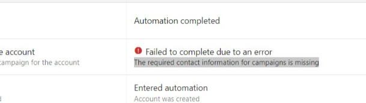

You can add automation to your email campaigns. This automation starts or stops a campaign automatically when a specific product is activated.

To add automation:

1. Go to **Partner Center** > **Marketing**.
2. Click on the campaign you want to add the automation to. 
   
   :::note
   You can also create a custom campaign. [Learn more](/automations/automations-my-automations/create-custom-email-campaigns)
   :::

3. Click Automations to expand the menu.
4. If you have not selected a market, select one from the top of the screen. The automation you set will only apply to this market.

   

5. Select the product that will trigger the email campaign.
   - When this product is activated, the platform will automatically start the campaign and send it to the prospects and customers on the campaign.

6. Select the product that will stop the email campaign.
   - When this product is activated, the platform will automatically end the campaign.

   

7. Click **Save**.

## Frequently Asked Questions

Campaign failed to start - Missing contact information

When attempting to start an email campaign from Automations, you may encounter an error stating: "Failed to complete due to an error. The required contact information for campaigns is missing." This error occurs when there is no contact information specified in Partner Center for your business.

You must include your contact information within every promotional email campaign, including a physical mailing address or PO Box where you can receive mail.

**To fix this error:**

1. Go to **Partner Center** > **Administration** > [**Customize**](https://partners.vendasta.com/customize-design)
2. Expand the **Email Settings** tab. 
3. In the **Required Contact Information for Campaigns** section, fill in the required fields.
4. Click **Apply Changes** to save your settings.

:::note
If you have Markets enabled, make sure that each market has the required contact information. To access the email settings for each market, click on the **Markets** tab at the top of the **Customize** page, then click the **Edit** icon for a specific market. For each market, you can choose to use the **Partner's Contact Information** or **Market's Contact Information**. However, selecting **None** will disable campaigns from being sent in that market.
:::

:::note
Even if it is a default market, this setting is necessary in order to get the campaigns completed successfully.
:::

<a className="button button--primary" href="https://partners.vendasta.com/customize-design" target="_blank" rel="noopener">
  Add Contact Information
</a>

