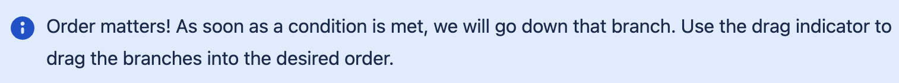
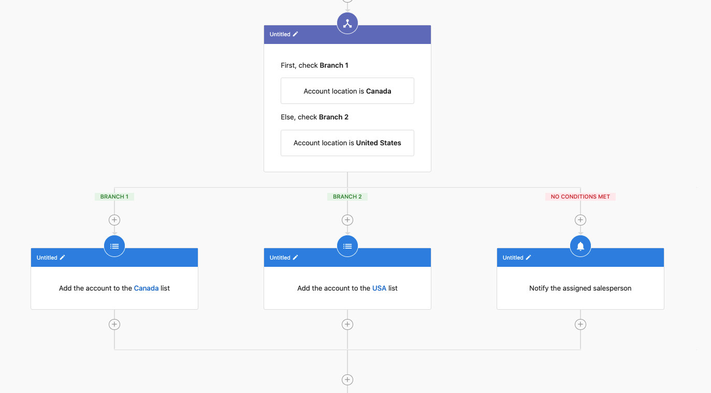
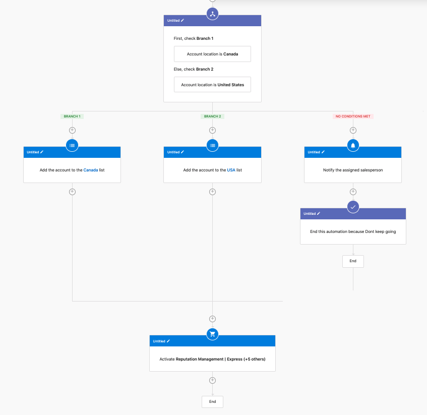
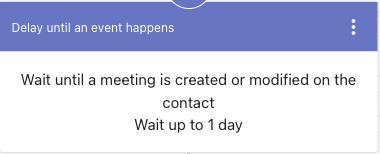
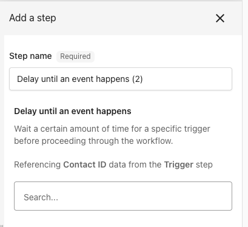
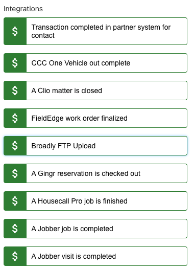
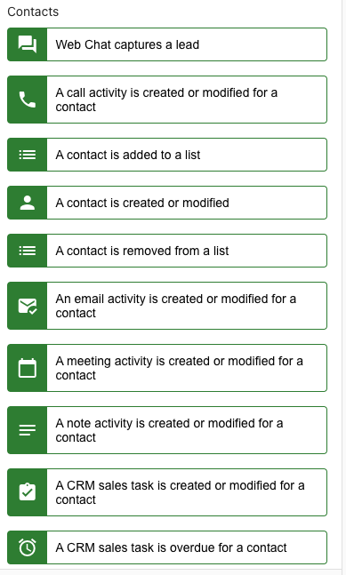
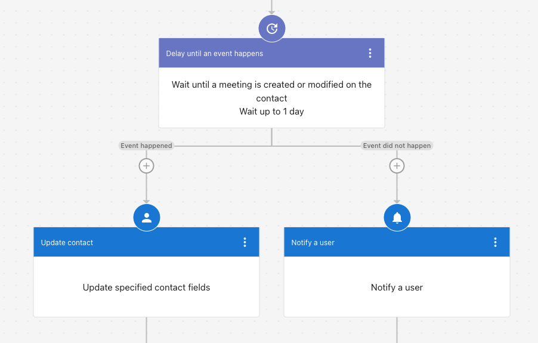

# Advanced automation features

This guide covers advanced automation features that allow you to create sophisticated, conditional workflows with precise timing and reusable components.

:::tip
Complex workflows get hard to read. See [Navigating the automation canvas](./navigating-the-automation-canvas.mdx) for the step search, step references, and minimap tools that help you find your way around a large automation.
:::

## Logic steps

Logic steps provide if/else functionality and the ability to end automations in Automations V2. These features enable conditional execution flow in your automations.

### If/else step

The If/Else step allows conditional execution flow in an automation, enabling you to execute different branches based on whether a condition is met.

#### Set up an if/else step

When adding a new step, select "If/Else" from the options:

When setting up an If/Else step, you will be prompted to define a filter:

After setting up your if/else condition, the workflow will show two branches:
- **If branch**: This path is followed when the condition is true
- **Else branch**: This path is followed when the condition is false

You can add different steps to each branch to create custom pathways based on your filter conditions.

### End this automation

The "End This Automation" step allows you to terminate an automation at a specific point. This is useful for scenarios where you've completed the necessary steps for some leads and don't need to continue processing.

Using this step along with if/else conditions gives you significant control over the automation flow. For example, you can terminate the automation early for certain leads while continuing the process for others based on specific criteria.

#### Common use cases for logic steps

1. **Contact Qualification**: Use if/else to determine if a lead meets your qualification criteria and end the automation for unqualified leads
2. **Multi-path Communication**: Send different follow-up emails based on customer responses and end the automation when a desired outcome is achieved
3. **Time-sensitive Processes**: End automations for contacts who haven't responded within a specified timeframe

## Delay until steps

A **Delay Until** step allows users to introduce a time-based control mechanism within CRM automation workflows. This feature ensures that actions occur at precisely the right moment, improving workflow flexibility, task scheduling, and customer engagement.

### How delay until works

The **Delay Until** step allows users to pause an automation workflow for a specified time or until a defined event occurs in the CRM. This can be useful for:

- Scheduling follow-ups after a certain period
- Ensuring tasks or messages are triggered based on customer activity
- Streamlining CRM actions without the need for manual intervention

### Set up a delay until step

1. Navigate to the **Automation Workflow Editor** within your CRM
2. Add a **Delay Until** step at the appropriate point in the workflow
3. Choose a delay period or specify an event that must occur before proceeding to the next step
4. Save and activate the workflow

### Available delay until options

- Name of the action: **Delay until an event happens**
- List of sub-triggers currently available for a contact:

### Benefits of using delay until steps

- **Improved Workflow Precision** – Ensures that automated tasks happen at the optimal moment
- **Better Customer Engagement** – Delays help optimize messaging and follow-up timing
- **Enhanced Sales Process Management** – Enables better tracking of missed sales touch points and notifications

### Use case example

A business wants to automate follow-ups for new contacts generated via web chat. The workflow includes:

1. AI-generated thank-you email upon contact creation
2. A plain text email sent to the contact
3. A CRM sales task created for follow-up
4. A **Delay Until** step to wait a set period before creating an opportunity
5. A note added to the contact after the delay period

By implementing a **Delay Until** step, the business ensures timely and meaningful engagement rather than immediate, potentially ineffective, actions.

## Grouping automation steps

Grouping simplifies the user experience by consolidating multiple actions in automation into an easily accessible set of actions. This feature is the foundation for Action Sets, which allow you to save and reuse groups of steps.

### How to use automation grouping

**Step 1:** Navigate to **Partner Center > Automations > My Automations.**

**Step 2:** 
- **Option 1:** Click on **Create Automation** in the top right to start building a workflow.
- **Option 2:** Use the filter feature to find an automation that's not turned ON.

**Step 3:** Open the automation.

**Step 4:** Identify Your Action Steps
- Start by identifying the consecutive action steps you want to group. For example, in the automation shown below, the automation includes several actions such as updating lead quality, tagging, starting a campaign, and notifying an internal user.

**Step 5:** Access the Grouping Option
- Navigate to the sequence of actions you want to group.
- Click on the three dots (more options) next to one of the actions in the sequence.

**Step 6:** Select Consecutive Steps
- Ensure that the steps you want to group are consecutive (one after the other).
- Select the consecutive steps that should be grouped together.

**Step 7:** Create the Group
- Once the steps are selected, click on Create Group.
- You will have the option to update the auto-generated name of the group.
- Optionally, you can add notes for clarity, which will be visible when viewing the group.

<iframe src="//www.loom.com/embed/f07430494fb2428aaa39dc68e32d3a89" width="560" height="315" frameborder="0" allowfullscreen></iframe>

## Action sets

Are you still duplicating entire automations to reuse only a few steps? With Action Sets, you can effortlessly start reusing automation steps. With saved Action Sets, you can easily integrate the saved Action Sets into a new automation. This powerful feature reduces redundancy, saving you time and effort by eliminating the need to recreate similar steps.

### How to use action sets

**Step 1 -** Navigate to **Partner Center > Automations > My Automations.**

**To save an Action Set:** Go to any existing **Automation Group > Click on the 3 dots > Save as Action Set.**

**To use an existing Action Set:** Click the **+** to add to the automation > Navigate to the **Action Sets** tab > Select the desired action set to preview > Select **Use Action Set.**

### Action sets Q&A

**Q: Why can't I add an Action Set inside a Group?**

**A:** This is intentional. The current system design prevents adding Action Sets within a Group because nesting groups within other groups is not supported.

**Q: Why can't I save Action Sets with if/else, end, and jump steps?**

**A:** These steps are not included in the initial release of Action Sets. We plan to add them in the future!

**Q: Who can create an Action Set?**

**A:** Any Admin with permission to create automations can also create and apply Action Sets when building an automation.

**Q: Can other users in my company use an Action Set that I created?**

**A:** Yes, currently, any Action Set created by you can be used by other users within your company, as there are no restrictions to manage this.

**Q: Is this feature available in the Business App?**

**A:** Yes, this feature is available in Business App as well.

## AI employee integration

You can integrate AI Employees (including Custom AI Employees) into your automation workflows using the "Send a prompt to an AI Employee" step. This adds LLM-powered intelligence and decision-making capabilities to your automations.

### How AI employee integration works

The "Send a prompt to an AI Employee" step allows you to:
- Send contextual prompts to your AI Employees within automation workflows
- Use AI Employees for intelligent decision-making based on customer data
- Generate dynamic responses or perform actions based on AI Employee capabilities
- Leverage your AI Employee's knowledge base and capabilities in automated processes

### Set up AI employee integration

1. Navigate to your automation workflow editor
2. Add a new step and select **"Send a prompt to an AI Employee"**
3. Select the AI Employee you want to use (pre-built or Custom AI Employee)
4. Configure the prompt with context from your automation (contact data, previous steps, etc.)
5. Define how to use the AI Employee's response in subsequent steps

### Use cases for AI employees in automations

**Intelligent Lead Qualification:**
- Use an AI Employee to analyze lead information and qualify prospects
- Generate personalized follow-up messages based on AI analysis
- Route leads to different paths based on AI Employee recommendations

**Dynamic Content Generation:**
- Generate personalized email content using AI Employee knowledge
- Create custom responses based on customer data and business context
- Adapt messaging based on AI Employee analysis of customer needs

**Contextual Decision Making:**
- Use AI Employees to make decisions based on complex criteria
- Analyze customer history and generate appropriate next steps
- Provide intelligent routing based on AI Employee recommendations

**Custom AI Employee Use Cases:**
- **Job Estimator**: Generate quotes or estimates in automated workflows
- **Project Manager**: Send status updates based on project data
- **Sales Enablement**: Provide product recommendations in sales automations
- **Payment Coordinator**: Handle payment-related decisions in billing workflows

### Benefits of AI employee integration

- **Enhanced Intelligence**: Add AI-powered decision-making to your automations
- **Contextual Responses**: Leverage business knowledge and customer context
- **Reduced Manual Work**: Automate complex decision-making processes
- **Consistent Quality**: Use trained AI Employees for reliable, consistent outputs

### Best practices for AI employee integration

1. **Provide Clear Context**: Include relevant customer data and business context in your prompts
2. **Test Thoroughly**: Test AI Employee responses in your automation before deploying
3. **Handle Edge Cases**: Plan for scenarios where AI Employee responses may need fallback logic
4. **Use Custom AI Employees**: Create specialized AI Employees for specific automation use cases
5. **Monitor Performance**: Review AI Employee responses in automation logs to optimize prompts

For more information on creating and configuring AI Employees, see:
- [AI Workforce Overview](../../ai/ai-workforce/index.mdx)
- [Creating Custom AI Employees](../../ai/ai-workforce/custom-ai-employees.md)
- [Creating Custom Capabilities](../../ai/ai-capabilities/creating-custom-capabilities.md)

## Best practices for advanced features

1. **Plan Logic Flow**: Before implementing if/else steps, map out all possible paths your automation might take
2. **Use Meaningful Delays**: Choose delay periods that make sense for your customer journey and business processes
3. **Group Related Actions**: Group steps that logically belong together to improve readability and reusability
4. **Create Reusable Action Sets**: Identify common sequences of steps that you use across multiple automations
5. **Test Complex Workflows**: Always test advanced automations thoroughly before deploying to production
6. **Document Complex Logic**: Add clear descriptions to groups and action sets to help team members understand their purpose

## Who can use these features?

These advanced features are available to users managing CRM automation workflows within Business App and Partner Center. Action Sets and grouping features are available to any Admin with permission to create automations.
