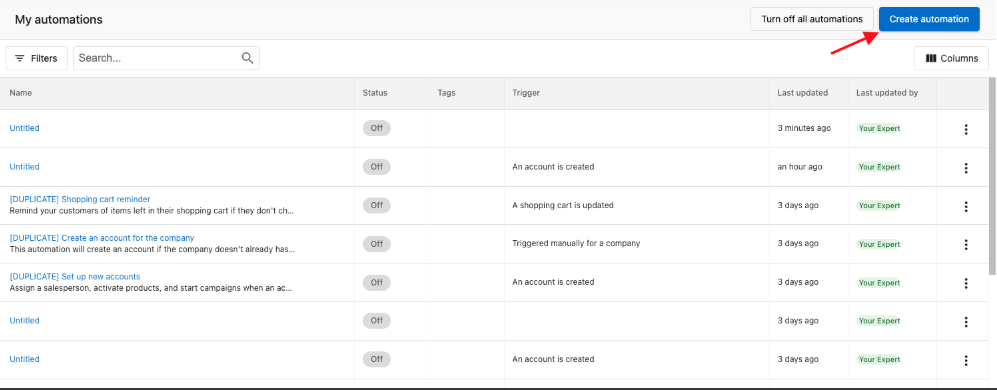
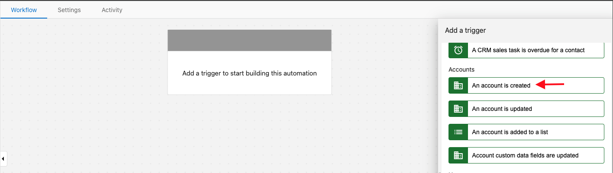
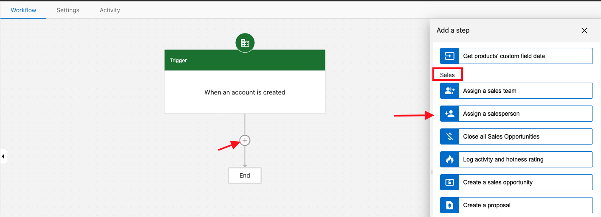

Want to have a specific Salesperson automatically assigned to all of your newly created accounts? No problem! You will need to set up an **Automation** first.

Navigate to: **Partner Center > Automations > My Automations > Create automation > select Blank Template:**

From here, a sidebar on the right will pop up prompting you to add a trigger. Under "Start the automation when", select **An account is created** and hit Save (adding conditions if need be, but not necessary):

Now select the **"+"** button located underneath the trigger you just created. Scroll down to **Sales** and select **Assign a salesperson:**

Select the desired salesperson of choice and click Save. Once this is done, toggle the automation on and you're all set!