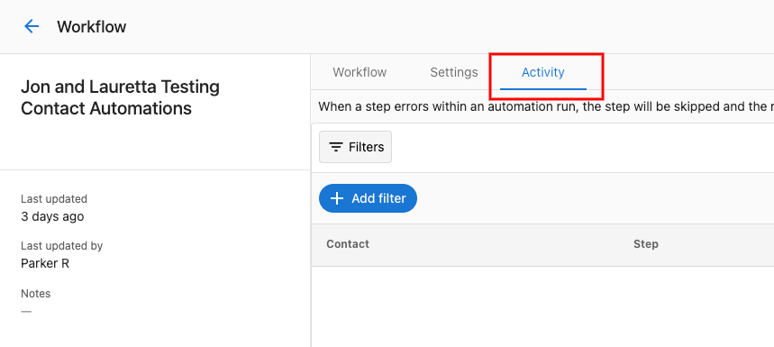
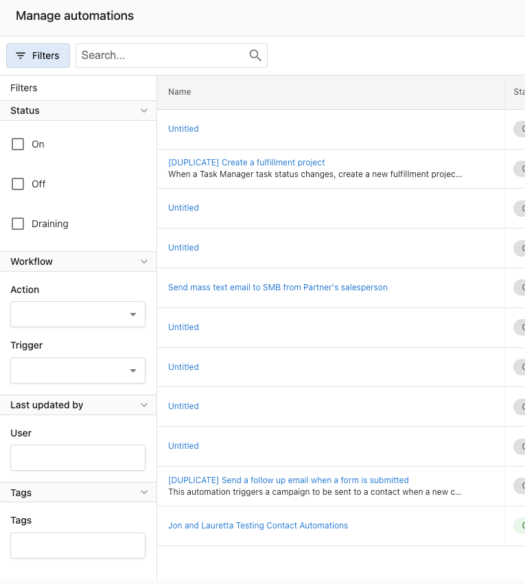
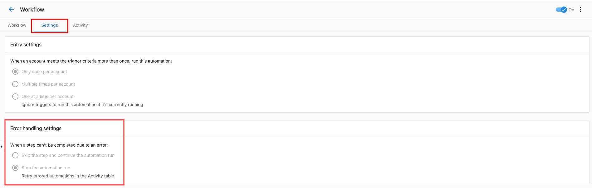
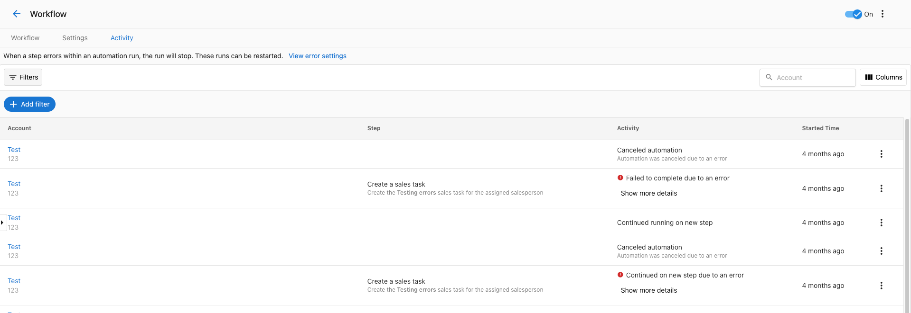
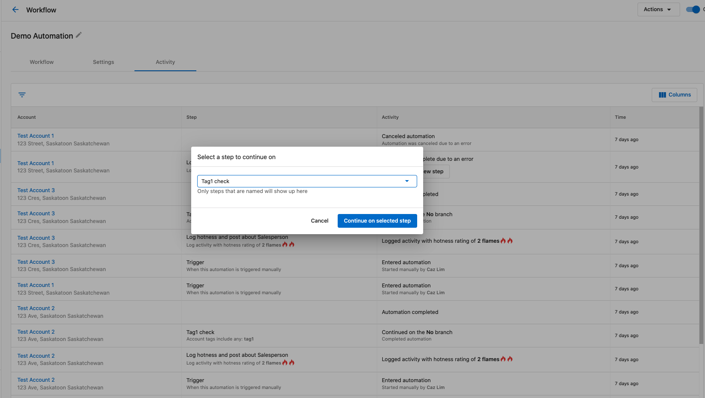

# Automation Activity

The Automation Activity tab is where you can find all of the activities for your automations, including errors or other details.

## Activity Filters

If you have a large number of automation activities, you can use the filters to narrow down what you're looking for. Available filters include:

- Date Range
- Automation
- Status
- Business

## Error Handling

If an automation encounters an error, you'll see this in the activity tab. Errors show up with an "Error" status and include details about what went wrong.

You can click on an activity to see more details about the error:

## Retrying Failed Automations

If an automation fails, you can retry it by clicking the "Retry" button. This will open a modal where you can select which step to retry from:

You can choose to retry from a specific step in the automation:

This allows you to fix issues and continue automations without having to restart them from the beginning.