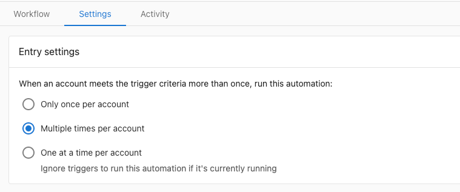
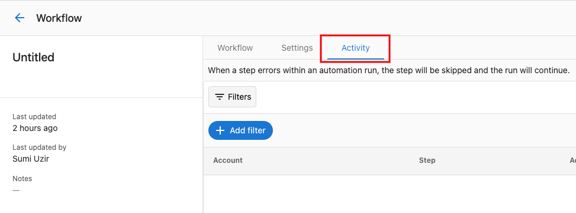

# Automation Activity

The Automation Activity tab is where you can find all of the activities for your automations, including errors or other details.

## Activity Filters

If you have a large number of automation activities, you can use the filters to narrow down what you're looking for. Available filters include:

- Date Range
- Automation
- Status
- Business

## Error Handling

If an automation encounters an error, you'll see this in the activity tab. Errors show up with an "Error" status and include details about what went wrong.

You can click on an activity to see more details about the error:

## Retrying Failed Automations

If an automation fails, you can retry it by clicking the "Retry" button. This will open a modal where you can select which step to retry from:

You can choose to retry from a specific step in the automation:

This allows you to fix issues and continue automations without having to restart them from the beginning.

## Frequently Asked Questions

Why isn't my automation running?

There are several reasons why your automation, or a step in your automation might not be running:

1. **The automation must be turned On** - Use the toggle button in the top-right of the automation editor.

   

2. **Running once per account** - The automation may be configured to run **once per account**, which is the default behavior. To allow the automation to run multiple times per account, update the **Entry settings** in the **Settings** tab of the automation.

   

3. **Automation encountered an error** - Check the **Activity** tab for error messages. If you would like the automation to keep running when an error occurs, update the **Error handling settings** in the **Settings** tab of the automation.

   

4. **Trigger conditions don't match** - The automation may have a trigger condition that doesn't match any accounts. Double-check how your trigger is set up to make sure accounts meet all of the criteria.

5. **Missing delay before conditional step** - The automation may have a step that only makes sense after a delay occurs, but no delay was provided. For example, you may build automation that starts with a trigger of an account being created, and then an if/else branch based on the salesperson assigned to the account. In this case, it takes about 10 mins to assign a salesperson to an account once the account is created. Since that delay is not accounted for in the automation, the automation will stop running when it gets to the if/else branch.

6. **Step can only run once per account** - The automation may have a step that can only run once per account under any circumstance, which can't be changed. For example, an email campaign can only be sent **once** to the same account. If you build automation that involves sending a campaign to an account, and you want the automation to run multiple times per account, the automation will have errors since it can't send the campaign multiple times.

Can I remove an account from an automation?

Once an account has been processed through automation, it cannot be undone. However, if the automation includes a delay step, you may have a brief window of time to intervene and stop the process. If no delay step is present, the automation will complete almost instantly, leaving no opportunity to interrupt it.

