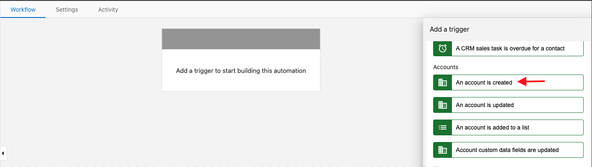
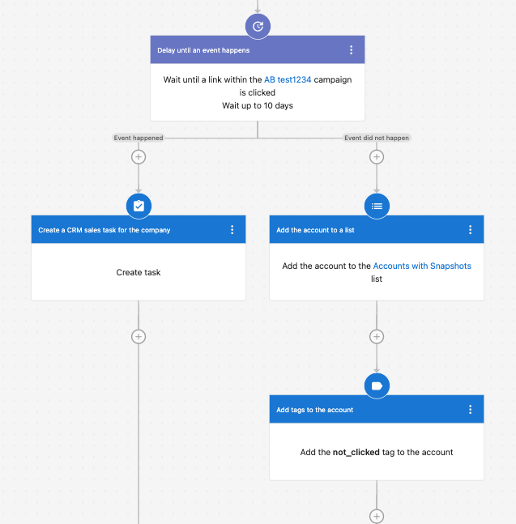
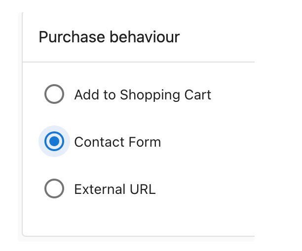
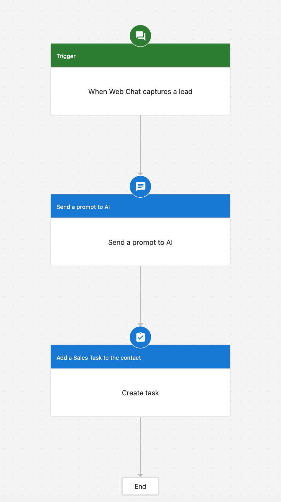

# Automation Examples & Use Cases

Use these practical examples to jump‑start your workflows. Each example links to the trigger(s), steps, and related docs you’ll need.

## Automatically assign a salesperson to new accounts

When an account is created, automatically assign the right salesperson.

1. Trigger: An account is created
2. Step: Assign a salesperson

Related:
- [Automation Triggers](./available-automations-triggers-list.mdx)
- [Available Automation Steps](./available-automation-steps.mdx)

## Start a campaign when a Snapshot Report is created or refreshed

Launch a follow‑up campaign based on Snapshot activity with a safe delay.

1. Trigger: Snapshot Report is created/refreshed
2. Step: Delay 25 hours
3. Step: Start a campaign for the account

Related:
- [Workflow Control Steps](./workflow-control-steps.mdx)
- [Available Automation Steps](./available-automation-steps.mdx)

## Respond to package interest (store)

Use store events to personalize follow‑ups and push data to external systems.

Steps outline:
1. Trigger: A user shows interest in a package
2. Steps: Get associated company → Add task → Send prompt to AI → Send Inbox message
3. Optional: Send a webhook to your CRM

<iframe src="//www.loom.com/embed/ece67d0707ab4768a047f6baf73a47fe" width="560" height="315" frameborder="0" allowFullScreen></iframe>

Prerequisites:
- Package Purchase behavior must be Contact Form

Related:
- [Automation Triggers](./available-automations-triggers-list.mdx)
- [API Action](./automations-api-action.mdx)

## Capture web chat leads and create CRM tasks

Turn web chat conversations into actionable CRM work or external workflows.

1. Trigger: Web Chat captures a Lead
2. Step: Create a sales task (simple)
3. Or: Send a webhook and pass data to an external system (advanced)

<iframe src="//www.loom.com/embed/db0e4e74d5aa4bbebafc4a92f0203887" width="560" height="315" frameborder="0" allowfullscreen></iframe>

Related:
- [Automation Triggers](./available-automations-triggers-list.mdx)
- [API Action](./automations-api-action.mdx)

## Add automation to email campaigns

Use automation to start/stop email campaigns based on product activity.

1. In Partner Center > Marketing, open a campaign
2. Configure automation: select product that starts or stops the campaign

## Frequently Asked Questions

Why did my campaign fail to start due to missing contact information?

This error occurs when the required contact information for campaigns is not configured in Partner Center.

To fix it:
1. Go to Partner Center > Administration > Customize
2. Expand Email Settings and complete the required fields
3. Click Apply Changes

Related:
- [Automation Triggers](./available-automations-triggers-list.mdx)
- [Available Automation Steps](./available-automation-steps.mdx)
