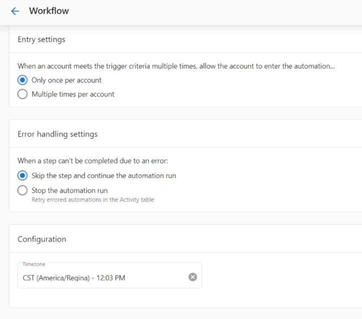

Several settings can be configured for each automation you create. You can access these settings in the **Settings** tab in your automation.

### Entry settings

Many trigger events and conditions can be met multiple times. For example, **A customer makes a payment** trigger with the trigger options set to **Succeeds or fails** will fire each time a customer attempts to pay for an invoice or shopping cart purchase. The entry settings allow you to specify whether you want the automation workflow to start only the first time the trigger criterion is met or every time.

### Error handling settings

You can have many steps in an automation workflow. If at any point a step fails to complete, you can choose to have your automation ignore the error and continue with the following steps, or stop that specific automation run.

- **Ignore the error and continue the automation:** If a step fails, the automation will log an error (viewable in the Activity table) and move on to the next step of the workflow.
- **Stop that specific automation run:** If a step fails, the automation run will completely stop for that account. The automation will not move on to the next step of the workflow. You may manually resume the run from any step in the workflow from the [activity table](https://support.vendasta.com/hc/en-us/articles/4470332548759-Automation-Activity).

### Timezone Configuration

Set your preferred timezone.

### Notification Settings

Subscribe to error notifications.

  <a 
    style={{fontSize: '16px', fontWeight: 'bold', color: '#ffffff', backgroundColor: '#33ace2', textDecoration: 'none', borderRadius: '5px', padding: '10px 30px 9px 30px', border: '1px solid #33ACE2', display: 'inline-block', textAlign: 'center'}}
    href="https://partners.vendasta.com/automations"
    target="_blank"
    rel="noopener"
  >
    Create an automation
  </a>

