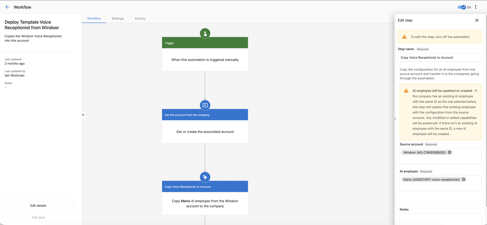

:::warning
This feature is only available upon request. If you are interested in this feature, please reach out to support.
:::

The **Copy AI Employee Configuration** automation action allows you to replicate an AI employee's settings and configuration from one company account and automatically apply it to other companies. This is a powerful tool for standardizing AI employee setups across multiple client accounts.

When this automation runs, it takes the complete configuration of an AI employee from your chosen source account and transfers it to each company that goes through the automation. Think of it as a template system for AI employees - you set up the perfect configuration once, then deploy it to many companies automatically.

## Overview
### What gets copied

The automation performs a comprehensive copy of the AI employee's configuration, including:
- **Basic Information**: Name, avatar, and core configuration settings
- **Goals (Capabilities)**
- **Functions (Tools)**
- **Prompt Modules**
- **Personality**

#### What gets preserved
When updating an existing AI employee, the automation preserves:
- Global goal overrides in the target account
- Additional local goals not in the source
- Non-managed resources

### What happens when the automation runs

The automation behaves differently depending on whether the target company already has an AI employee:

- **If the company has an existing AI employee with the same ID**: The automation updates that employee with the configuration from your source account. Any custom capabilities or modifications the company added will be preserved.

- **If the company doesn't have an AI employee with that ID**: The automation creates a brand new AI employee with the source configuration.
## Choosing the right trigger

Before you can add the "Copy AI Employee Configuration" action, you need to create an automation with an appropriate trigger. The trigger determines when and for which companies the automation will run.

### Recommended triggers for this action
This automation action works with **account/company-level triggers** because it operates on companies. Make sure your trigger provides:
- An account group ID (the company to receive the AI employee)
- The ability to run on multiple companies (for bulk operations)

#### For onboarding new companies
- **Account Created** - Automatically runs when a new company is added to the system
- **Company Created** (CRM) - Runs when a new company is created in CRM

#### For bulk deployment
- **Triggered manually for an account** - Allows you to select multiple companies and run the automation on demand
- **Triggered manually for a company** (CRM) - Manual trigger for CRM companies

#### For product-based provisioning
- **Product purchased** - Runs when a company purchases a specific product

#### For event-based updates
- **Account custom data fields are updated** - Runs when specific account data changes
- **A Salesperson assigned to account** - Runs when a salesperson is assigned

#### For API/integration scenarios
- **Triggered via API for an account** - Allows external systems to trigger the automation

**Note**: Triggers that work with contacts, orders, or other entity types won't work well with this action since it needs to know which company to update.

## Step-by-step configuration

### Step 1: Select an automation with a trigger

1. Navigate to the Automations section on Partner Center
2. Click **"Create Automation"**
3. Choose an appropriate trigger from the list above
4. Configure the trigger settings if needed (e.g., which product, which list, etc.)
5. Save the trigger configuration

### Step 2: Add the action to your automation

1. In the automation editor, locate the workflow area
2. Click the **"+"** button where you want to add this action (typically right after the trigger or any filters)
3. Search for **"Copy AI employee configuration to another company"**
4. Click to add it to your workflow

### Step 3: Select the source account

1. In the configuration panel, locate the **"Source account"** field
2. Click the field to open the account selector
3. Search for and select the account that contains your template AI employee
4. Click to confirm your selection

**Important**: You must select a source account before you can select an AI employee.

### Step 4: Select the AI employee

1. After selecting a source account, the **"AI employee"** field will become available
2. Click the field to see all AI employees available in the source account
3. Select the AI employee whose configuration you want to copy
4. Click to confirm your selection

**Note**: If you see "No employees available for this account group", it means the selected source account doesn't have any AI employees configured yet.

### Step 5: Save the configuration

1. Click the **"Save"** button to save your configuration
2. The automation node will now display: "Copy **[Employee Name]** AI employee from the **[Account Name]** account to the company"

### Step 6: Turn on and test your automation

Before turning on your automation for all companies:

1. Test it with a single test company first
2. Verify the AI employee was created or updated correctly
3. Check that all settings transferred as expected
4. Confirm the AI employee functions properly in the target account

*Example workflow configuration showing the source account and AI employee selection fields.*

