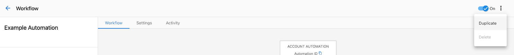
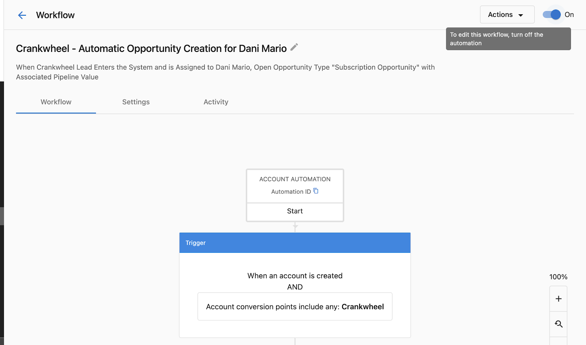

import { Cards, Card } from '@site/src/components/Cards';

# Creating and configuring automations

## Create an automation

1. Go to **Partner Center** then **Automations**.
2. Click **Create automation** (top right).
3. Choose a template or start with a blank canvas.
4. Add a name and optional description.
5. Add your **trigger** — the event that starts the workflow.
6. Add **actions** — the steps that run when the trigger fires.
7. Toggle the automation **On** when you're ready.

:::info Go deeper
Want to see this built end to end? [Put your workforce on autopilot](/learn/ai-workforce/autopilot) pairs a CRM smart list with this exact trigger to run a real automation on its own.
:::

## Settings

Open an automation and click **Settings** in the left menu. Settings are organized into five tabs.

<Cards cols={3}>
  <Card href="#overview" title="Overview">
    Entry settings and error handling — how often and how reliably your automation runs
  </Card>
  <Card href="#goal" title="Goal">
    Define a success condition that ends the run early when met
  </Card>
  <Card href="#timezone" title="Timezone">
    Set the timezone for schedules, delays, and activity timestamps
  </Card>
  <Card href="#notifications" title="Notifications">
    Get alerted via email and in-app when automations encounter issues
  </Card>
  <Card href="#advanced" title="Advanced">
    Manage permissions and authorization for the automation
  </Card>
</Cards>

### Overview

#### Entry settings

Controls how often the automation runs per account.

| Setting | Behavior | Use when |
|---|---|---|
| **Only once per account** | Runs one time per account, ever. That account is excluded from all future runs. | One-time onboarding, welcome sequences |
| **One at a time per account** | Prevents concurrent runs. A second trigger is dropped while a run is in progress. New triggers start normally after the first run completes. | Overlapping runs would cause duplicate actions |
| **Multiple times per account** | Runs every time trigger conditions are met, no limits. | Ongoing notifications, recurring tasks |

:::warning
**One at a time per account** does not mean "run once." It only prevents two runs from overlapping. After the first run finishes, new triggers start fresh runs. To run only once ever, use **Only once per account**.
:::

#### Error handling

Controls what happens when a step fails.

| Setting | Behavior |
|---|---|
| **Ignore the error and continue** | Logs an error (viewable in Activity) and moves to the next step |
| **Stop that specific automation run** | Stops the run for that account. You can resume from any step in the Activity section |

### Goal

Define a success condition. When the goal is met, the run ends early with a **Completed from goal** status instead of running through all remaining steps.

1. Go to **Settings** then **Goal**.
2. Define the condition that counts as success.
3. Save.

### Timezone

Set the timezone for time-based steps and scheduling. This affects:

- When **On a schedule** triggers fire
- When **Delay** steps calculate wait periods
- How timestamps appear in the Activity tab

To set the timezone, go to the automation's **Settings** tab and select **Timezone**. Timezones in the list are sorted by UTC offset. Your browser-detected timezone appears at the top of the list for quick selection, in addition to its place in the full list.
Go to **Settings** then **Timezone** and select your timezone.

### Notifications

Get alerted when automations encounter issues.

1. Go to **Settings** then **Notifications**.
2. Choose which events trigger a notification (e.g., errors, completion).
3. Select who receives the notifications.

Notifications are sent via email and in-app alerts.

### Advanced

#### Permissions

An automation runs on behalf of whoever turned it on. If that person's access changes — deactivated, role changed, or consent revoked — the automation stops processing new triggers.

To fix this:
1. Open the automation and go to **Settings** then **Advanced**.
2. Click **Transfer Permissions**.
3. Sign in and approve the requested access.

See [Fixing "Automation requires valid permissions"](../automation-history/automation-permissions-error.mdx) for full troubleshooting steps.

## Manage your automations

<Cards cols={2}>
  <Card href="#duplicate-an-automation" title="Duplicate">
    Copy an existing automation to use as a starting point
  </Card>
  <Card href="#market-scope" title="Market scope">
    Restrict automations to specific markets using trigger conditions
  </Card>
  <Card href="#organize-with-tags" title="Tags">
    Group automations into categories and filter them quickly
  </Card>
  <Card href="#turn-off-an-automation" title="Turn off">
    Stop or drain an automation — choose what happens to in-progress runs
  </Card>
</Cards>

### Duplicate an automation

Copy an existing automation to use as a starting point.

:::note
Duplicated automations are **off by default**. Turn it on when you're ready. If you have markets enabled, the copy is scoped to all markets regardless of the original.
:::

**From the Automations list:**
1. Find the automation in the table and click the **menu icon** at the end of the row.
2. Click **Duplicate**.

**From inside an automation:**
1. Click the **menu icon** in the top right corner.
2. Click **Duplicate**.

### Market scope

Automations apply to **all markets** by default. To restrict to a specific market, add a condition to the trigger:

1. In the trigger step, click **Add conditions for starting this automation**.
2. Set **Condition type** to **Account data**.
3. Select **Market** then **Is** then choose the market.
4. Save.

To target multiple markets, add additional market conditions using **OR** logic.

### Organize with tags

Add tags to group automations into categories and find them faster.

| Action | How to |
|---|---|
| **Add tags** | Open an automation, click **Edit Details**, enter tags in the **Tags** field, press **Enter**, then **Save** |
| **Remove tags** | Open **Edit Details**, click the **X** on the tag, then **Save** |
| **Filter by tag** | On the Automations list, click the **Filter** icon and select a tag |

### Turn off an automation

When you turn off an automation, choose between:

| Option | What happens |
|---|---|
| **Stop immediately** | All scheduled steps are canceled right away |
| **Drain** | In-progress runs finish, but no new runs start |

**From the Automations list:** Click the **menu icon** on the row, then **Turn off**.

**From inside an automation:** Toggle from **On** to **Off**.

:::warning
Stopping without drain cancels all scheduled steps permanently. They will not resume if the automation is turned back on. For example, emails scheduled for the next 5 days will be canceled.
:::
