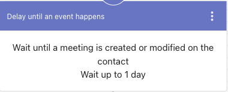
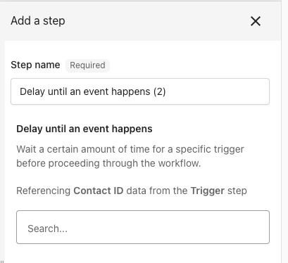
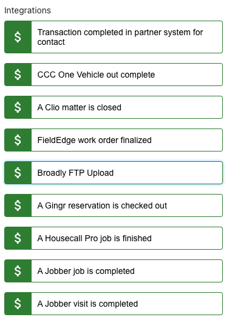
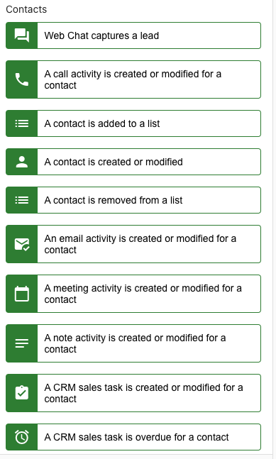
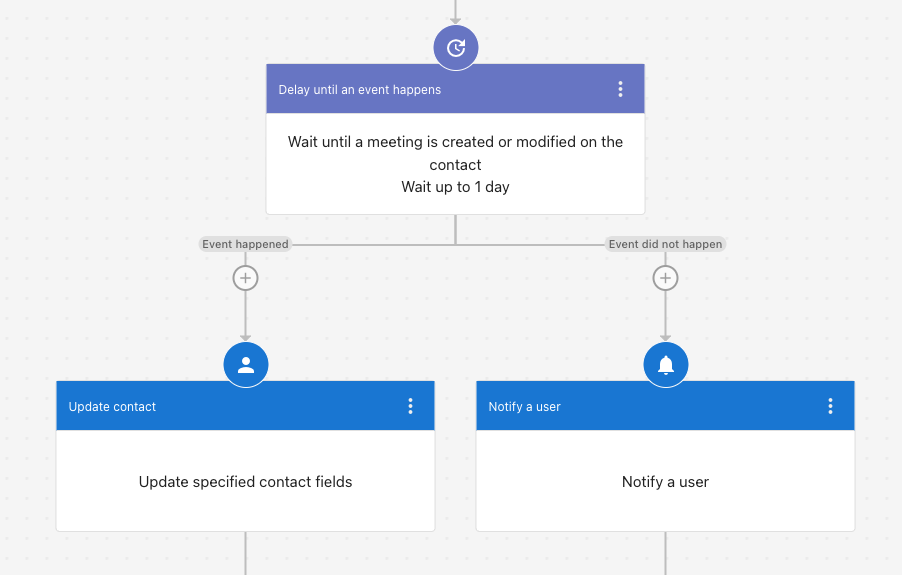

## What is a Delay Until Step?

A **Delay Until** step allows users to introduce a time-based control mechanism within CRM automation workflows. This feature ensures that actions occur at precisely the right moment, improving workflow flexibility, task scheduling, and customer engagement.

## How It Works

The **Delay Until** step allows users to pause an automation workflow for a specified time or until a defined event occurs in the CRM. This can be useful for:

- Scheduling follow-ups after a certain period.
- Ensuring tasks or messages are triggered based on customer activity.
- Streamlining CRM actions without the need for manual intervention.

## Setting Up a Delay Until Step

1. Navigate to the **Automation Workflow Editor** within your CRM.
2. Add a **Delay Until** step at the appropriate point in the workflow.
3. Choose a delay period or specify an event that must occur before proceeding to the next step.
4. Save and activate the workflow.

## What Does it Look Like?

- Name of the action: **Delay until an event happens**
- List of sub-triggers currently available for a contact:

## Benefits of Using Delay Until Steps

- **Improved Workflow Precision** – Ensures that automated tasks happen at the optimal moment.
- **Better Customer Engagement** – Delays help optimize messaging and follow-up timing.
- **Enhanced Sales Process Management** – Enables better tracking of missed sales touch points and notifications.

## Use Case Example

A business wants to automate follow-ups for new contacts generated via web chat. The workflow includes:

1. AI-generated thank-you email upon contact creation.
2. A plain text email sent to the contact.
3. A CRM sales task created for follow-up.
4. A **Delay Until** step to wait a set period before creating an opportunity.
5. A note added to the contact after the delay period.

By implementing a **Delay Until** step, the business ensures timely and meaningful engagement rather than immediate, potentially ineffective, actions.

## Who Can Use This Feature?

The **Delay Until** step is available to users managing CRM automation workflows within Business App and Partner Center.