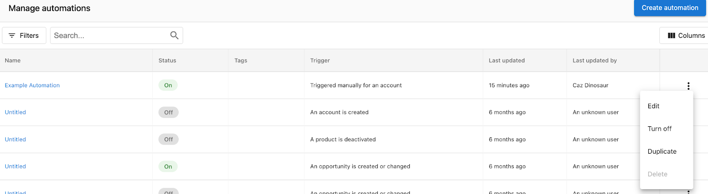
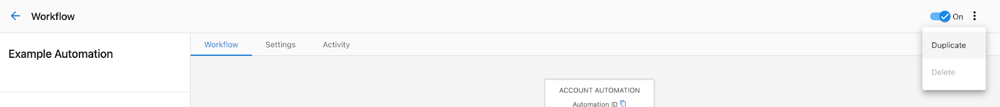

There may be times when you want to copy an automation you've created. You can do this from the main Automations page, or from specific automation.

:::note
**Notes:**
- Duplicated automations are off by default. Remember to turn on the automation when you're ready.
- If you have markets enabled, the new automation will be copied into the same market as the original.
:::

### **From the automations page**

To copy an automation from **Partner Center** > [**Automations**](https://partners.vendasta.com/automations):

1. Find the automation you want to copy in the table. Then, click the **Menu** icon at the end of the row.
2. Click **Duplicate**.

### **From a specific automation**

To copy an automation from specific automation:

1. Click **Menu** in the top right corner of the screen.
2. Click **Duplicate**.

