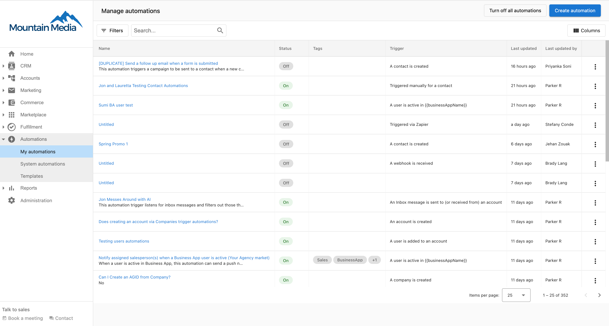

Automations are a tool you can use to automate your sales and marketing processes. Map out your personalized workflows in our simple builder and watch your business grow. 

<iframe 
  src="//www.youtube-nocookie.com/embed/AdLMXuGvGDE" 
  width="700" 
  height="393.75" 
  frameborder="0" 
  allowfullscreen=""
></iframe>

An automation workflow is simply a set of instructions that tell the platform "***when*** this specific trigger happens, ***then*** perform this action." For example, "When a new client is added, then assign a salesperson to the account."

Here are some ideas of how you can use Automations.

### **Welcome new clients**

When an account is created, automatically send an email campaign to welcome them to the platform. Assign a salesperson to that account, and create a task for the salesperson to connect personally with the client. 

### **Drive product upgrades**

When your clients activate a Standard product, automatically send them an email campaign outlining the benefits of the Pro edition. Set the automation to log your lead's activity in the Sales & Success Center, and notify your team when your customers open or click through an email.

### **Keep track of failed payments** 

When your customer has a failed payment, receive a notification so you can follow up with them quickly.

You can find more ideas in this article: [Automation examples](/automations/automations-my-automations/automation-examples)

**Looking for more information on automations?** 

Here are some helpful links:

- [Create a new automation](/automations/automations-my-automations/create-a-new-automation)
- [Automation triggers](/automations/automations-my-automations/automation-triggers)
- [Automation steps](/automations/automations-my-automations/automation-steps)
- [Manually trigger an automation](/automations/automations-my-automations/manually-trigger-an-automation)

  <a 
    style={{ 
      fontSize: '16px', 
      fontWeight: 'bold', 
      color: '#ffffff', 
      backgroundColor: '#33ace2', 
      textDecoration: 'none', 
      borderRadius: '5px', 
      padding: '10px 30px 9px 30px', 
      border: '1px solid #33ACE2', 
      display: 'inline-block', 
      textAlign: 'center'
    }} 
    href="https://partners.vendasta.com/automations" 
    target="_blank" 
    rel="noopener"
  >
    Create an Automation
  </a>

