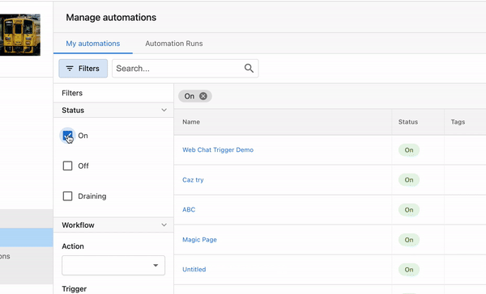

Grouping simplifies the user experience by consolidating multiple actions in automation into an easily accessible set of actions.

For instance, if users frequently use actions such as adding a task to the company and starting a campaign, with the latest update they can now add them to a Group. 

Grouping is a pre-work enabling users to save Groups in automation as **Action Sets**. We should be able to release `Action Sets` in the upcoming weeks. With Action Sets, we aim to increase the reusability of their saved Groups.

### **How to Use Automation Grouping**

**Step 1:** Navigate to **Partner Center > Automations > My Automations.**

**Step 2:** 

- **Option 1:** Click on **Create Automation** in the top right to start building a workflow.
- **Option 2:** Use the filter feature to find an automation that's not turned ON. 

  

**Step 3:** Open the automation.

**Step 4:** Identify Your Action Steps

- Start by identifying the consecutive action steps you want to group. For example, in the automation shown below, the automation includes several actions such as updating lead quality, tagging, starting a campaign, and notifying an internal user.

**Step 5:** Access the Grouping Option

- Navigate to the sequence of actions you want to group.
- Click on the three dots (more options) next to one of the actions in the sequence.

**Step 6:** Select Consecutive Steps

- Ensure that the steps you want to group are consecutive (one after the other).
- Select the consecutive steps that should be grouped together.

**Step 7:** Create the Group

- Once the steps are selected, click on Create Group.
- You will have the option to update the auto-generated name of the group.
- Optionally, you can add notes for clarity, which will be visible when viewing the group.

<iframe src="//www.loom.com/embed/f07430494fb2428aaa39dc68e32d3a89" width="560" height="315" frameborder="0" allowfullscreen></iframe>