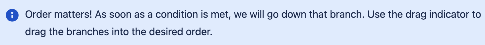
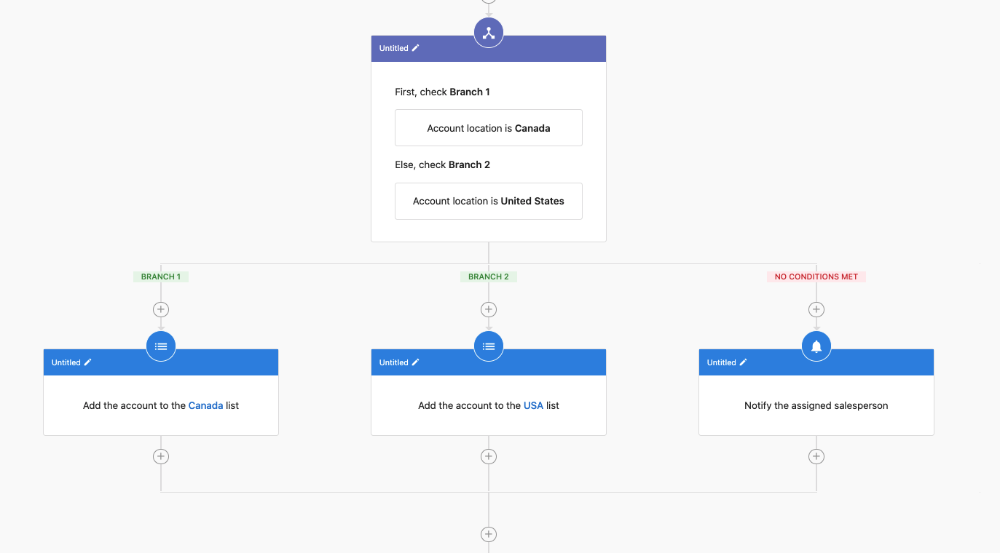
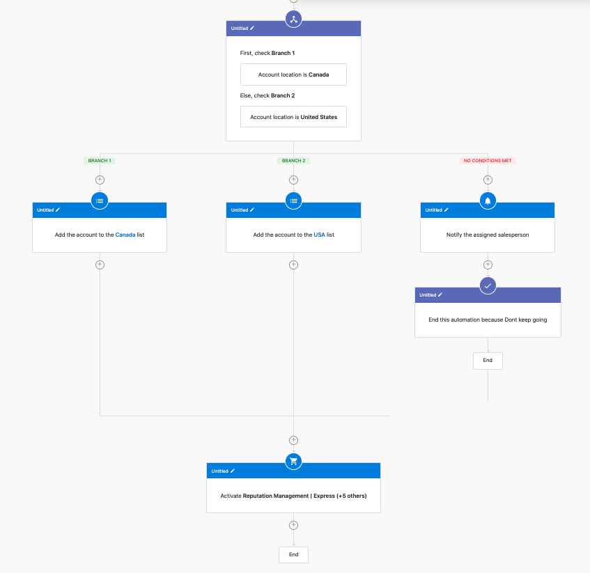

# Automations: Logic Steps

Logic steps provide if/else functionality and the ability to end automations in Automations V2. Automations V2 introduces two new step types: "If/Else" and "End This Automation".

## If/Else Step

The If/Else step allows conditional execution flow in an automation, enabling you to execute different branches based on whether a condition is met.

### Setting Up an If/Else Step

When adding a new step, select "If/Else" from the options:

When setting up an If/Else step, you will be prompted to define a filter:

After setting up your if/else condition, the workflow will show two branches:
- **If branch**: This path is followed when the condition is true
- **Else branch**: This path is followed when the condition is false

You can add different steps to each branch to create custom pathways based on your filter conditions.

## End This Automation

The "End This Automation" step allows you to terminate an automation at a specific point. This is useful for scenarios where you've completed the necessary steps for some leads and don't need to continue processing.

Using this step along with if/else conditions gives you significant control over the automation flow. For example, you can terminate the automation early for certain leads while continuing the process for others based on specific criteria.

### Common Use Cases

1. **Contact Qualification**: Use if/else to determine if a lead meets your qualification criteria and end the automation for unqualified leads

2. **Multi-path Communication**: Send different follow-up emails based on customer responses and end the automation when a desired outcome is achieved

3. **Time-sensitive Processes**: End automations for contacts who haven't responded within a specified timeframe

**Note**: Logic steps make your automations more powerful and efficient by providing granular control over the execution flow.