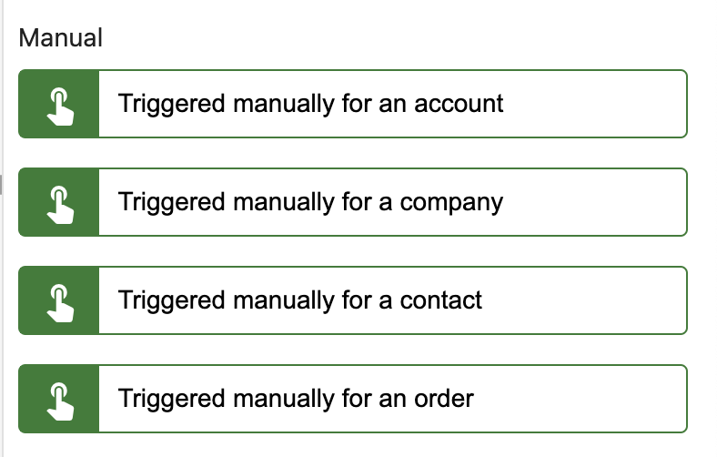
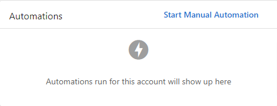
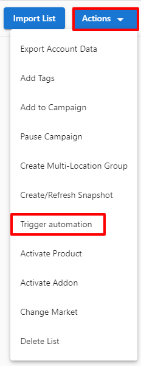
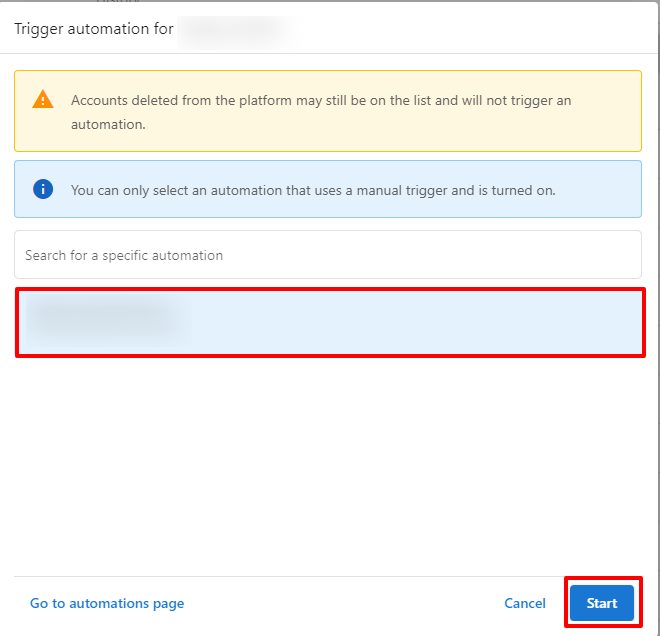
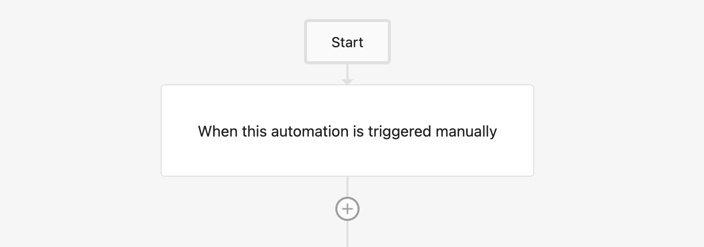
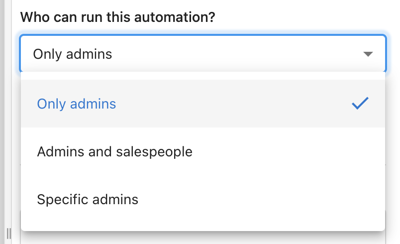
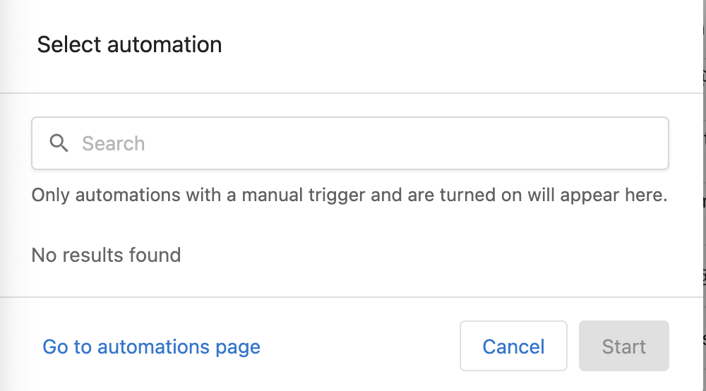

# Manually Triggered Automations

Manually triggered automations are a powerful feature that allows you to execute automations on demand, rather than waiting for specific triggers or scheduled times. This guide explains how to set up and use manually triggered automations.

## Creating a Manually Triggered Automation

When creating an automation, you can set it to be manually triggered by selecting the appropriate option:

## Starting a Manually Triggered Automation

There are two ways to start a manually triggered automation:

### 1. From the Start Automation Button

### 2. From the Business List

You can also trigger automations from your list of businesses:

Select the business(es) and then click "Start Automation":

## Multiple Executions Per Account

Manually triggered automations can be run multiple times on the same account:

## Allowing Salespeople to Start Automations

You can configure permissions to allow salespeople to start automations on their accounts:

## Company-wide Automation Controls

Manage your company's automation settings through the dedicated interface:

## Best Practices

- Use manually triggered automations for processes that require human judgment before execution
- Combine manual triggers with conditional steps for flexible workflows
- Properly configure permissions to ensure only authorized users can trigger automations
- Monitor automation execution through the reporting tools