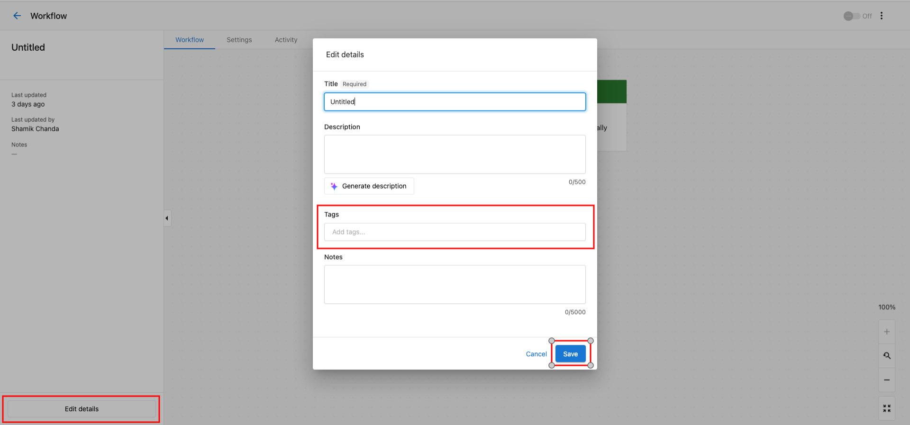
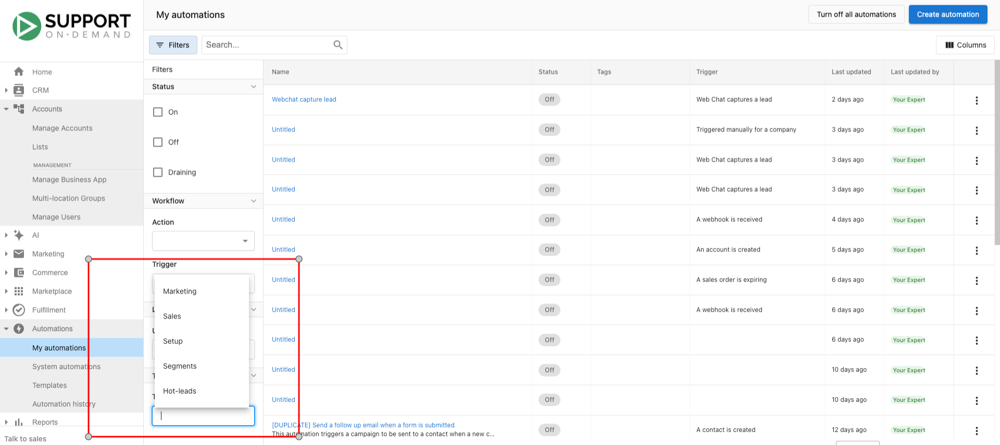

# Organize your automations with tags

Tired of scrolling through your long list of automation? You can now add tags to your automation to group them into categories and find them more easily.

Here are some commonly used tags:

- Leads
- Onboarding
- Sales
- Retention
- Marketing
- Trial
- Pipeline

You can enter any tag you like, so the options are endless!

## How to add tags

To add tags to automation:

1. Go to **Partner Center** > [**Automations**](https://partners.vendasta.com/automations)
2. Create new automation by clicking **Create automation** and selecting a template, or selecting an existing automation.
3. Click the **Edit Details.**
4. In the **Tags** field, enter one or more tags. To use a new tag, enter the text for the tag, then press **Enter**.
5. Click **Save**. 

## How to remove tags

To remove tags from automation:

1. Repeat steps 1-3 in the **Add tags section**.
2. In the **Tags** field, click the **Remove** icon on the tag(s) you want to remove. 
3. Click **Save**.

## How to filter automations by tags

To filter the automation table by tags:

1. Go to **Partner Center** > My [**Automations**](https://partners.vendasta.com/automations)
2. Click the **Filter** icon  on the table.
3. In the **Tags** section, select a tag to filter the table by.

The table should now be filtered by the selected tag.

  <a 
    style={{
      fontSize: '16px', 
      fontWeight: 'bold', 
      color: '#ffffff', 
      backgroundColor: '#33ace2', 
      textDecoration: 'none', 
      borderRadius: '5px', 
      padding: '10px 30px 9px 30px', 
      border: '1px solid #33ACE2', 
      display: 'inline-block', 
      textAlign: 'center'
    }} 
    href="https://partners.vendasta.com/automations" 
    target="_blank" 
    rel="noopener"
  >
    Organize your automations
  </a>

