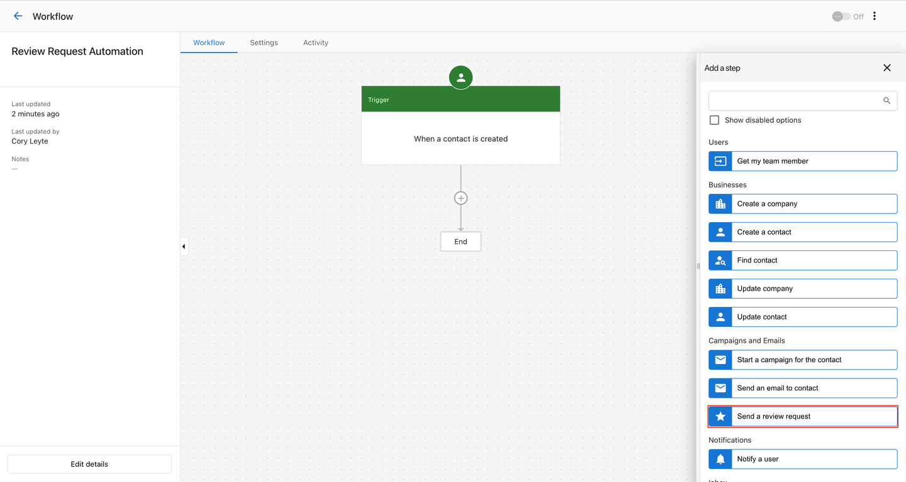
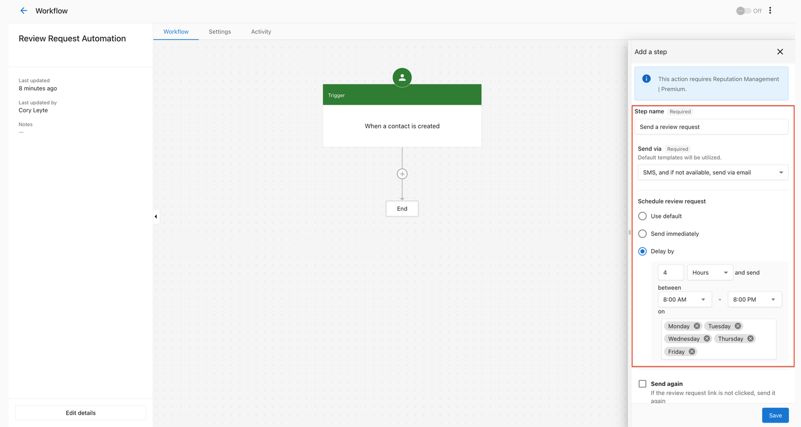
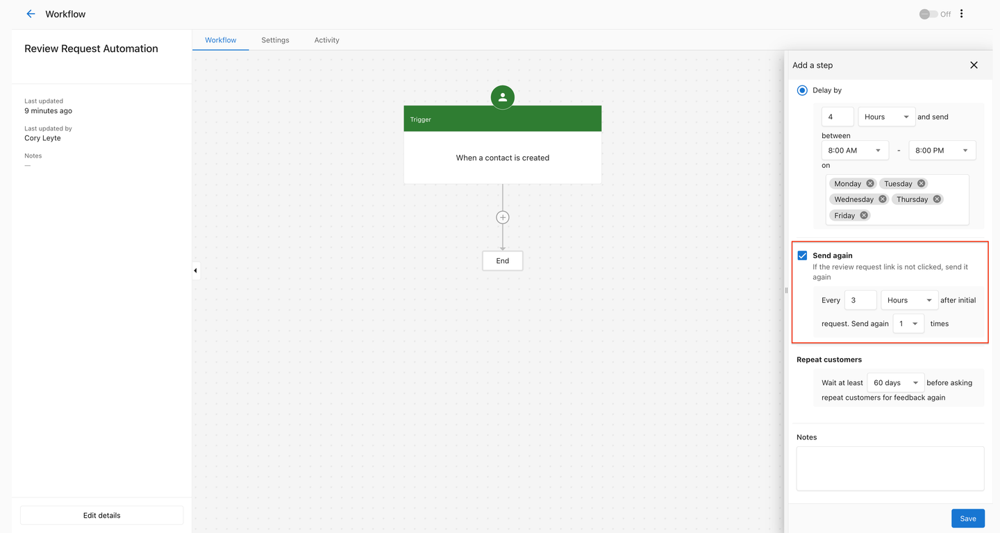

Easily configure triggers to send review requests when a new contact is added to the business's CRM through the UI or APIs or when an existing customer completes a transaction. With the enhanced capabilities of Automations and Reputation Management Premium, businesses gain greater control over how and when they send review and survey requests. They can choose the most appropriate channel (email or SMS), timing, and follow-up actions while benefiting from customizable system defaults tailored to their needs.

### **Review request system defaults**

- **Channel:** Send via SMS; if no phone number is available, send via email.
- **Timing:** Wait 4 hours before sending.
- **Availability:** Only send Monday to Friday, between 8:00 AM and 8:00 PM.
- **Follow-up:** If the user does not click the review link, follow up once after 3 days.

### **Set up the automation**

**Step 1: Create Review Request Automation**

- Navigate to the **Automations** section in Business App.
- Select **Create automation,** add your trigger, and then choose **Send a review request.**

**Step 2: Configure Scheduling Logic**

- Once **Send a review request** is selected, a side panel will open. Here, you can choose the request channel (email or SMS).
- You can use the system defaults, send the request immediately, or set your own delay time and date.

**Step 3: Configure Follow-up**

- If the recipient does not open or click the review links, you can set up to three follow-up requests via the selected channel (email or SMS). Note that this is based on the default template.

**Step 4: Configure For Repeat Customers**

- For businesses like home services (e.g., cleaners), set a repeat customer interval, such as 60 or 90 days, to ensure customers don't receive a review request after every service visit.

**Step 5: Complete the Automation**

- Follow the remaining steps to finalize the business automation setup.

Learn more about Automations in Business App [here](https://support.vendasta.com/hc/en-us/articles/22597391292183-Automations-in-Business-App-Review-Requesting).