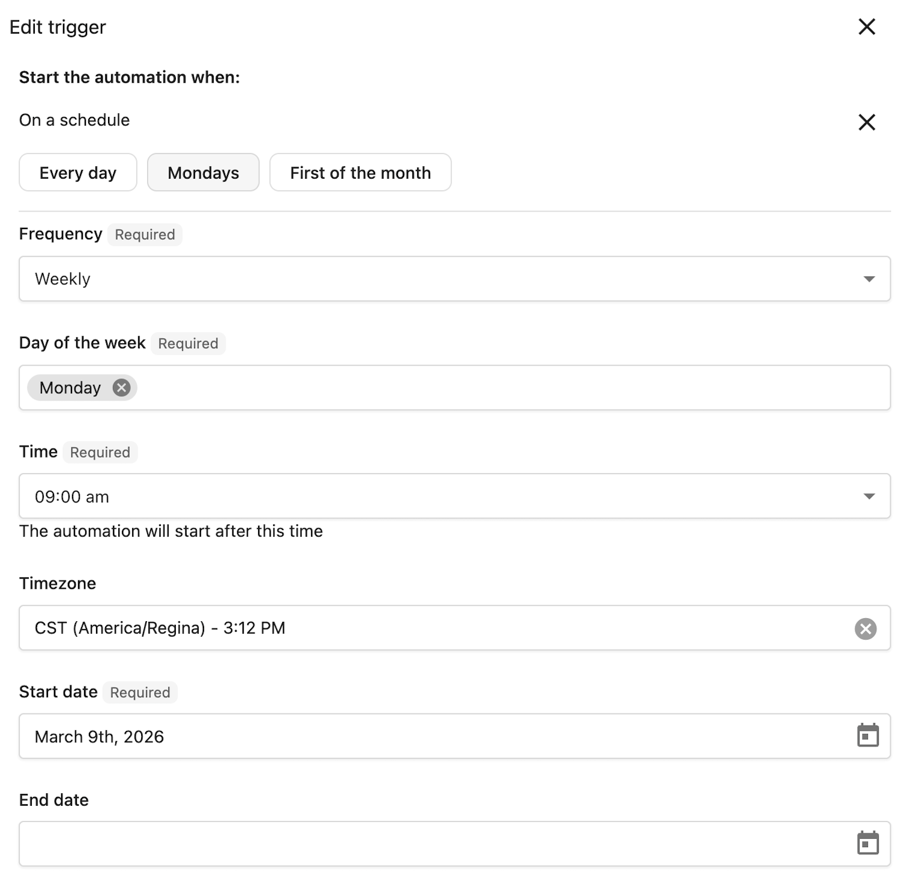

# Time-based triggers

Run automations on a recurring schedule without waiting for an event to trigger them. The **On a schedule** trigger is useful for routine tasks like sending team reminders, weekly notifications, or monthly check-ins.

## How time-based triggers work

Unlike event-based triggers that run when something happens (like a payment or account creation), time-based triggers run at times you define. You set the frequency, time of day, and date range, and the automation runs automatically.

**Key benefits:**
- Automate recurring tasks without manual intervention
- Run automations at optimal times for your recipients
- Set start and end dates to control when the schedule is active

## Set up the On a schedule trigger

1. Go to **Partner Center** > **Automations**.
2. Click **Create automation** or open an existing automation.
3. In the trigger selection, find **Time-based** and select **On a schedule**.
4. Configure the schedule options (see below).
5. Add your automation steps and save.

## Schedule options

### Daily

Run the automation at the same time every day.

| Setting | Description |
| --- | --- |
| **Time** | The time of day to run (in your configured timezone) |

**Example:** Send your team a daily reminder at 9:00 AM with a static link to review new orders.

### Weekly

Run the automation on specific days of the week.

| Setting | Description |
| --- | --- |
| **Time** | The time of day to run |
| **Days of week** | Select one or more days (Sunday through Saturday) |

**Example:** Send your team a Monday reminder at 8:00 AM with a static link to the sales pipeline.

### Monthly

Run the automation on specific days of the month.

| Setting | Description |
| --- | --- |
| **Time** | The time of day to run |
| **Days of month** | Select one or more days (1-31) |
| **End of month** | Run on the last day of the month, regardless of how many days it has |

:::tip
Use the **End of month** option for consistent month-end notifications. This ensures the automation runs on the 28th, 30th, or 31st depending on the month.
:::

**Example:** Send your finance team a monthly reminder on the 1st with a static link to the invoices page.

## Date boundaries

Control when your time-based automation is active.

| Setting | Description |
| --- | --- |
| **Start date** | The earliest date the automation can run. The schedule becomes active on this date. |
| **End date** | (Optional) The latest date the automation can run. After this date, the schedule stops. |

## Timezone

The schedule runs based on your automation's timezone setting. All times you enter are interpreted in this timezone.

## Example use cases

### Monthly invoice reminder for admin

Notify your admin to review outstanding invoices:
- **Frequency:** Monthly
- **Day:** 1st of each month
- **Time:** 9:00 AM
- **Steps:** Send a notification to admin with a link to the invoices page

### Weekly sales task for client check-ins

Create a recurring task to reach out to a **key client**:
- **Frequency:** Weekly
- **Day:** Wednesday
- **Time:** 10:00 AM
- **Steps:**
  1. Find the contact
  2. Create a sales task to check in with the client

### Invoke an AI employee on a schedule

Invoke an AI employee to generate a job and share them with your team:
- **Frequency:** Daily
- **Time:** 8:00 AM
- **Steps:**
  1. Send a request to an AI employee with your prompt
  2. Send a webhook and configure it to send to Slack or Google Chat

## Troubleshooting

### Automation didn't run at the scheduled time

- Verify the automation is turned **on** (running state)
- Check that the current date is within the **Start date** and **End date** range
- Confirm the timezone is set correctly in automation settings

### Schedule options not appearing correctly

- Ensure you've selected at least one day for weekly or monthly frequencies
- For monthly schedules, remember that selecting day 31 only runs in months with 31 days

### Automation runs at unexpected times

- Double-check your timezone configuration
- Remember that daylight saving time changes may affect the actual run time in your local time

## Related resources

- [Automation Triggers Reference](./automation-triggers-reference.mdx)
- [Creating and Configuring Automations](./creating-and-configuring-automations.mdx)
- [Managing Your Automations](../automation-history/managing-your-automations.mdx)
