The Vendasta App in Zapier allows Partners to connect the Vendasta CRM to several 3rd Party systems using Zapier. Users can select any 3rd Party system available in Zapier as a Trigger which would initiate an action in the Vendasta CRM

## How triggering an automation with Zapier works

**Step 1: Selecting the Trigger**

In this step, you can select the trigger that initiates an action in your workflow. As an example when a New Payment in Quickbooks Online can be used as a trigger, however, you can also choose from various other triggers available in Zapier.

**Step 2: Choosing the Action**

After selecting the trigger, you'll need to choose the app that will carry out your desired action. In this scenario, that app would be the Vendasta App. This means that whenever a New Payment is received in Quickbooks online, an automation would be executed in the Vendasta CRM. As part of the Vendasta App in Zapier various actions are possible.

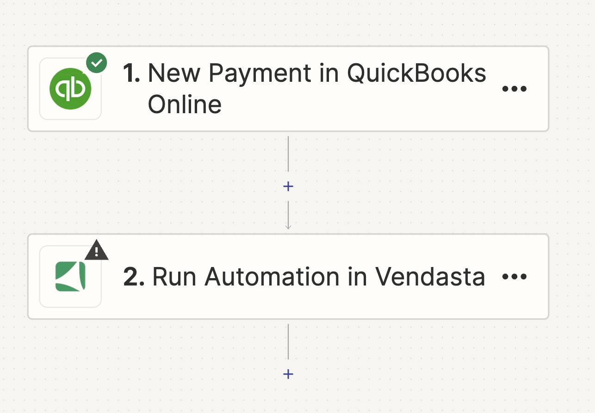

**Step 3: Choosing the Action**

In this step, you'll set the action to be performed when the trigger event happens. For this scenario, the action is to Run Automation in the Vendasta CRM.

Remember, you can change the action anytime by clicking on the dropdown menu and choosing a different option. After selecting the action, click "Continue" to proceed to the next step.

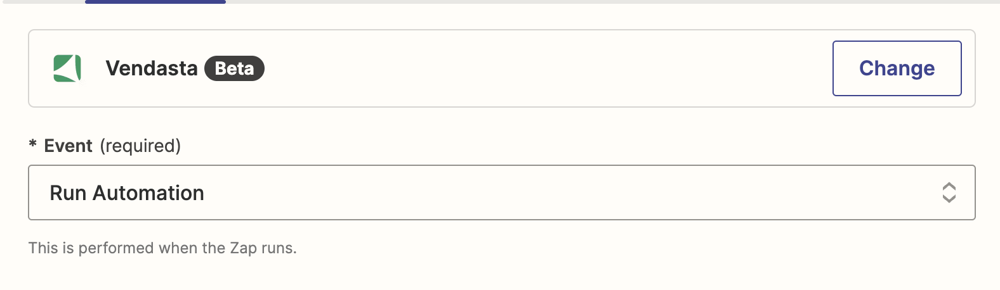

**Step 4: Signing In**

In this step, you'll connect your Vendasta account. Click on "Sign in" to be redirected to the login page. Here, you'll enter your Partner ID or the Account ID of the client you are setting up Zapier for and grant the necessary permissions. After this, you'll be automatically redirected back to Zapier.

:::note
You only need to complete this process once. In the future, you'll be automatically signed into your account when using the Vendasta Action.
:::

**Step 5: Entering the Organization ID**

In this step, you will need to enter the Organization ID, which is a mandatory field. This ID is automatically populated based on the Partner ID or Account ID you used when signing in.

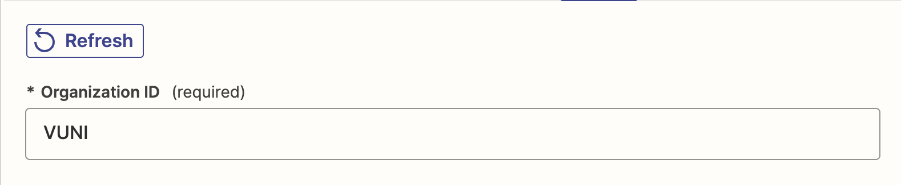

**Step 6: Trigger**

In the 'Trigger' field, select the type of Automation that you would want to run in the Vendasta CRM.

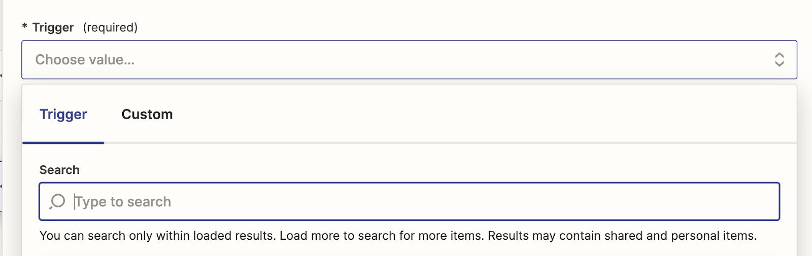

You will be able to search and select the Trigger type from the Dropdown provided. There are five options available

1. Triggered via API
2. Triggered manually for an Account
3. Triggered via API for an Account
4. Triggered manually for an Order
5. Triggered via API for an Order

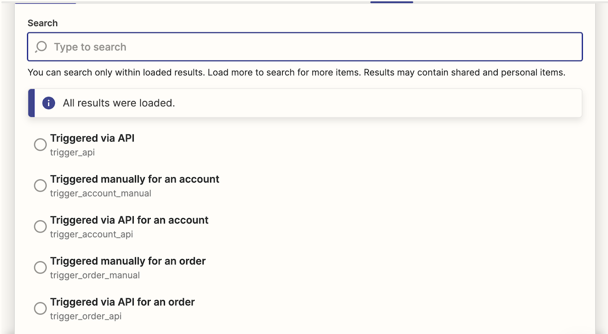

Once you have chosen the Trigger type, please enter the Account ID or Order ID based on the Type of Trigger Chosen. 

For Automations Triggered manually for an Account or Triggered via API for an Account enter the Account ID.

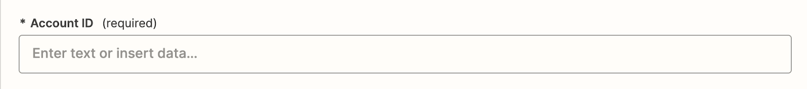

For Automations Triggered manually for an Order or Triggered via API for an Order enter the Order ID.

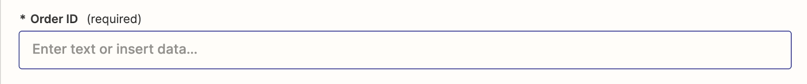

**Step 7: Automation ID**

In the 'Automation ID' field, enter the ID of the automation you want Zapier to run in Vendasta when a trigger occurs in an external system, such as Quickbooks.

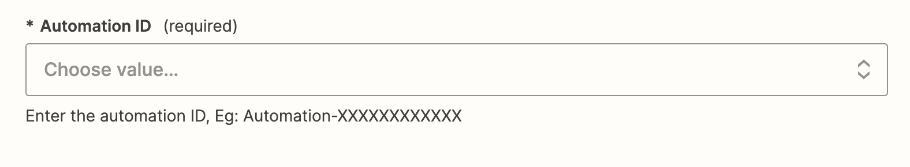

The 'Automation ID' field is a searchable dropdown that lets you find the Automation ID by searching with either the ID or the Automation name. This makes it easier to select the correct automation to run in Vendasta when a trigger occurs in an external system.

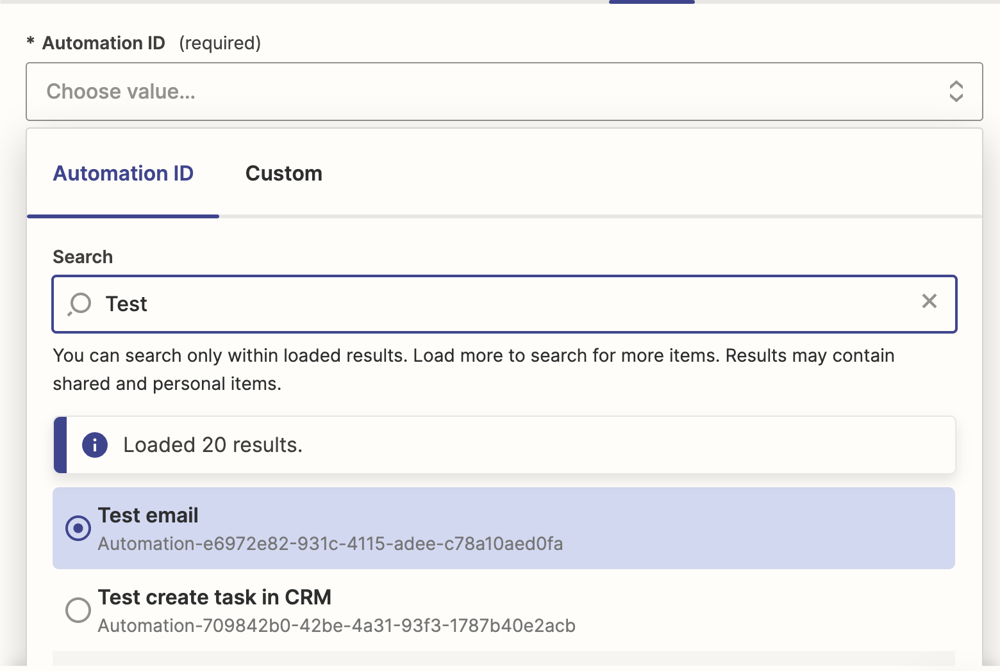

If you do not see your automation on the list, make sure it has one of the following triggers: 

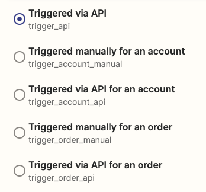

**Note:** The automation in Vendasta must be turned on for it to be triggered via Zapier.

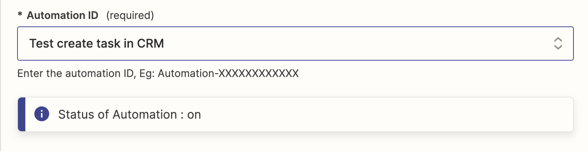

**Step 8: Testing the Step**

Before publishing the Zap, be sure to test the steps in Zapier. This can help identify any missing fields or incorrect data.

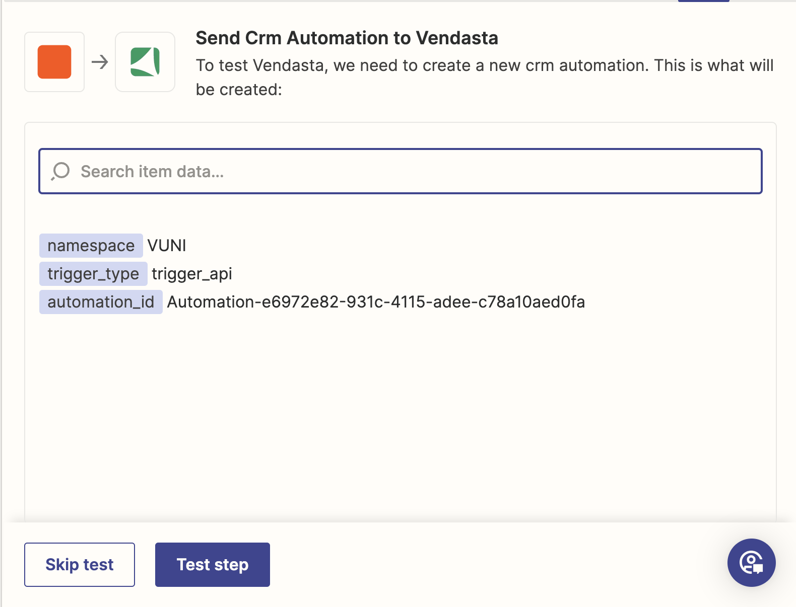

After testing, a 'Run Automation Successful' message confirms that the Zap is working as expected and ready to be published.

## Connect Facebook Lead Ads to Vendasta automations

You can automatically create contacts in Vendasta CRM whenever a new lead submits a Facebook Lead Ad. This uses Zapier as middleware between Facebook and Vendasta.

**Prerequisites:**
- An active [Zapier](https://zapier.com) account
- A Facebook Lead Ads account with at least one active lead form
- Partner Center access with permission to manage automations and CRM

### Set up the Zap

1. In Zapier, create a new Zap and set **Facebook Lead Ads** as the trigger with **New Lead** as the trigger event.
2. Connect your Facebook account, then select the Page and lead form to watch.
3. Click **Test trigger** to pull in a sample lead.
4. Add a Vendasta action:
   - **Run Automation** — triggers a specific Vendasta automation for each new lead, allowing you to run a full onboarding or notification flow.
   - **Create or Update Contact** — writes the lead directly to CRM.
5. Connect your Vendasta account and enter your Partner ID when prompted.
6. Map the lead fields (first name, last name, email, phone) to the corresponding Vendasta CRM fields.
7. Test the action, then publish the Zap.

### Associate contacts with companies

If a contact should be linked to a company in Vendasta CRM, pass the **Company ID** in the **Primary Company** field — not the company name. The company must already exist in CRM before the Zap runs.

To find a Company ID, open the company in `Partner Center` → `CRM` → `Companies` and check the URL: `.../companies/76543/details` — the number is the Company ID.

### Common issues

| Issue | Fix |
|-------|-----|
| Primary company not linking | Use the numeric Company ID, not the company name |
| Leads not appearing in CRM | Verify the Zap is **On** and all required fields are mapped |
| Automation not triggering | Confirm the automation is toggled **On** in Partner Center and uses a compatible trigger type |
