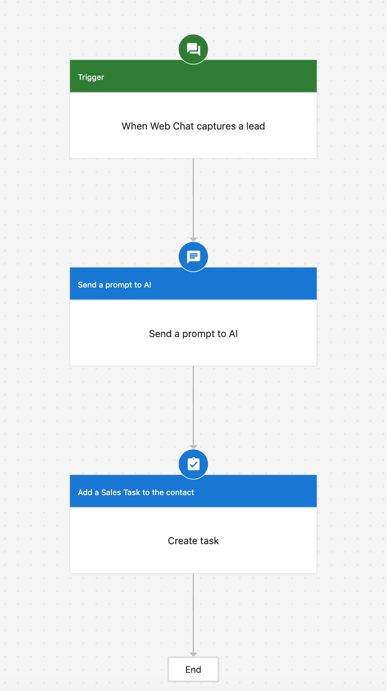
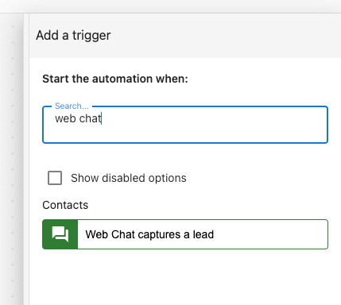

The Web Chat Lead Trigger activates when a Web Chat summary is generated for a lead, whether it's for a newly created contact via Web Chat or an existing contact. It can output key information such as the contact ID, chat summary, chat link, and more, tailored to your company's needs. This data can be used to create CRM-related tasks, update contact details, and notify stakeholders. Advanced users can even push this data to their own platforms using the 'Send a Webhook' action. 

<iframe src="//www.loom.com/embed/0bf92cf0737f4a718c43edaea0d9184a" width="560" height="315" frameborder="0" allowfullscreen></iframe>

## Usecases:

### Simple: Web chat lead Capture to task generation in the CRM

- This automation triggers a prompt to an AI system when a contact is created via web chat, followed by adding a sales task to the contact in the CRM system.

### Advanced: Webchat lead capture to webhook

- This automation trigger is set to activate a workflow when a contact is created via web chat. The workflow involves sending a webhook to a specified URL and prompting an AI system with specific data related to the contact creation or the webchat inquiry.

<iframe src="//www.loom.com/embed/db0e4e74d5aa4bbebafc4a92f0203887" width="560" height="315" frameborder="0" allowfullscreen></iframe>

To start building the automation: 

1. Navigate to **Partner Center > Automations > My Automations.**

2. Looks for the trigger **Web Chat captures a Lead** to begin building. 

## FAQ

**Q: Does this trigger also work in Business App?**

**A:** Yes! 