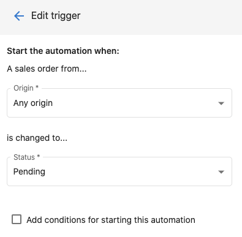
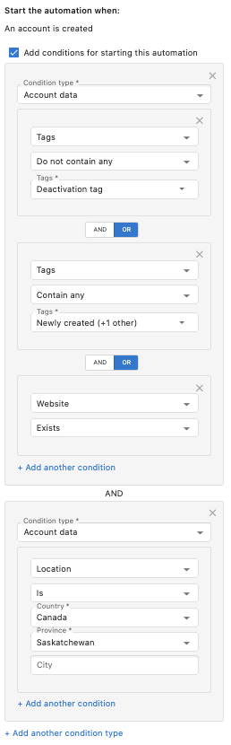

# What are automation triggers?

Automation triggers are specific actions that start your workflows. There are numerous triggers to choose from, and we're frequently adding more.

Some triggers are simple and are ready out-of-the-box. For example, the **An account is created** trigger will start whenever any account is created.

Other triggers may require specifying **trigger options**. For example, the **A sales order status is changed** trigger requires that you specify the sales order origin and status that it's changed to.

## Trigger conditions

Trigger conditions allow you to further filter the triggers that start your workflows. There are a number of trigger conditions you can filter on, including tags, salespeople, account location, account categories, active products, and more.

When applying multiple conditions, you can specify which logical operator (AND or OR) should be used when putting these conditions together.

**OR Operator**

When using the OR operator, the trigger conditions are met when ***any*** of the conditions in the group are met. In the example below, the conditional group in the top box is met if *either* the account created does not contain the *Deactivation tag* **OR** it contains the *Newly created* tag **OR** a *Website exists*.

**AND Operator**

When using the AND operator, the trigger conditions are met only when ***all*** the conditions in the group are met. In the example below, the AND operator is being used between the conditional group in the top box and the conditional group in the bottom box. The trigger conditions are met if one of the conditions is met from the top box **AND** the condition is met in the bottom box.

  <a 
    style={{
      fontSize: '16px', 
      fontWeight: 'bold', 
      color: '#ffffff', 
      backgroundColor: '#33ace2', 
      textDecoration: 'none', 
      borderRadius: '5px', 
      padding: '10px 30px 9px 30px', 
      border: '1px solid #33ACE2', 
      display: 'inline-block', 
      textAlign: 'center'
    }} 
    href="https://partners.vendasta.com/automations" 
    target="_blank" 
    rel="noopener"
  >
    Create an automation
  </a>

