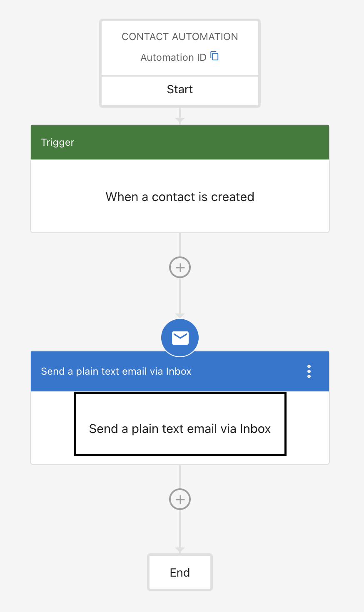

You can send plain text emails from automations so they appear in Business App Conversations.

### How to send plain text emails via automations in Conversations

**Step 1** – Go to **Business App > Administration > Automations**.

**Step 2** – Open an existing automation or create a new one.

**Step 3** – Set the trigger to **When a Contact is created**.

**Step 4** – Add the **Send a plain text email** action step.

Emails sent by this step appear in your Conversations inbox. This action requires **Conversations AI Pro—AI-Assisted web chat lead capture**.
