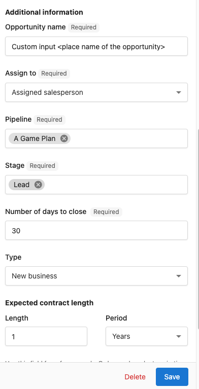
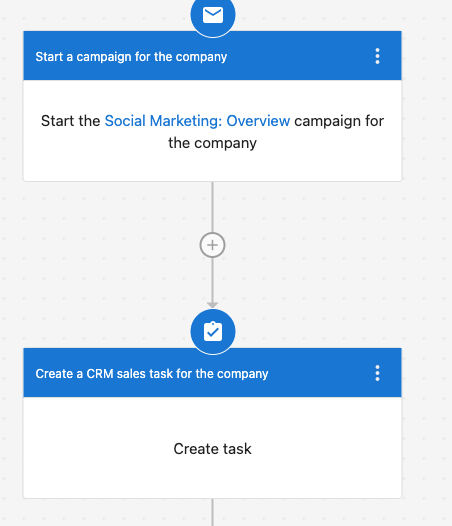

## Template Name

Create a Sales Opportunity for a Company Based on Form Submission.

## Purpose

This automation streamlines your sales process by creating a sales opportunity whenever a new company is added via Form submissions. By leveraging this automation, your sales team can act quickly on new leads, ensuring personalized and effective engagement with potential clients.

## Prerequisites

- Before setting up this automation, ensure:
- You have access to the Forms & CRM in your system.
- The form with a custom record source to be used to collect company data is integrated with your CRM.
- You have the necessary permissions to create automation templates.
- How to video:

<iframe src="//www.loom.com/embed/412d950b220745719009a560af0fa1ab" width="560" height="315" frameborder="0" allowfullscreen></iframe>

## Step-by-Step Setup

1. Go to Automations in Partner Center.
2. Navigate to the Automation Templates section.
3. Click on **All Templates** and search **Create a sales opportunity for a Company based on form submission.**
4. Click on **Use Template** and customize the record source on your trigger.
5. Configure **Sales Opportunity Creation Form** on the Automation Side Panel as needed.
6. Turn on the automation. 

## Additional Customizations

Feel free to add a few more steps such as:

- Starting a campaign for the Company.
- Create a CRM task so that your salesperson can follow up.

