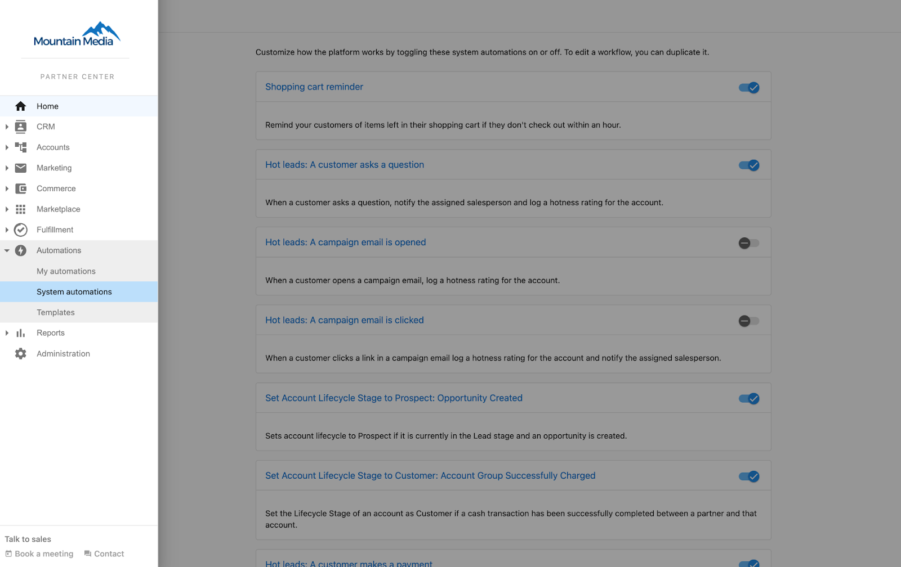
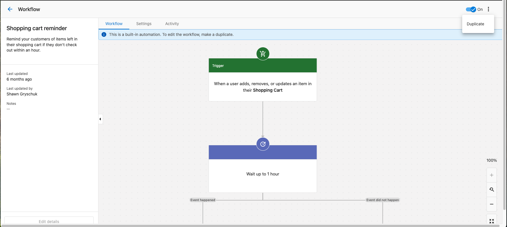
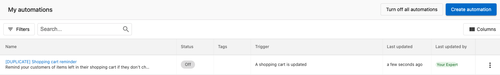
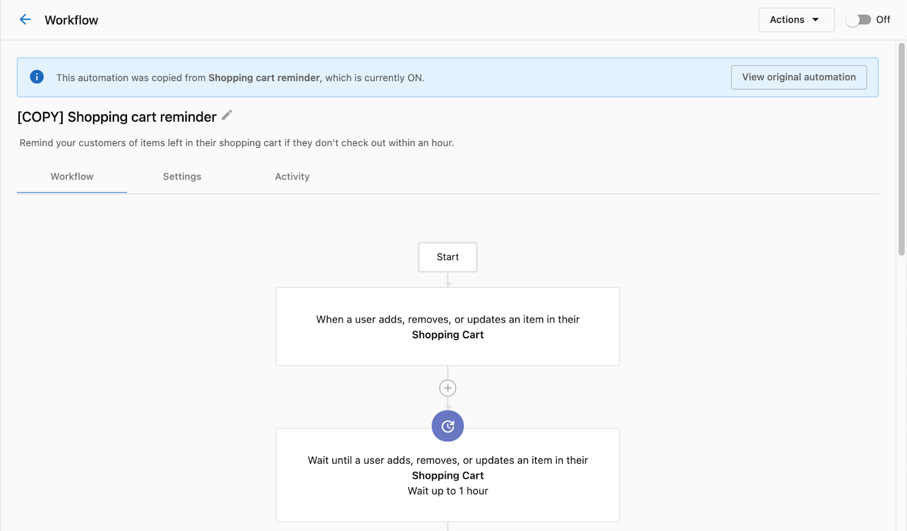

## What are System Automations?

System automations are automations created by Vendasta for all Channel Partners. Some system automations are new features that you can customize to tailor to your needs, such as reminding customers when items are left in their shopping cart.

These system automations are On by default for all markets (if applicable). However, you have the option to turn off the automation or copy them into your automation to make any modifications.

## Which System Automations are available?

- Shopping cart reminder
  - Remind your customers of items left in their shopping cart if they don't check out within an hour.
- Set Account Lifecycle Stage to Prospect: Opportunity Created
  - Sets account lifecycle to Prospect if it is currently in the Lead stage and an opportunity is created.
- Set Account Lifecycle Stage to Customer: Account Group Successfully Charged
  - Set the Lifecycle Stage of an account as Customer if a cash transaction has been successfully completed between a partner and that account.

## How does it work?

To access system automations, go to Partner Center > Automations > System Automations. There, you can see all existing system automations, including their description, and status. You can click into each automation to view its workflow, and make copies of the workflow.

## Turn off a System Automation

The status for system automations works the same as other automations. You can turn off system automations using the On/Off toggle at the top of the Workflow page or from the main System Automations page.

For more information, view this article: [Turn off an automation](/automations/turn-off-an-automation)

## Edit/copy a system automation

Unlike regular automations, system automations can't be edited directly. However, you can still customize the workflow by making a copy of the system automation.

To copy system automation, click Actions on the main Workflow page. Then, click Duplicate.

A copy of the system automation will be created in the **My Automations** tab. You can customize this automation any way you like. The status of the system automation will remain the same, whereas the status of the copied automation will be Off by default.

When you're ready to turn on the copied automation, you can do so by clicking the On/Off toggle at the top of the page.

