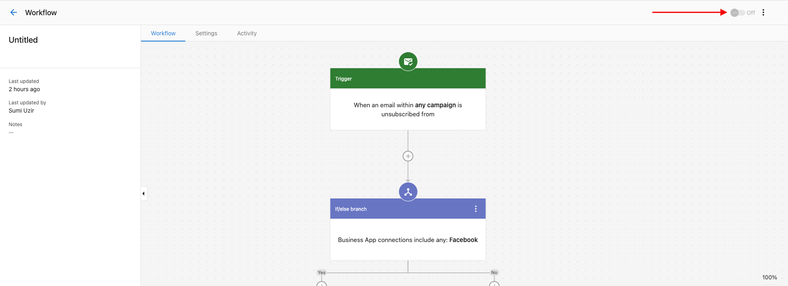
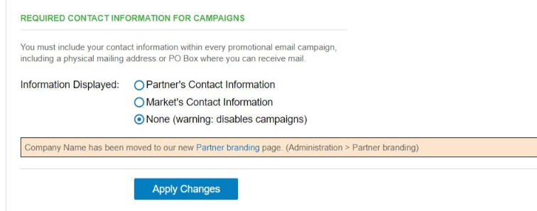

# Troubleshooting Automations

This page covers the issues you're most likely to hit. For a full picture of activity and error details, see [Managing your automations](./managing-your-automations.mdx).

## Why isn't my automation running?

### 1. The automation is turned off

Automations only run when the toggle at the top-right of the automation editor is set to **On**.

### 2. The entry setting is "Run once per account"

By default, an automation only runs the first time the trigger conditions are met for a given account. If you need it to run every time, change **Entry settings** in the automation's **Settings** tab to **Run every time**.

### 3. A previous step threw an error and stopped the run

If a step fails and your **Error handling settings** are set to **Stop that specific automation run**, the workflow halts.

Check the **Activity** tab for the specific error, then either:

- Fix the underlying issue (missing data, misconfigured step, etc.), then retry the run from the failed step, or
- If non-critical, change **Error handling settings** to **Ignore the error and continue** so future runs don't stop.

### 4. The trigger conditions don't match

Double-check your trigger's conditions against the account or record you expect it to fire on:

- Are you using **AND** when you meant **OR** (or vice versa)?
- Are the conditions too restrictive?
- Test with a record you know should qualify.

### 5. A step is running before its data is ready

Some triggers complete before downstream data exists. For example, when an account is created it takes about 10 minutes before a salesperson is assigned — so an if/else step that checks the salesperson will find nothing if it runs immediately.

Add a **Delay** or **Delay until an event happens** step before any branch that depends on upstream data.

### 6. A step has a once-per-account limit

Some steps can only run once per account regardless of settings. For example, an email campaign can only be sent to the same account once. If your automation is set to run multiple times per account and includes a "Send campaign" step, later runs will error.

Design around these limits by using different campaigns or by using pause/resume campaign steps instead.

## Campaign failed to start

When starting an email campaign from an automation, you may see this error:

> Failed to complete due to an error. The required contact information for campaigns is missing.

**Cause:** Contact information for your business isn't set in Partner Center. Every promotional email campaign must include a physical mailing address or PO Box.

**Fix:**

1. Go to **Partner Center** → **Administration** → [**Customize**](https://partners.vendasta.com/customize-design).
2. Expand the **Email Settings** tab.
3. Fill in the **Required Contact Information for Campaigns** section.
4. Click **Apply Changes**.

:::note Markets
If Markets are enabled, each market needs contact information. Open the **Markets** tab on the **Customize** page, click **Edit** on each market, and choose **Partner's Contact Information** or **Market's Contact Information**. Selecting **None** disables campaigns for that market, even the default market.
:::

## Can I remove an account from an automation that's already running?

Once an automation has started processing an account, the completed steps can't be undone. What you can do depends on whether the run is still in flight:

- **Run is still in progress or waiting.** Check the **Activity** tab for runs in **In progress** or **Waiting** status (for example, between delay steps). You may be able to cancel the remaining steps from there.
- **Run has already completed.** You'll need to manually reverse any actions that can be undone (remove tags, deactivate products, etc.).

To prevent unintended runs going forward, add conditions or exclusion lists to the trigger so the affected accounts aren't eligible.

## Getting help

If the above doesn't resolve the issue, reach out to support with:

- Automation name and ID
- The specific error message from the **Activity** tab
- Steps to reproduce
- Account or record IDs affected
- Timeline of when the issue started

You can also ask in the [Vendasta community](https://www.facebook.com/groups/vendasta).

## Related resources

- [Managing your automations](./managing-your-automations.mdx) — Activity tab, error details, retry
- [Creating and configuring automations](./creating-and-configuring-automations.mdx) — entry settings, error handling
- [Automation triggers reference](./automation-triggers-reference.mdx)
- [Automation steps reference](./automation-steps-reference.mdx)
