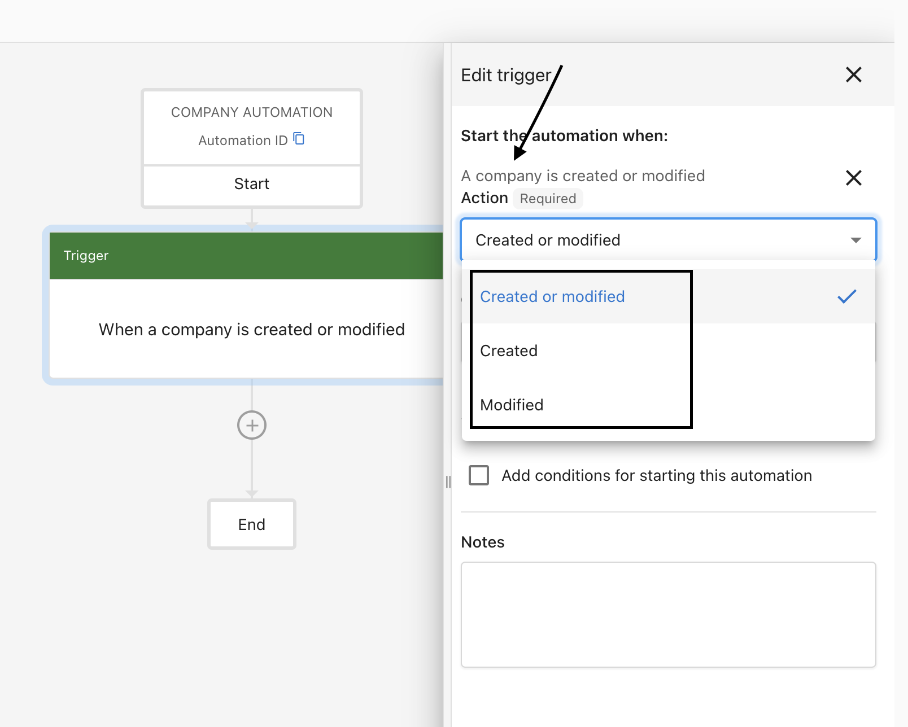
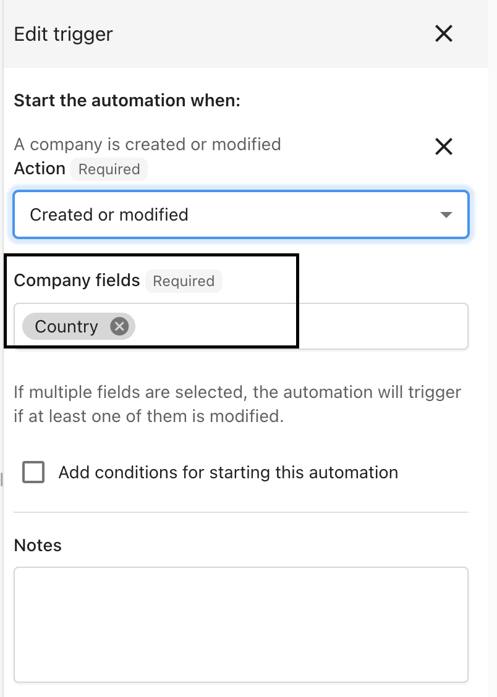

# Update company trigger in Business App automations

You can use the **When a Company is created or modified** trigger to run automations based on company changes.

### How to set up the company trigger

**Step 1** – Go to **Business App > My Business > Automations**.

**Step 2** – Create an automation and set the trigger to **When a Company is created or modified**.

**Step 3** – In the side panel, choose the fields that must change for the automation to run. This prevents every company update from triggering the automation.

**Step 4** – Turn the automation on using the toggle at the top right.

**Step 5** – You can also choose which updated field(s) trigger the automation.

## Related content

- [Business App](/business-app)
