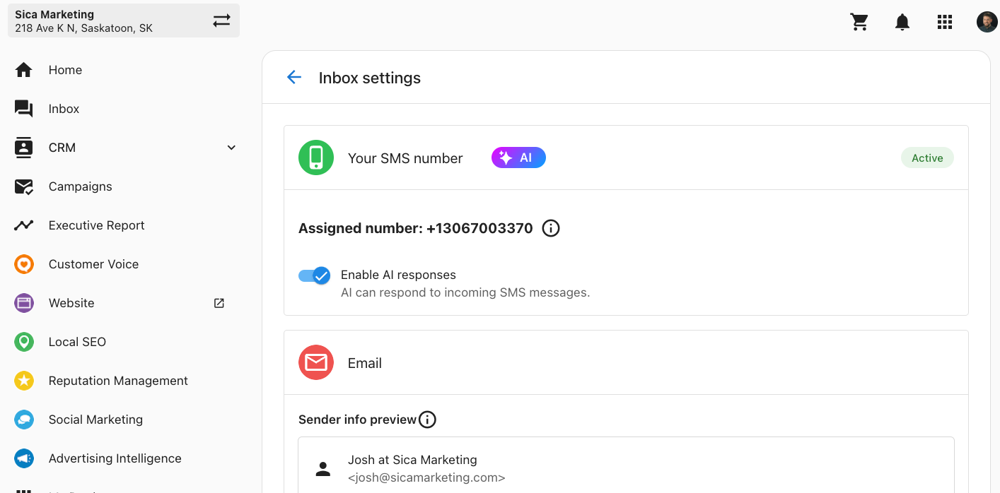

## What is the AI SMS Receptionist?

The AI SMS Receptionist feature allows businesses to instantly reply to SMS messages from customers, ensuring that every inquiry is acknowledged immediately. Whether customers are reaching out after hours or while staff are busy, the AI receptionist can answer questions or inform the customer that a team member will be in touch soon. This feature helps reduce response times, enhancing customer satisfaction and capturing more leads.

## Why Use AI-Powered SMS Replies?

- **24/7 Availability:** Customers who message a business via SMS receive an instant response at any hour, reducing wait times and ensuring they feel acknowledged.
- **Streamlined Workload:** The AI can manage simple inquiries, easing the communication burden on business employees.
- **Improved Customer Experience:** By immediately addressing common questions or confirming receipt of a message, the AI helps maintain customer satisfaction while freeing up time for business staff to focus on more complex inquiries.

## How to Set Up the AI SMS Receptionist

To enable the AI Receptionist for SMS in **Business App** or **Partner Center**, follow these steps:

1. **Navigate to Inbox Settings**
   - In Business App, go to **Administration > Inbox Settings.**

2. **Enable SMS Channel**
   - In the Inbox settings, ensure that **SMS** is enabled as an available channel. Toggle on **Enable AI Responses**. Once activated, the AI will automatically reply to incoming SMS messages.
   

3. **Optional: Disable AI Responses for Specific Conversations**
   - If there are specific customers or conversations where AI responses aren't desired, business users can disable AI replies manually:
     - Go to the conversation, click on the **kabob menu (three dots)**, and select **Disable AI Responses**.

The AI SMS Receptionist feature is a powerful tool for businesses looking to provide excellent, always-available service and optimize SMS communication with customers.